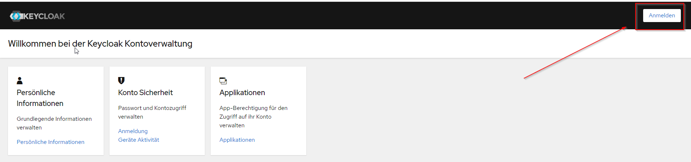
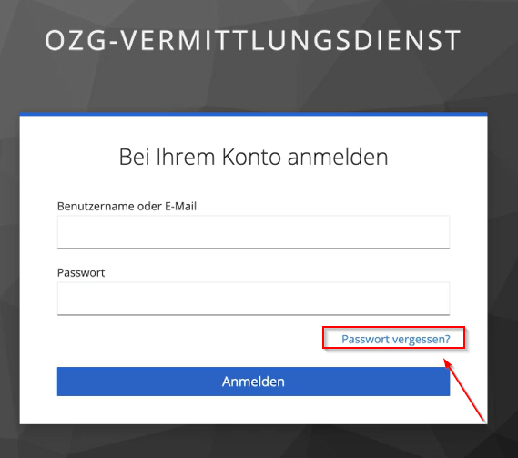
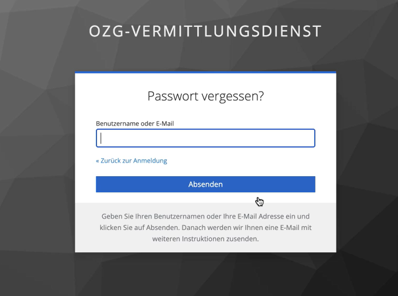
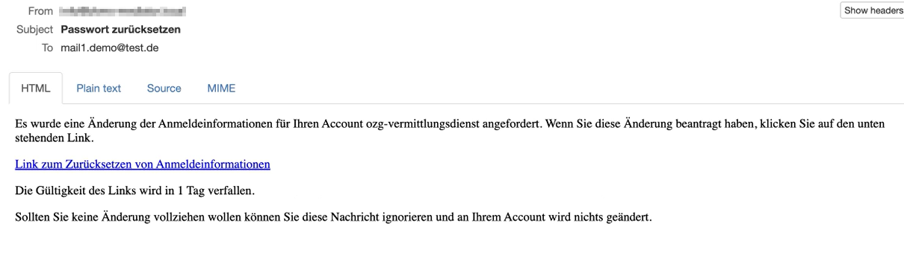
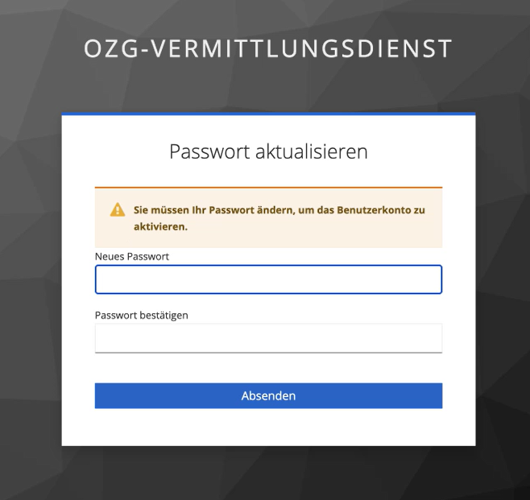

**EfA-Umsetzungsprojekt "Zugang zur öffentlichen Vergabe"**
### Dokumentation Vermittlungsdienst
[Startseite](Readme.md)
  

# Anbindung an den Vermittlungsdienst
Es gibt zwei Möglichkeiten Bekanntmachungen an den Vermittlungsdienst zu übermitteln, per REST API oder per PEEPOL (in der Umsetzung).
  

## Anbindung per REST API
Der Vermittlungsdienst stellt eine REST API zur Verfügung, die von jeder Vergabeplattform genutzt werden kann, um Bekanntmachungen an den Vermittlungsdienst zu übermitteln.
  

## Anbindung per PEPPOL (in der Umsetzung)
Es ist zukünftig möglich Bekanntmachungen auch über das eDelivery Network PEPPOL an den Vermittlungsdienst zu übermitteln. Details und weitere Informationen folgen. 
  

## Beantragen eines Zugangs duch einen FVH
Ein Vertreter des FVH beantragt die Einrichtung eines neuen Benutzer bei dem zuständigen Organisationsadministrator per E-Mail oeffentliche-vergabe@nortal.com. Es muss pro Portal ein Benutzer angelegt werden. 
In der E-Mail müssen folgende Angaben enthalten sein:

- E-Mail-Adresse unter der der Benutzer angelegt werden soll
- URL der Vergabeplattform
- Vor- und Nachname sowie die E-Mail-Adresse des Vertreters des FVH
- Name des FVH

Nach der Erstellung des Benutzer wird zur Überprüfung an die angegebene Benutzer E-Mail-Adresse eine Bestätigungs-E-Mail versendet. Außerdem enthält die E-Mail einen Link zur Erstellung des Passworts.
  
Der Link ist 24 Stunden lang gültig. 
Das Passwort muss aus mindestens 8 Zeichen bestehen, 1 Großbuchstaben und 1 Zahl enthalten. 
Das Passwort muss in der FVH-Software hinterlegt werden um sicher zu gehen, dass die Verbindung mit dem Vermittlungsdienst funktioniert.
  

## Wie setzt man ein Benutzer Passwort zurück?
1. Anmeldeseite aufrufen 
Testumgebung. https://keycloak-preview.efa-fhb.apps-int.nortal.com/realms/ozg-vermittlungsdienst/account/#/ → Auf 'Anmelden' klicken 

2. Auf 'Passwort vergessen?' klicken 

3. E-Mail-Adresse eintragen und auf 'Absenden' klicken 

4. Die Meldung 'Sie sollten in Kürze eine E-Mail mit weiteren Instruktionen erhalten' wir angezeigt. 

5. Überprüfen der E-Mails: Ein Link zum Zurücksetzen der Anmeldeinformationen ist in der E-Mail erhalten. 

6. Auf 'Link zum Zurücksetzen von Anmeldeinformationen' klicken.
7. Der Benutzer wird auf die Seite 'Passwort aktualisieren' umgeleitet. 

8. Neues Passwort eintragen und bestätigen und auf 'Absenden' klicken. 
Das Passwort muss aus mindestens 8 Zeichen bestehen, 1 Großbuchstaben und 1 Zahl enthalten.
9. Das Passwort muss in der FVH-Software hinterlegt werden um sicher zu gehen, dass die Verbindung mit dem Vermittlungsdienst funktioniert.