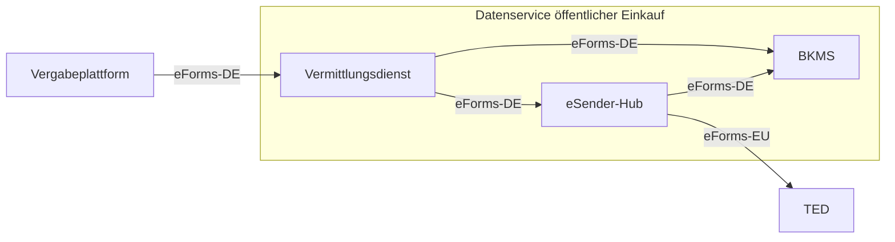

# Dokumentation zur Anbindung an den OZG-Vermittlungsdienst und den Systemverbund

```mermaid
graph LR; 
Vergabeplattform-->|eForms-DE|Vermittlungsdienst
subgraph Datenservice öffentlicher Einkauf
Vermittlungsdienst-->|eForms-DE|BKMS
Vermittlungsdienst-->|eForms-DE|eSender-Hub
end
eSender-Hub-->|eForms-DE|BKMS
eSender-Hub-->|eForms-EU|TED
```

