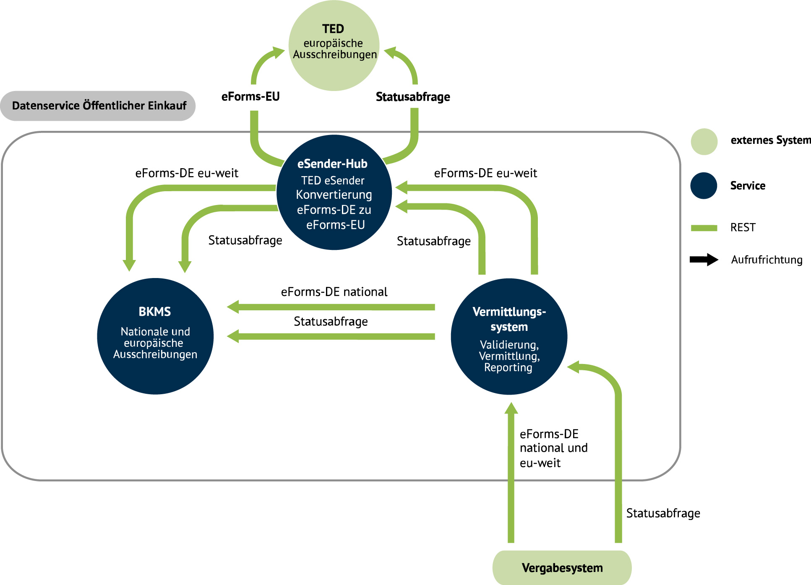

## EfA-Umsetzungsprojekt "Zugang zur öffentlichen Vergabe"
# Dokumentation Vermittlungsdienst

## Inhalte
- Einführung
- Aufgaben des Vermittlungsdienstes
- Datenservice Öffentlicher Einkauf Diagramm
- [Verfügbare Entwicklungsumgebungen](Development_environments.md)
- [Workflow](Workflow.md)
- [Statusinformationen](Status_information.md)
- [eForms Unterstützung](eForms_support.md)
- [Releases](Releases.md)
- ...
  

## Einführung
Sie möchten Unternehmen und die öffentliche Verwaltung dabei unterstützen, bürokratische Hürden im Beschaffungsprozess abzubauen
und den Wettbewerb bei öffentlichen Aufträgen stärken? Dann binden Sie sich mit Ihrer Vergabeplattform gerne an den von der Freien
Hansestadt Bremen bereitgestellten Vermittlungsdienst an. Der Dienst ist Teil des Bremer EfA-Projektes „Zugang zur öffentlichen Vergabe“,
das im Projektkontext „Datenservice Öffentlicher Einkauf“ – einem Kooperationsprojekt des Bundes und Landes Bremen – umgesetzt wird.
Mit Hilfe des Vermittlungsdiensts können Vergabesysteme Bekanntmachungen an den Bekanntmachungsservice und TED übermitteln und so
bundesweite Ausschreiben für Unternehmen leicht zugänglich machen. Wie Sie sich anbinden können, erfahren Sie in dieser Dokumentation.
  

## Die Aufgaben des Vermittlungsdiensts auf einen Blick
- Validierung aller eingehenden Bekanntmachungen nach
Schema- sowie Schematron-Regeln 
- Prüfung: Ist die Bekanntmachungen bereits im Bekanntmachungsservice
veröffentlicht
- Übermittlung unterschwelliger Bekanntmachungen an
den Bekanntmachungsservice
- Übermittlung oberschwelliger Bekanntmachungen über
den eSender-Hub an TED und an den
Bekanntmachungsservice
  

## Datenservice Öffentlicher Einkauf Systemarchitektur

