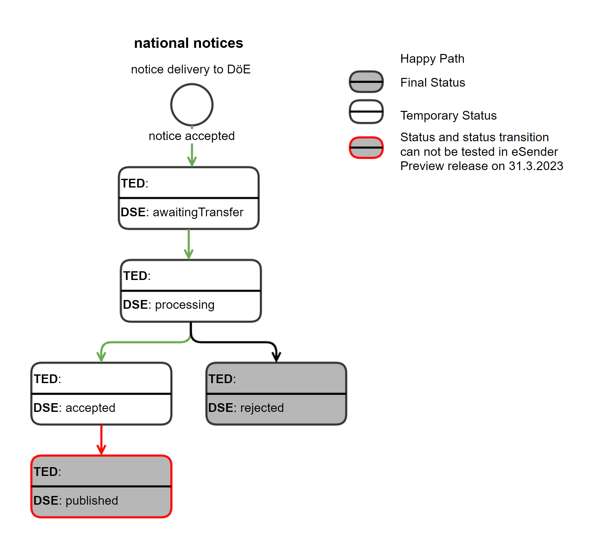
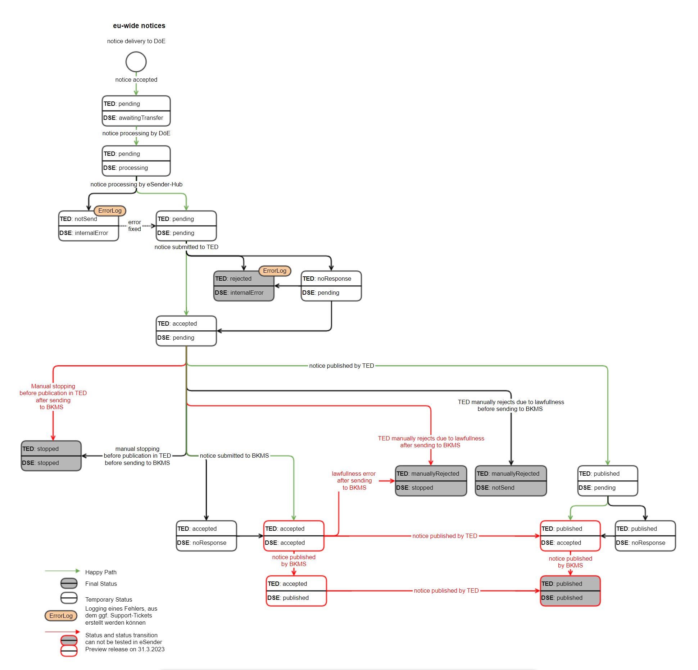

**EfA-Umsetzungsprojekt "Zugang zur öffentlichen Vergabe"**
### Dokumentation Vermittlungsdienst
[Startseite](Readme.md)
  

# Statusinformationen

Der Status und weitere Informationen zu aufgetretenen Fehlern oder Warnungen zu einer Bekanntmachung können jederzeit von den FVH abgefragt werden, indem ein Request an den Mediator gesendet wird. Da der Mediator regelmäßig sämtliche Statusänderungen zu eu-weiten Bekanntmachungen vom eSender abfragt, liegt auch im Mediator immer der aktuelle Status einer Bekanntmachung vor, egal ob national oder eu-weit. Ebenso werden eventuelle Fehler von TED oder BKMS gespeichert und an den Mediator weitergegeben. Bezüglich der Statusabfrage ist zu beachten, dass für eu-weite Bekanntmachungen immer zwei Statuswerte für jede Bekanntmachung existieren: Der Status der internen Prozessierung im Vermittlungsservice (DöE-Status) und der Status in TED (TED-Status). Die TED Statuswerte orientieren sich an den Statuswerten der EU. 
  

## Status nationale Bekanntmachungen

Die folgenden Statuswerte existieren für nationale Bekanntmachungen: 

**Anmerkung:** Die in kursiv formatierten Statuseinträge sind im eSender Release vom 31.3.2023 noch nicht testbar, da vom BKMS noch nicht zwischen accepted und published unterschieden wird.

| DöE Status       | Beschreibung                                                                                                   |
| ---------------- | -------------------------------------------------------------------------------------------------------------- |
| awaitingTransfer | Die Bekanntmachung wurde vom Mediator angenommen und akzeptiert. Nun wird die Versendung zum BKMS vorbereitet. |
| processing       | Die Bekanntmachung wird vom BKMS verarbeitet.                                                                  |
| accepted         | Die Bekanntmachung wurde vom Bekanntmachungsservice akzeptiert.                                                |
| rejected         | Die Bekanntmachung wurde von BKMS abgelehnt.                                                                   |
| ⚠️*published*      | *Die Bekanntmachung wurde im BKMS veröffentlicht.*                                                             |

**Anmerkung:** Die kursiv markierten Statuskombinationen sind im eSender Preview Release am 31.3.2023 noch nicht testbar, da der BKMS noch nicht zwischen accepted und published unterscheidet. 

  

## Status eu-weite Bekanntmachungen
Die folgenden Statuswerte existieren für eu-weite Bekanntmachungen: 

**Anmerkung:** Die in kursiv formatierten Statuskombinationen sind im eSender Preview Release am 31.3.2023 noch nicht testbar, da Bekanntmachungen in eFormsDE 1.0.0 noch nicht vom BKMS angenommen werden.

| TED status (ted-status) | Datenservice Öffentlicher Einkauf Status (doe-status) | Beschreibung                                                                                                                                                             |
| ----------------------- | ----------------------------------------------------- | ------------------------------------------------------------------------------------------------------------------------------------------------------------------------ |
| pending                 | awaitingTransfer                                      | Der Vermittlungsdienst hat die Bekanntmachung angenommen und verarbeitet sie in Kürze.                                                                                   |
| pending                 | processing                                            | Der Vermittlungsdienst verarbeitet die Bekanntmachung.                                                                                                                   |
| pending                 | pending                                               | Die Bekanntmachung wurde vom eSender zur weiteren Verarbeitung angenommen. Die Übermittlung der Bekanntmachung an TED und an den Bekanntmachungsservice stehen noch aus. |
| noResponse              | pending                                               | Die Übermittlung an TED wird erneut versucht. Die Übermittlung der Bekanntmachung an den Bekanntmachungsservice steht noch aus.                                          |
| notSend                 | internalError                                         | Ein interner Fehler ist aufgetreten. Ein entsprechendes Support-Ticket wird ggf. erstellt.                                                                               |
| rejected                | internalError                                         | Ein interner Fehler ist aufgetreten. Ein entsprechendes Support-Ticket wird ggf. erstellt.                                                                               |
| stopped                 | notSend                                               | Die Bekanntmachung wurde in TED gestoppt und wird nicht zum Bekanntmachungsservice gesendet.                                                                             |
| ⚠️*stopped*               | ⚠️*accepted/ published/ noResponse*                     | *Die Bekanntmachung wurde in TED gestoppt und wird in Kürze auch im Bekanntmachungsservice gestoppt werden.*                                                             |
| ⚠️*stopped*               | ⚠️*stopped*                                             | *Die Bekanntmachung wurde sowohl in TED als auch im Bekanntmachungsservice gestoppt.*                                                                                    |
| accepted                | pending                                               | Die Bekanntmachung wurde von TED akzeptiert, die Übermittlung an den Bekanntmachungsservice steht noch aus.                                                              |
| accepted                | noResponse                                            | Die Bekanntmachung wurde von TED akzeptiert, aber noch nicht veröfentlicht. Die Übermittlung an den Bekanntmachungsservice wird erneut versucht.                         |
| ⚠️*accepted*              | ⚠️*accepted*                                            | *Die Bekanntmachung wurde von TED und dem Bekanntmachungsservice akzeptiert, aber noch nicht veröffentlicht.*                                                            |
| ⚠️*accepted*              | ⚠️*published*                                           | *Die Bekanntmachung wurde von TED akzeptiertt, aber noch nicht veröffentlicht. Die Bekanntmachung wurde bereits im Bekanntmachungsservice veröffentlicht.*               |
| published               | pending                                               | Die Bekanntmachung wurde in TED veröffentlicht, die Übermittlung an den Bekanntmachungsservice steht noch aus.                                                           |
| published               | noResponse                                            | Die Bekanntmachung wurde in TED veröffentlicht, die Übermittlung an den Bekanntmachungsservice wird erneut versucht.                                                     |
| ⚠️*published*             | ⚠️*accepted*                                            | *Die Bekanntmachung wurde in TED veröffentlicht und vom Bekanntmachungsservice akzeptiert, aber ncoh nicht veröffentlicht.*                                              |
| ⚠️*published*             | ⚠️*published*                                           | *Die Bekanntmachung wurde in TED und im Bekanntmachungsservice veröffentlicht.*                                                                                          |
| manuallyRejected        | notSend                                               | Die Bekanntmachung wurde von TED auf Grund einer rechtlichen Prüfung manuell abgelehnt und wurde nicht zum Bekanntmachungsservice gesendet.                              |
| ⚠️*manuallyRejected*      | ⚠️*accepted/ published/ noResponse*                     | *Die Bekanntmachung wurde von TED auf Grund einer rechtlichen Prüfung manuell abgelehnt und wird in Kürze auch im Bekanntmachungsservice gestoppt.*                      |
| ⚠️*manuallyRejected*      | ⚠️*stopped*                                             | Die Bekanntmachung wurde von TED auf Grund einer rechtlichen Prüfung manuell abgelehnt und wurde auch im Bekanntmachungsservice gestoppt.*                               |

**Anmerkung:** Die in kursiv markierten Statuskombinationen sind im eSender Preview Release am 31.3.2023 noch nicht testbar, da der BKMS eFormsDE 1.0.0 und das Stoppen von Bekannmachungen noch nicht unterstützt 

