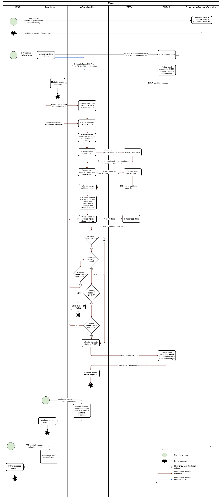

**EfA-Umsetzungsprojekt "Zugang zur öffentlichen Vergabe"**
### Dokumentation Vermittlungsdienst
[Startseite](Readme.md)
  

# Workflow des Datenservice öffentlicher Einkauf

Im folgenden Diagram ist der generelle Workflow einer Bekanntmachung beschrieben. Der zentrale Punkt zum Einliefern von Bekannmachungen und Abfragen von Statusinformationen für Fachverfahrenshersteller (FVH) ist der Mediator. Bevor in den Mediator eingeliefert werden kann, muss ein Account in Keycloak erstellt und dort ein API-Key generiert werden. Mit diesem API-Key erfolgt die Authetifikation zum Einsenden in den Mediator. Bereits beim Einsenden wird der Mediator das eForms entsprechend seiner Version validieren (eFormsEU 0.0.1, 1.0, 1.5 & eFormsDE 1.0.0) und diese annehmen oder ablehnen. Bei erfolgreicher Einlieferung wir die Bekanntmachung weiter prozessiert. Abhängig davon, ob es sich um ein nationales oder eu-weites eForms-Dokument handelt, werden Bekanntmachungen entweder direkt an den BKMS (national) oder an den eSender (eu-weit) weitergeleitet. Der BKMS akzeptiert derzeit (auf der Umgebung Alpha im Rahmen des eSender Preview Release 31.3.23) die Versionen eFormsEU 0.0.1 und 1.0. Im eSender erfolgt bei Einlieferung von eFormsDE 1.0.0 eine Transformation in eFormsEU 1.5. Hierbei ist zu beachten, dass im eSender derzeit (Stand eSender Preview Release 31.3.23) nur eFormsDE 1.0.0 unterstützt wird, nicht eFormsDE 1.0.1, da das codetable mapping noch nicht final ist.

Nach erfolgreicher Transformation in eFormsEU1.5 wird die Bekanntmachung an TED (Umgebung Preview) weitergeleitet. Die Rückmeldung von TED (Erfolgreiche Einlieferung oder Ablehnung) wird gespeichert und triggert einen entsprechenden Statuswechsel. Im Anschluss wird von TED der zugehörige Validierungsreport abgefragt, gespeichert und eventuelle Fehler oder Warnungen (zum Beispiel Lawfulness warnings) extrahiert. Bei erfolgreicher Einlieferung wird der exakte Zeitpunkt der Einlieferung erfasst, um die 48h-Frist für eine nationale Veröffentlichung zu berechnen. Wenn keine Warnungen existieren wird nach Ablauf der 48h die Bekanntmachung an den BKMS weitergeleitet. Sollten Lawfulness Warnungs existieren, wird die Bekanntmachung erst nach 5 Tagen an den BKMS weitergeleitet, um die manuelle Prüfung von TED abzuwarten. Aktuell unterstützt der BKMS Bekanntmachungen mit Version eFormsDE 1.0.0 und eFormsEU1.5 nicht, sodass der DöE Status für eu-weite Bekanntmachungen immer "Pending" sein wird (Stand eSender Preview Release 31.3.23). Hierzu wird vom BKMS intern eine spezielle HTTP 400 Fehlermeldung ausgegeben (z.B. Unsupported EForms version: "eforms-de-1.0"), um zu verdeutlichen, dass die Ablehnung nur durch die (noch) nicht unterstützte Version verursacht wird. Während des gesamten Prozesses werden Statusänderungen z.B. ausgelöst durch eine Rückmeldung von TED sowie aufgetretene Fehler oder Warnungen intern gespeichert. Relevante Statusinformationen und können jederzeit durch die FVH vom Mediator abgefragt werden (Siehe Statusliste und Diagramme).
  

