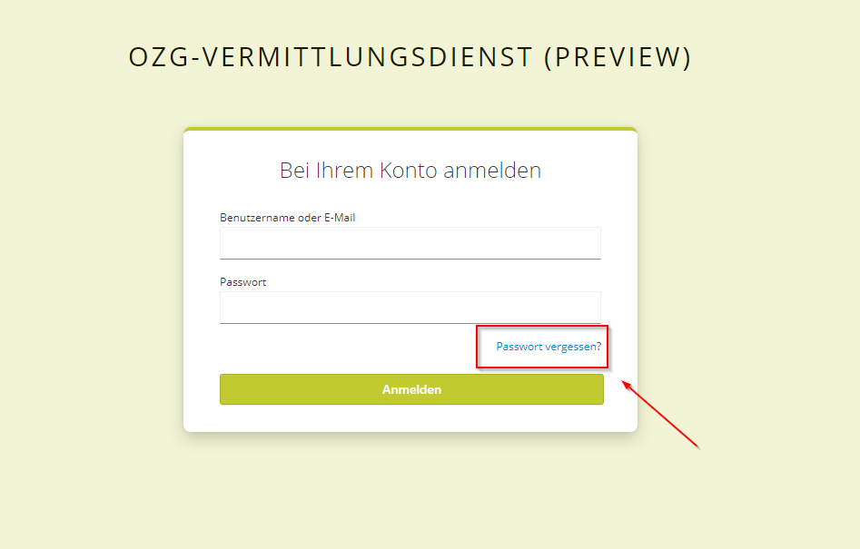
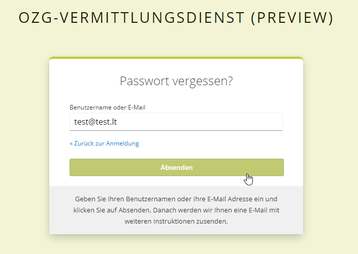
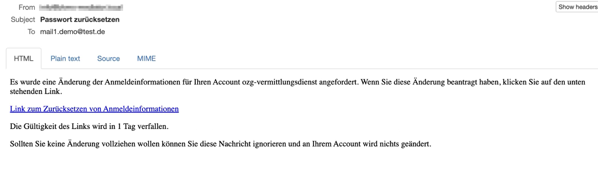
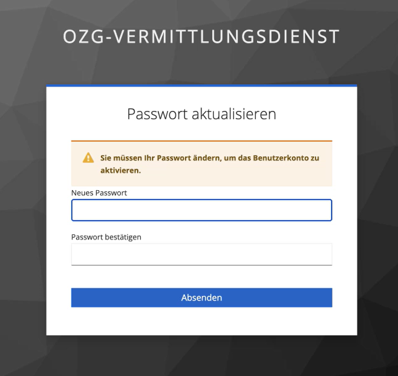

### Datenservice Öffentlicher Einkauf
[Inhaltsverzeichnis](/documentation/documentation.md)
<br>

>**Hinweis** <br>
>Bitte beachten Sie: Wenn unterschwellige Bekanntmachungen weiterhin an service.bund.de gesendet werden, dürfen diese NICHT zusätzlich an den Vermittlungsdienst gesendet werden!

# Anbindung an den Vermittlungsdienst
Die Übermittlung von Bekanntmachungen an den Vermittlungsdienst kann über die [REST-API](#anbindung-per-rest-api) des Vermittlungsdienst oder über das [eDelivery-Network PEPPOL](#anbindung-per-peppol) erfolgen.
<br>

## Anbindung per REST-API
Unter https://ozg-vermittlungsdienst.de wird die REST-API und die dazugehörige Dokumentation der vorhandenen Endpoints zur Verfügung gestellt.
Für die Nutzung der API müssen einmalig Zugangsdaten beantragt werden. Die Autorisierung erfolgt über OAuth 2.0.
<br>

### Beantragen eines Accounts zum Einliefern von Bekanntmachungen

>**Hinweis** <br>
>Nach dem Produktionsrelease im Juni 2023 muss für die Produktions- und Stagingumgebung erneut ein User angefragt werden, auch wenn in Preview bereits ein User besteht. 

Ab den 04.10.2023 erfolgt die Einrichtung eines neuen Accounts über das Self-Service-Portal (Produktionumgebung: https://portal.ozg-vermittlungsdienst.de). Ein Konto kann im Portal erstellt werden, indem eine E-Mail-Adresse und ein Passwort festgelegt werden. Nach Bestätigung der E-Mail-Adresse kann der Nutzer sich anmelden und das Antragsformular für einen neuen VD-Account ausfüllen. Pro Vergabeplattform ist ein separater Benutzer notwendig. <br>

Nach der Erstellung des Benutzers wird zur Überprüfung an die angegebene Benutzer-E-Mail-Adresse eine Authentifizierungs-E-Mail versendet, welche einen Link zur Authentifizierung und zur Erstellung des Passworts enthält. Wenn Sie 10 Accounts beantragen auf einer Umgebung, benötigen Sie auch 10 individuelle E-Mail-Adressen. Die E-Mail-Adresse dient zum Abruf der Tokens, die Sie zur eindeutigen Authentifizierung mit dem Account benötigen. Deshalb muss diese einzigartig sein.
<br><br>
Der Link ist 10 Tage gültig.<br>
Klicken Sie auf den Link und folgen Sie den Anweisungen zur Passwort-Erstellung.
<br><br>
Mit den erstellten Zugangsdaten kann mit Hilfe der API ein Access-Token und ein Refresh-Token generiert werden.
<br><br>
Bitte beachten Sie, dass Sie pro Entwicklungsumgebung (Preview, Staging, Produktion) einen Zugang beantragen müssen. Es wird keine Synchronisierung der Zugangsdaten durchgeführt. [Preview](https://portal.preview-ozg-vermittlungsdienst.de/)- und [Staging](https://portal.staging-ozg-vermittlungsdienst.de/)-Accounts können in der entsprechenden Self-Service-Portalumgebung angefordert werden.
<br>

### Authentifizierung und Autorisierung (Access-Token, Refresh-Token)
Der Endpunkt `POST /api/token` wird mit den zu übergebenden Parametern `username` und `password` genutzt, um einen `access_token` und `refresh_token` zu erhalten. `username` ist hierbei die von Ihnen angegebene E-Mail-Adresse. 

Der `access_token` ist 24 Stunden gültig und kann bei allen folgenden Anfragen im Header folgendermaßen zur Autorisierung genutzt werden: `Authorization: Bearer <<access_token>>`. Nach Ablauf der 24 Stunden ist eine erneute Authentifizierung nötig. Um eine regelmäßige Authentifizierung mit `username` und `password` zu vermeiden, kann mit Hilfe des `refresh_token` und dem Endpunkt `POST /api/token/refresh` ein neuer `access_token` generiert werden, ohne eine erneute vollständige Authentifizierung durchführen zu müssen. 

Durch das Anfragen eines neuen Tokens, wird der vorige Token nicht invalidiert. 

Beispielantwort der Endpunkte `POST /api/token` und `POST /api/token/refresh`: 

```
{
  "access_token": "eyJhbGciOikpXVCJ9.eyJzMDIyfQ.SflKxwRJSM",
  "expires_in": 36000,
  "refresh_expires_in": 36000,
  "refresh_token": "eyJhbGciOikpXVCJ9.eyJzMDIyfQ.SflKxwRJSM",
  "token_type": "Bearer",
  "not-before-policy": 0,
  "session_state": "e65f24ae-4e90-4635-8ae7-4fb89fe471bf",
  "scope": "profile email"
}
```
<br>

Weitere Informationen zum Konzept des Refresh-Token und Hinweise zur Umsetzung werden unter https://auth0.com/blog/refresh-tokens-what-are-they-and-when-to-use-them/ zur Verfügung gestellt.
<br>


## Anbindung per PEPPOL
Es ist zukünftig möglich, Bekanntmachungen auch über das eDelivery-Network PEPPOL an den Vermittlungsdienst zu übermitteln. Details und weitere Informationen folgen. 
<br>


## Wie setzt man ein Benutzerpasswort in Keycloak zurück?

>**Hinweis** <br>
> Das Passwort des Benutzers ist gleichzeitig das Passwort, welches für die Einlieferung bei der Vermittlungsdienstschnittstelle genutzt wird! <br>
> Sollten Sie das Passwort ändern, stellen Sie sicher, dass es auch in der Software zur Einlieferung in den Vermittlungsdienst geändert wird! 

1. Self-Service Portal der gewünschten Umgebung aufrufen (zu finden unter [Systemumgebungen](/documentation/Development_environments.md) in der Spalte _Self Service Portal_ ).

2. Auf 'Passwort vergessen?' klicken.<br>

<br>

3. E-Mail-Adresse eintragen und auf 'Absenden' klicken.<br>

<br>

4. Die Meldung 'Sie sollten in Kürze eine E-Mail mit weiteren Instruktionen erhalten' wird angezeigt.<br>

<br>

5. Überprüfen der E-Mails: Ein Link zum Zurücksetzen der Anmeldeinformationen ist in der E-Mail erhalten.<br>

<br>

6. Auf 'Link zum Zurücksetzen von Anmeldeinformationen' klicken.
<br>

7. Der Benutzer wird auf die Seite 'Passwort aktualisieren' umgeleitet.<br>

<br>

8. Neues Passwort eintragen und bestätigen und auf 'Absenden' klicken.<br>
Das Passwort muss aus mindestens 8 Zeichen bestehen, 1 Großbuchstaben und 1 Zahl enthalten.
<br>

9. Das Passwort muss in der FVH-Software hinterlegt werden, um sicher zu gehen, dass die Verbindung mit dem Vermittlungsdienst funktioniert.
<br>

## Zugang löschen
Um Ihren Zugang zu löschen, senden Sie bitte eine E-Mail an den Support der Nortal AG [oeffentliche-vergabe-support@nortal.com](mailto:oeffentliche-vergabe-support@nortal.com).<br>
In der E-Mail müssen folgende Angaben enthalten sein:

- Systemumgebung, in der die Zugangsdaten gelöscht werden sollen
- E-Mail-Adresse, welche als Benutzername verwendet wird
- URL der Vergabeplattform
- Vor- und Nachname sowie die E-Mail-Adresse des Vertreters des FVH
- Name des FVH

Nach Prüfung der angegebenen Daten in der E-Mail werden wir die Löschungs des Zugangs durchführen und Ihnen eine Bestätigung per E-Mail zukommen lassen.
