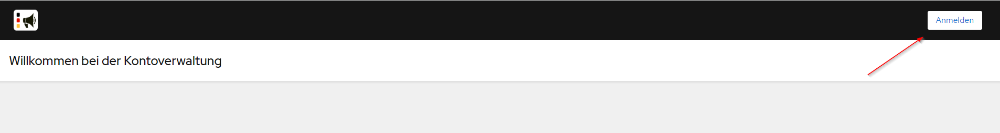

### EfA-Umsetzungsprojekt "Zugang zur öffentlichen Vergabe"
## Dokumentation Vermittlungsdienst
[Inhaltsverzeichnis](/documentation/documentation.md)
<br><br>

# Anbindung an den Vermittlungsdienst
Die Übermittlung von Bekanntmachungen an den Vermittlungsdienst kann über die [REST API](#anbindung-per-rest-api) des Vermittlungsdienst oder mit Hilfe des [eDelivery Network PEPPOL](#anbindung-per-peppol-in-der-umsetzung) (in der Umsetzung) erfolgen.
<br><br>

## Anbindung per REST API
Unter https://bkms-mediator-app-preview.efa-fhb.apps-int.nortal.com wird die REST API und die dazugehörige Dokumentation, der vorhandenen Endpoints, zur Verfügung gestellt.
Für die Nutzung der API müssen einmalig Zugangsdaten beantragt werden, mit derer Hilfe entsprechende Access Token und Refresh Token generiert werden können, um eine Autorisierung für den Zugriff auf die API zu erhalten.
<br><br>

### Beantragen eines Zugangs durch einen FVH
Ein Vertreter des Fachverfahrenshersteller beantragt die Einrichtung eines neuen Benutzers per E-Mail an oeffentliche-vergabe@nortal.com bei der Nortal AG. Es muss pro Vergabeplattform ein Benutzer angelegt werden.<br>
In der E-Mail müssen folgende Angaben enthalten sein:

- Benutzer E-Mail-Adresse welche als Benutzername verwendet werden soll
- URL der Vergabeplattform
- Vor- und Nachname sowie die E-Mail-Adresse des Vertreters des FVH
- Name des FVH

Nach der Erstellung des Benutzers wird zur Überprüfung an die angegebene Benutzer E-Mail-Adresse eine Authentifizierungs-E-Mail versendet, welche einen Link zur Authentifizierung und zur Erstellung des Passworts enthält.
<br><br>
Der Link ist 24 Stunden lang gültig.<br>
Klicken Sie auf den Link und folgen Sie den Anweisungen zur Passwort-Erstellung.
<br><br>
Mit den nun erstellten Zugangsdaten kann mit Hilfe der API ein Access Token und ein Refresh Token generiert werden.
<br><br>

### Authentifizierung und Autorisierung (Access Token, Refresh Token)
Mit Hilfe des Endpoints `POST/ api/token` und den übermittelten Zugangsdaten `username` und `password` kann man sich an der API authentifizieren. In der Antwort des Endpoints wird nach erfolgreicher Authentifizierung ein `access_token` und ein `refresh_token` übermittelt.

Der `access_token` ist 24 Stunden gültig. Nach ablauf der 24 Stunden ist eine erneute Authentifizierung nötig. Um eine regelmäßige Authentifizierung mit `username` und `password` zu vermeiden, kann mit Hilfe des `refresh_token` und dem Enpoint `POST/ api/token/refresh` neue `access_token` generieren, ohne eine erneute vollständige Authentifizierung durchführen zu müssen.

```
{
  "access_token": "eyJhbGciOikpXVCJ9.eyJzMDIyfQ.SflKxwRJSM",
  "expires_in": 36000,
  "refresh_expires_in": 36000,
  "refresh_token": "eyJhbGciOikpXVCJ9.eyJzMDIyfQ.SflKxwRJSM",
  "token_type": "Bearer",
  "not-before-policy": 0,
  "session_state": "e65f24ae-4e90-4635-8ae7-4fb89fe471bf",
  "scope": "email profile"
}
```
/// Beispiel einer Antwort der zwei Token Endpoints.
<br><br>

Weitere Informationen zum Konzept des Refresh Token und Hinweise zur Umsetzung werden unter https://auth0.com/blog/refresh-tokens-what-are-they-and-when-to-use-them/ zur Verfügung gestellt.
<br><br><br>


## Anbindung per PEPPOL (in der Umsetzung)
Es ist zukünftig möglich Bekanntmachungen auch über das eDelivery Network PEPPOL an den Vermittlungsdienst zu übermitteln. Details und weitere Informationen folgen. 
<br><br><br>


## Wie setzt man ein Benutzer Passwort in Keycloak zurück?
1. Anmeldeseite aufrufen<br>
Testumgebung. https://keycloak-preview.efa-fhb.apps-int.nortal.com/realms/ozg-vermittlungsdienst/account/#/ → Auf 'Anmelden' klicken<br>

<br><br>

2. Auf 'Passwort vergessen?' klicken<br>

<br><br>

3. E-Mail-Adresse eintragen und auf 'Absenden' klicken<br>

<br><br>

4. Die Meldung 'Sie sollten in Kürze eine E-Mail mit weiteren Instruktionen erhalten' wir angezeigt.<br>

<br><br>

5. Überprüfen der E-Mails: Ein Link zum Zurücksetzen der Anmeldeinformationen ist in der E-Mail erhalten.<br>

<br><br>

6. Auf 'Link zum Zurücksetzen von Anmeldeinformationen' klicken.
<br><br>

7. Der Benutzer wird auf die Seite 'Passwort aktualisieren' umgeleitet.<br>

<br><br>

8. Neues Passwort eintragen und bestätigen und auf 'Absenden' klicken.<br>
Das Passwort muss aus mindestens 8 Zeichen bestehen, 1 Großbuchstaben und 1 Zahl enthalten.
<br><br>

9. Das Passwort muss in der FVH-Software hinterlegt werden um sicher zu gehen, dass die Verbindung mit dem Vermittlungsdienst funktioniert.