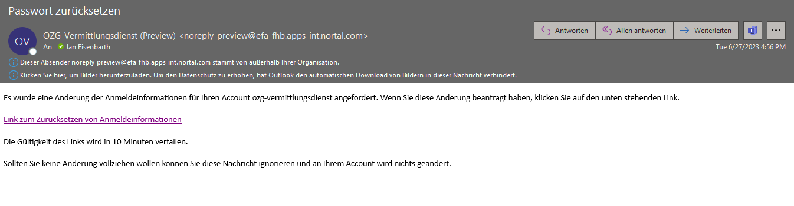
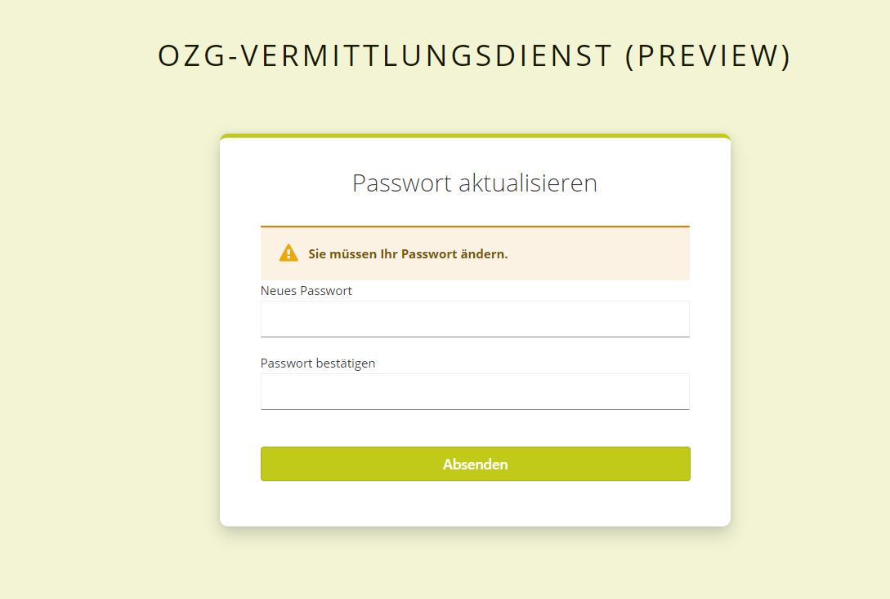

### EfA Implementation Project "Access to Public Procurement".
## Documentation mediation service
[table of contents](/documentation/documentation.md)
<br>

>**Note** <br>
>Please note: If subliminal announcements are still sent to service.bund.de, they must NOT be sent to the mediation service in addition!

# Connection to the switching service
Notices can be sent to the mediation service via the mediation service's [REST API](#connection-per-rest-api) or via the [eDelivery Network PEPPOL](#connection-per-peppol-in-implementation) (in implementation).
<br>

## Connection via REST API
The REST API and associated documentation for the existing endpoints is provided at https://ozg-vermittlungsdienst.de.
Access data must be requested once in order to use the API. The authorization is done via OAuth 2.0.
<br>

### Apply for an account to deliver announcements.

>**Note** <br>
>After the production release in June, a user must be requested again for the production and staging environment, even if a user already exists in Preview.

Starting 10/04/2023, a new account will be created via the Self-Service Portal (production environment: https://portal.ozg-vermittlungsdienst.de). An account can be created in the portal by specifying an email address and password. After confirming the email address, the user can log in and fill out the application form for a new VD account. A separate user is required per award platform. <br>

After the user is created, an authentication email will be sent to the specified user email address for verification, which will include a link to authenticate and create the password. If you apply for 10 accounts on one environment, you will also need 10 individual email addresses. The email address is used to retrieve the tokens you need to uniquely authenticate with the account. Therefore, it must be unique.
<br><br>
The link is valid for 10 days.<br>
Click on the link and follow the password creation instructions.
<br><br>
With the created credentials, an Access Token and a Refresh Token can be generated using the API.
<br><br>
Please note that you need to request one access per development environment (preview, staging, production). There will be no synchronization of access credentials. [Preview](https://portal.preview-ozg-vermittlungsdienst.de/) and [Staging](https://portal.staging-ozg-vermittlungsdienst.de/) accounts can be requested in the corresponding self-service portal environment.
<br>

### Authentication and Authorization (Access Token, Refresh Token).
The `POST /api/token` endpoint is used with the `username` and `password` parameters to be passed to obtain an `access_token` and `refresh_token`. The `username` is the email address you provided.

The `access_token` is valid for 24 hours and can be used for authorization in all following requests in the header as follows: `Authorization: Bearer <<access_token>>`. After the 24 hours have expired, a new authentication is necessary. To avoid regular authentication with `username` and `password`, a new `access_token` can be generated using the `refresh_token` and the `POST /api/token/refresh` endpoint without having to perform a full authentication again.

Requesting a new token does not invalidate the previous token.

Example response of the `POST /api/token` and `POST /api/token/refresh` endpoints:

```
{
  "access_token": "eyJhbGciOikpXVCJ9.eyJzMDIyfQ.SflKxwRJSM",
  "expires_in": 36000,
  "refresh_expires_in": 36000,
  "refresh_token": "eyJhbGciOikpXVCJ9.eyJzMDIyfQ.SflKxwRJSM",
  "token_type": "bearer",
  "not-before-policy": 0,
  "session_state": "e65f24ae-4e90-4635-8ae7-4fb89fe471bf",
  "scope": "profile email"
}
```
<br>

More information on the Refresh Token concept and implementation guidance is provided at https://auth0.com/blog/refresh-tokens-what-are-they-and-when-to-use-them/.
<br>


## Connection via PEPPOL (in implementation).
In the future, it will also be possible to transmit notices to the switching service via the eDelivery Network PEPPOL. Details and further information will follow.
<br>


## How to reset a user password in Keycloak?

>**Note** <br>
>The user's password is also the password used for submission to the switching service interface! <br>
> If you change the password, make sure that it is also changed in the software for submission to the mediation service!

1. call account management of the desired environment (to be found under [system environments](/documentation/Development_environments.md) in the column _Account Management (Keycloak)_)

2. click on 'Forgotten password?"<br>

<br>

3. enter email address and click on 'submit'<br>

<br>

4. the message 'You should receive an email shortly with further instructions' will be displayed.<br>

<br>

5. check emails: a link to reset the credentials is received in the email.<br>

<br>

6. click on 'link to reset credentials'.
<br>

7. user will be redirected to 'Update password' page.<br>

<br>

8. enter and confirm new password and click on 'Submit'.<br>
Password must be at least 8 characters, contain 1 capital letter and 1 number.
<br>

9.The password must be stored in the FVH software to ensure that the connection with the switching service works.
<br>

## Delete access
To delete your access, please send an email to Nortal AG support [oeffentliche-vergabe-support@nortal.com](mailto:oeffentliche-vergabe-support@nortal.com).<br>
The email must contain the following information:

- System environment in which the access data is to be deleted
- E-mail address which is used as username
- URL of the awarding platform
- First and last name as well as e-mail address of the representative of the FVH
- Name of the FVH

After checking the data provided in the e-mail, we will carry out the deletion of the access and send you a confirmation by e-mail...
