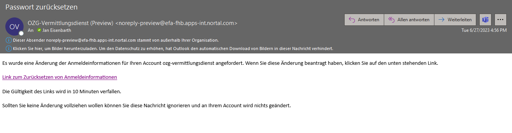

### EfA-Umsetzungsprojekt "Zugang zur öffentlichen Vergabe"
## Dokumentation Vermittlungsdienst
[Inhaltsverzeichnis](/documentation/documentation.md)
 

# Verfügbare Systemumgebungen
Aktuell steht eine **Test-, Referenz- und eine Produktionsumgebung** des Vermittlungsdiensts zur Verfügung. Jede Vermittlungsdienst-Instanz sendet innerhalb der Umgebung die Daten an den entsprechenden Bekanntmachungsservice. Mit Anbindung des eSender-Hubs ist der Datenservice öffentlicher Einkauf auch in der Lage, Bekanntmachungen an die entsprechende TED-Umgebung zu übermitteln.
  

**Hinweis:** Mit dem Production Release am 30.06.2023 wird der eSender-Hub in der Produktivumgebung angebunden und testbar sein.
 

<table class="wrapped">
  <colgroup>
    <col/>
    <col/>
    <col/>
    <col/>
  </colgroup>
  <thead>
    <tr>
      <th style="text-align: left;">
         
      </th>
      <th style="text-align: left;">
        
Preview Umgebung

      </th>
      <th style="text-align: left;">
        
Staging Umgebung 

      </th>
      <th style="text-align: left;">
        
Production Umgebung 

      </th>
    </tr>
  </thead>
  <tbody>
    <tr>
      <td style="text-align: left;">URL</td>
      <td style="text-align: left;">
        bis 15.09.2023: <a class="external-link" href="https://preview.ozg-vermittlungsdienst.de" rel="nofollow">https://preview.ozg-vermittlungsdienst.de</a>  
        ab 30.08.2023: <a class="external-link" href="https://preview-ozg-vermittlungsdienst.de" rel="nofollow">https://preview-ozg-vermittlungsdienst.de</a>
      </td>
      <td style="text-align: left;">
        bis 15.09.2023: <a class="external-link" href="https://staging.ozg-vermittlungsdienst.de" rel="nofollow">https://staging.ozg-vermittlungsdienst.de</a>  
        ab 30.08.2023: <a class="external-link" href="https://staging-ozg-vermittlungsdienst.de" rel="nofollow">https://staging-ozg-vermittlungsdienst.de</a>
      </td>
      <td style="text-align: left;">
        <a class="external-link" href="https://ozg-vermittlungsdienst.de" rel="nofollow">https://ozg-vermittlungsdienst.de</a>
      </td>
    </tr>
    <tr>
      <td style="text-align: left;">IP Address(es)</td>
      <td style="text-align: left;">4.245.108.202</td>
      <td style="text-align: left;">185.158.224.47</td>
      <td style="text-align: left;">185.158.224.47 + 185.158.224.58</td>
    </tr>
    <tr>
      <td style="text-align: left;">eForms Validator</td>
      <td style="text-align: left;">
        <a class="external-link" href="https://validator.preview-ozg-vermittlungsdienst.de/" rel="nofollow">https://validator.preview-ozg-vermittlungsdienst.de/</a>
      </td>
      <td style="text-align: left;">
        <a href="https://validator.staging-ozg-vermittlungsdienst.de/">https://validator.staging-ozg-vermittlungsdienst.de/</a>
      </td>
      <td style="text-align: left;">
        <a href="https://validator.ozg-vermittlungsdienst.de">https://validator.ozg-vermittlungsdienst.de</a>
      </td>
    </tr>
    <tr>
      <td style="text-align: left;">BKMS</td>
      <td style="text-align: left;">
        <a href="https://alpha.oeffentlichevergabe.de" rel="nofollow">https://alpha.oeffentlichevergabe.de</a>
      </td>
      <td style="text-align: left;">
        <a class="external-link" href="https://alpha.oeffentlichevergabe.de" rel="nofollow">https://alpha.oeffentlichevergabe.de</a>
      </td>
      <td style="text-align: left;">
        <a class="external-link" href="https://www.oeffentlichevergabe.de" rel="nofollow">https://www.oeffentlichevergabe.de</a>
      </td>
    </tr>
    <tr>
      <td style="text-align: left;">
        
Account Management (Keycloak)

      </td>
      <td style="text-align: left;">
        <a href="https://account-management.preview-ozg-vermittlungsdienst.de/" rel="nofollow">https://account-management.preview-ozg-vermittlungsdienst.de/</a>
        
           
        
      </td>
      <td style="text-align: left;">
        <a href="https://account-management.staging-ozg-vermittlungsdienst.de/" rel="nofollow" style="text-decoration: inherit;text-align: left;">https://account-management.staging-ozg-vermittlungsdienst.de//</a>
      </td>
      <td style="text-align: left;">
        <a href="https://account-management.ozg-vermittlungsdienst.de/" rel="nofollow" style="text-decoration: inherit;text-align: left;">https://account-management.ozg-vermittlungsdienst.de/</a>
      </td>
    </tr>
    <tr>
      <td style="text-align: left;">
        
TED

        

           
        

      </td>
      <td style="text-align: left;">
        <a class="external-link" href="https://enotices2.preview.ted.europa.eu/esenders/webjars/swagger-ui/index.html#/" rel="nofollow">https://enotices2.preview.ted.europa.eu</a>
         </td>
      <td style="text-align: left;">
        

          <a class="external-link" href="https://enotices2.preview.ted.europa.eu/esenders/webjars/swagger-ui/index.html#/" rel="nofollow">https://enotices2.preview.ted.europa.eu</a>
        

        

      </td>
      <td style="text-align: left;">
        

          <a class="external-link" href="https://enotices2.preview.ted.europa.eu/esenders/webjars/swagger-ui/index.html#/" rel="nofollow">https://enotices2.ted.europa.eu</a>
        

        

      </td>
    </tr>
  </tbody>
</table>

1. Account Management der gewünschten Umgebung aufrufen (zu finden unter [Systemumgebungen](/documentation/Development_environments.md) in der Spalte _Account Management (Keycloak)_)

2. Auf 'Passwort vergessen?' klicken 

 

3. E-Mail-Adresse eintragen und auf 'Absenden' klicken 

 

4. Die Meldung 'Sie sollten in Kürze eine E-Mail mit weiteren Instruktionen erhalten' wir angezeigt. 

 

5. Überprüfen der E-Mails: Ein Link zum Zurücksetzen der Anmeldeinformationen ist in der E-Mail erhalten. 

 

6. Auf 'Link zum Zurücksetzen von Anmeldeinformationen' klicken.
 

7. Der Benutzer wird auf die Seite 'Passwort aktualisieren' umgeleitet. 

 

8. Neues Passwort eintragen und bestätigen und auf 'Absenden' klicken. 
Das Passwort muss aus mindestens 8 Zeichen bestehen, 1 Großbuchstaben und 1 Zahl enthalten.
 

9. Das Passwort muss in der FVH-Software hinterlegt werden um sicher zu gehen, dass die Verbindung mit dem Vermittlungsdienst funktioniert.
 
