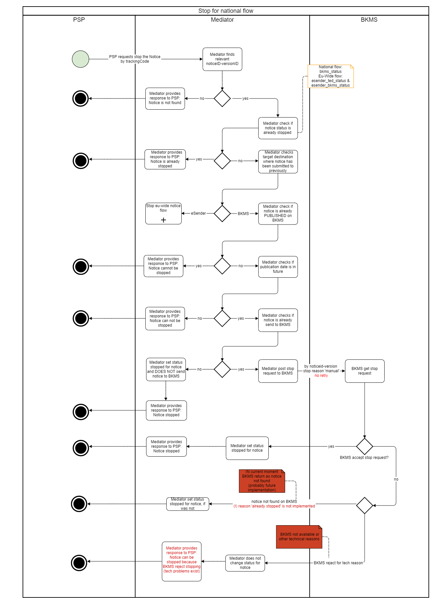

### EfA-Umsetzungsprojekt "Zugang zur öffentlichen Vergabe"
## Dokumentation Vermittlungsdienst
[Inhaltsverzeichnis](/documentation/documentation.md)
 

# Change Notices/ Stop-und-Update-Funktionalität

## Inhalt
- [Anpassen des Inhalts einer Bekanntmachung](#stop-oder-change)
    - [Update zu einer Bekanntmachung](#update)
	- [Change Notices](#change-notice)
- [STOP-Publikation Funktionalität](#stop-func)

## Anpassen des Inhalts einer Bekanntmachung
Es gibt zwei Möglichkeiten, den Inhalt einer Bekanntmachung zu ändern: Durch *Stop + Update* vor Veröffentlichung oder durch eine Änderungsmitteilung (*Change Notice*) nach der Veröffentlichung.
  

### Update zu einer Bekanntmachung
Eine Aktualisierung oder Neueinreichung (auch als Update bezeichnet) einer Bekanntmachung ist ein einfacher Bearbeitungsprozess, wenn die Bekanntmachung noch nicht in TED und/oder BKMS veröffentlicht ist. Wenn eine Bekanntmachung korrigiert werden muss, muss die vorherige Version zuerst gestoppt werden oder sich im Status "rejected" befinden. Andernfalls ist eine Aktualisierung nicht möglich, um sicherzustellen, dass zu jedem Zeitpunkt nur eine gültige Version eines Dokuments existiert. Um eine Aktualisierung zu erstellen, sollte die gleiche noticeID wie im vorhergehenden zu korrigierenden Dokument verwendet werden, nur die versionID muss erhöht werden (Lücken sind möglich). Eine Aktualisierung ist NICHT dasselbe wie eine Change Notice. Eine Aktualisierung enthält nicht die UBL-Extension einer Change Notice und kann nur eingereicht werden, bevor die Bekanntmachung veröffentlicht wird.
 

#### **Beispiele**

Szenario A: Korrektur einer abgelehnten Bekanntmachung durch eine Aktualisierung (Update)

1. Bekanntmachung A mit der noticeID ABC *Version 01* wird eingereicht und abgelehnt, z. B. weil sie falsch ausgefüllt wurde. Da sie abgelehnt wurde, wird sie nicht veröffentlicht.
2. Der FVH möchte diese Bekanntmachung korrigieren
3. Der FVH reicht eine Aktualisierung mit noticeID ABC *Version 02* ein.
4. Die Aktualisierung wird akzeptiert, da die vorherige Version des Dokuments den Status REJECTED hat.

Szenario B: Verwendung einer Aktualisierung (Update) zur Bearbeitung einer eingereichten Bekanntmachung

1. Bekanntmachung A mit der noticeID ABC *Version 01* wird eingereicht und angenommen. Sie ist noch nicht veröffentlicht, z. B. weil das gewünschte Veröffentlichungsdatum in der Zukunft liegt.
2. Der FVH möchte etwas in dieser Bekanntmachung bearbeiten, z. B. weil sich einige Informationen geändert haben und angepasst werden müssen.
3. Der FVH stoppt die vorherige Bekanntmachung noticeID ABC version 01 mit Hilfe der Stop-API (Dies ist obligatorisch, bevor eine Aktualisierung gesendet wird. TED hat angekündigt, dass dies in Zukunft wahrscheinlich auch in TED implementiert werden wird)
4. Das System stoppt die Bekanntmachung in TED und BKMS (je nachdem, wohin sie bereits gesendet wurde)
5. Der FVH reicht eine Aktualisierung mit noticeID ABC Version 02 ein.
6. Die Aktualisierung wird akzeptiert, da sich die vorherige Version im Status STOPPED befindet.
  

### Change Notice
Eine Change Notice ist eine Änderung, die auf eine bereits veröffentlichte Bekanntmachung angewendet werden muss. Wenn eine Änderungsmitteilung eingereicht wird, hat diese Bekanntmachung ihre eigene noticeID und versionID. Eine Change Notice enthält immer eine UBL-Extension, in der angegeben werden muss, welche Bekanntmachung geändert werden soll. Dies wird in dem Feld BT-738 Change Notice Identifier angegeben. Hier muss die noticeID-versionID oder die Notice Publication Number (wenn die referenzierte Notice im alten TED-XML Format eingereicht wurde) in der xml angegeben werden.

Beispiel für einen Referenzhinweis mit noticeID-versionID:

`<efbc:ChangedNoticeIdentifier>c4c415ee-ac08-4465-8fa6-57568cf69462-01</efbc:ChangedNoticeIdentifier>`

Beispiel für einen Referenzhinweis unter Verwendung der Notice Publication Number:

`<efbc:ChangedNoticeIdentifier>01234567-2022</efbc:ChangedNoticeIdentifier>`

Das Verfahren zur Einreichung einer Change Notice ist das gleiche wie bei jeder anderen Bekanntmachung.
  

## STOP-Publikation Funktionalität
Die Funktion "Stop Publication" wird verwendet, um die Veröffentlichung von Bekanntmachungen auf TED/BKMS (Oberschwellenvergabe) oder nur BKMS (Unterschwellenvergabe) zu stoppen. Das Stoppen einer Bekanntmachung funktioniert nur, wenn eine Bekanntmachung intern vollständig bearbeitet, aber noch nicht veröffentlicht wurde. 

Die Veröffentlichung einer Bekanntmachung kann gestoppt werden:
1. Manuell durch einen externen Benutzer:
Der Benutzer sollte das Stoppen der Bekanntmachung anhand des TrackingCodes über die API V1/notices/stop/{trackingCode} im Mediator anfordern. Der Grund für das Anhalten wird als "manuell" festgelegt.
2. Automatisch: Wenn TED eine eingereichte Bekanntmachung aufgrund von [Legalitätswarnungen](Fehlerbehandlung.md/#lawfullness) manuell ablehnt, dann wird automatisch ein Stoppantrag an BKMS gesendet. Der Grund dafür würde als "automatisch" festgelegt.

Es gibt einige Unterschiede in den Anforderungen hinsichtlich der Art und Weise, wie die Veröffentlichung für den ober- und den unterschwelligen Vergabe gestoppt werden kann.
    

**Unterschwellige Vergabe**  
Die Veröffentlichung kann nur vor dem in der Bekanntmachung angegebenen bevorzugten Veröffentlichungsdatum manuell gestoppt werden, so dass die Bekanntmachung noch nicht auf BKMS veröffentlicht ist.

    

**Oberschwellige Vergabe: manuelle Stop**  
Die Veröffentlichung kann nur manuell gestoppt werden, bevor die Bekanntmachung auf TED veröffentlicht wird. Es ist möglich, eine bereits in BKMS veröffentlichte Meldung zu stoppen, solange der TED-Status noch " submitted " ist.

    

**Oberschwellige Vergabe: automatische Stop**  
Die Veröffentlichung kann automatisch gestoppt werden, auch wenn sie auf der BKMS-Seite veröffentlicht wurde, wenn TED sie manuell aufgrund von Legalitätswarnungen ablehnt.

  

**Stopp-Antworten**  
Die genaue Antwort, die aufgrund der Statuszuordnung zurückgegeben wird, ist im Abschnitt [Statusinformationen](/documentation/Status_information.md) beschrieben

Die Fehler sind im Abschnitt [Fehlerbehandlung](/documentation/Fehlerbehandlung.md) beschrieben.