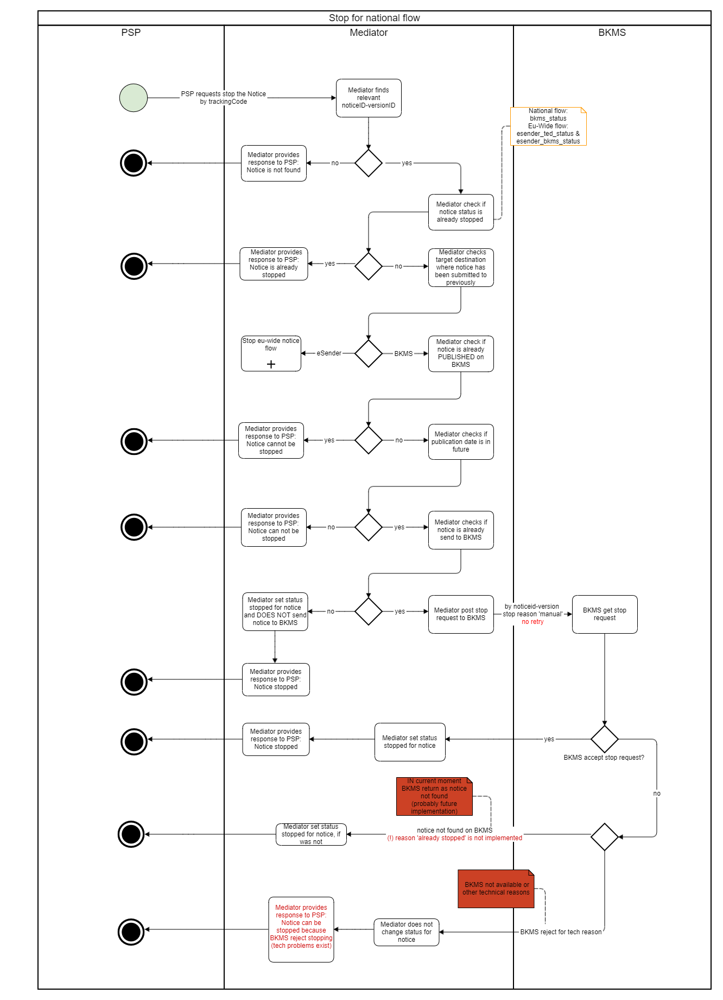
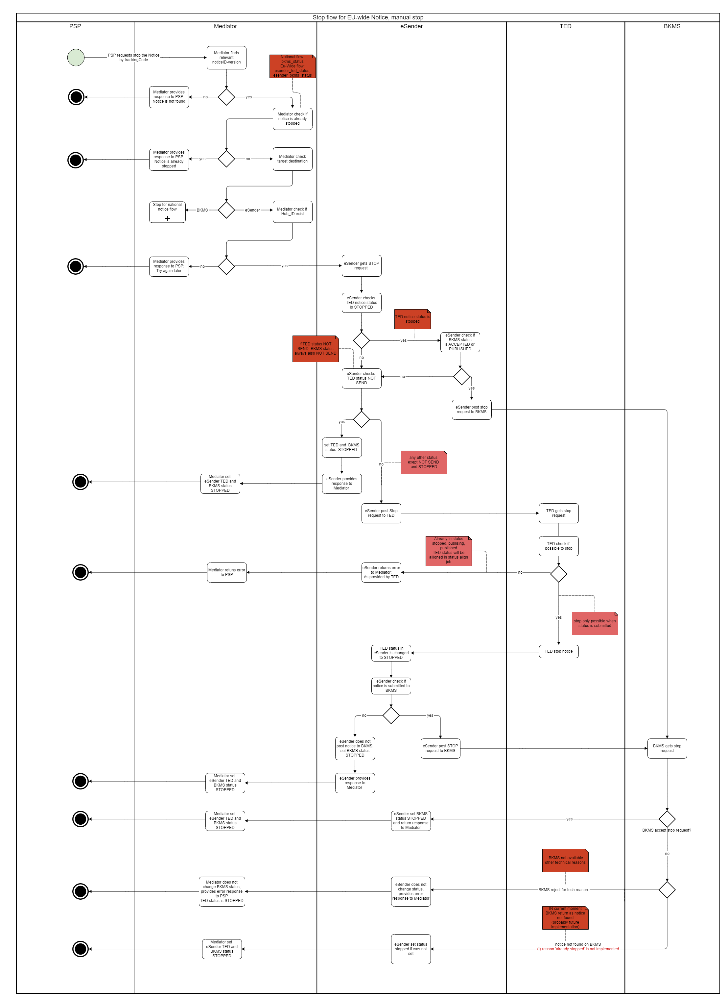
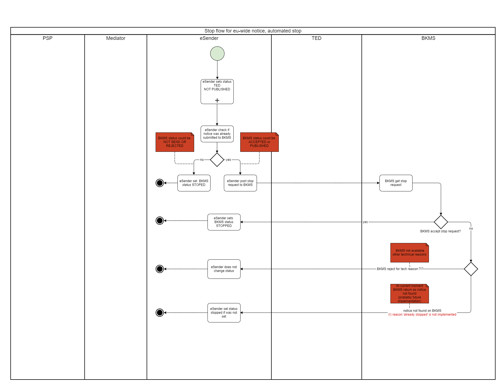

[Inhaltsverzeichnis](/documentation/documentation.md)
<br>

# Change-Notices/Updates & Stop-Publication Funktionalität

## Inhalt

1. [Verwendung von Versionsnummern und Notice-IDs im Kontext der Weitergabe von Bekanntmachungen ](#versions-explained)<br>
    1.1 [Versionen und die Verwendung von Versionsnummern [Funktionalität ‚Update Notice‘]](#versions-update)<br>
    1.2 [Neue Notice-ID für Changes [Funktionalität ‚Change-Notice‘]](#versions-change)<br>
    1.3 [Changes, die aufeinanderfolgen](#versions-changes)<br>
2. [Anpassen des Inhalts einer Bekanntmachung](#stop-or-change)<br>
    2.1 [Update zu einer Bekanntmachung](#update)<br>
    2.2 [Change-Notices](#change-notice)<br>
3. [STOP-Publikation Funktionalität](#stop-func)

## 1. Verwendung von Versionsnummern und Notice-IDs im Kontext der Weitergabe von Bekanntmachungen <span id='versions-explained'>

Zum Umgang mit Versionsnummern und Notice-IDs im Kontext von Änderungen an Bekanntmachungen, die bereits an die Veröffentlichungsplattform der EU (TED) geschickt wurden, sind seitens der EU zwei Konzepte vorgegeben, die durch die Vergabeplattformen im Umgang mit dem Datenservice Öffentlicher Einkauf umgesetzt sein müssen. Da der Datenservice Öffentlicher Einkauf keine inhaltlichen Veränderungen an den Bekanntmachungen vornimmt, sind die Betreiber der Vergabeplattformen angehalten, diese beiden Konzepte umzusetzen.<br><br>
Das erste Konzept betrifft die Verwendung von Versionsnummern in einer Bekanntmachung. Das Versenden aktualisierter Bekanntmachungen mit neuen (aufsteigenden) Versionsnummern zu einer (bereits versendeten) Bekanntmachung an den Datenservice Öffentlicher Einkauf ist so lange möglich, bis die Bekanntmachung auf TED veröffentlicht ist. Anschließend kann keine weitere Bekanntmachung mit derselben Notice-ID und hochgezählter Versionsnummer versendet werden. Nun greift das zweite Konzept.<br><br>
Das zweite Konzept beschreibt den Umgang mit bereits auf TED und im Datenservice Öffentlicher Einkauf veröffentlichten Bekanntmachungen, bei denen das Konzept der Change-Notices angewendet wird. (vgl. https://docs.ted.europa.eu/eforms/latest/schema/change-notice.html und https://github.com/OP-TED/eForms-SDK/discussions/88 ):
<br><br>

### 1.1 Versionen und die Verwendung von Versionsnummern [Funktionalität ‚Update Notice‘]<span id='versions-update'>

Das Konzept der Versionen bei Bekanntmachungen dient dazu, Änderungen an einer Bekanntmachung gegenüber TED anzuzeigen, die nach Absendung der ersten Bekanntmachung an TED bis zur Veröffentlichung einer höheren Version dieser Bekanntmachung (auf TED und im Datenservice Öffentlicher Einkauf) erfolgten.<br><br>
Bekanntmachungen könnten also über Nachfolgeversionen zu einer Notice-ID geändert werden, NACHDEM sie von TED angenommen wurden (Status „Accepted“), aber noch nicht veröffentlicht sind (Status „Published“). Versionen dürfen zu einer Notice-ID nur so lange hochgezählt werden, bis die Bekanntmachung bei TED veröffentlicht worden ist.<br><br>
Sobald der Status einer Bekanntmachung von TED den Status „published“ erreicht hat, darf keine neue Version mehr verschickt werden. Die nachfolgende grafische Darstellung veranschaulicht das oben Gesagte. 


*Abbildung 1: Kette von unveröffentlichten Versionen zu einer Bekanntmachung bei TED*
<br><br>

### 1.2	Neue Notice-ID für Changes [Funktionalität ‚Change-Notice‘]<span id='versions-change'>

Sobald eine Bekanntmachung auf TED veröffentlicht (also im Status „Published“) ist, kann eine Korrektur zu dieser Bekanntmachung nur als „Change“ erfolgen. Changes werden technisch als vollkommen neue Bekanntmachung verstanden und benötigen somit auch eine neue Notice-ID. Die Version wird auf 01 gesetzt, damit das Prinzip der Versionierung auch für Änderungen an Changes (für den Veröffentlichungsprozess bei TED) genutzt werden kann (s. Punkt 1).<br><br>
Eine Bekanntmachung, die als Change veröffentlicht werden soll, muss im Change-Block (BT-758) auf die Bekanntmachung (inkl. Versionsnummer) verweisen, die bei TED veröffentlicht ist. Der Inhalt enthält die gesamte neu zu veröffentlichende Bekanntmachung inkl. neuer Notice-ID in BT-701.<br><br>
Die nachfolgende Darstellung der entsprechenden BTs im XML einer beliebigen Bekanntmachung verdeutlicht das oben Gesagte.

```
<?xml version="1.0" encoding="UTF-8" standalone="no"?>
<ContractNotice …. >
  <ext:UBLExtensions>
    <ext:UBLExtension>
      <ext:ExtensionContent>
        <efext:EformsExtension>
          <efac:Changes>
             <!—BT-758 – Referenz auf „Notice-ID“-„Version-ID“ der zu ändernden Bekanntmachung-->
            <efbc:ChangedNoticeIdentifier>eb131bee-d78c-4a9c-9f4a-9fded9b01a21-04</efbc:ChangedNoticeIdentifier>
            <efac:Change>
              …
            </efac:Change>
            <efac:ChangeReason>
              …
            </efac:ChangeReason>
          </efac:Changes>
  </ext:UBLExtensions>
  <cbc:UBLVersionID>2.3</cbc:UBLVersionID>
  <cbc:CustomizationID>eforms-sdk-1.7</cbc:CustomizationID>
  <!—BT-701 NEUE Notice-ID für diese neue Bekanntmachung, die eine Vorgängerbekanntmachung ersetzt-->
  <cbc:ID schemeName="notice-id">f3d000d2-7f80-4091-a8e9-c2b93bd2a2d1</cbc:ID>  
  <cbc:ContractFolderID>6406055d-28cb-430b-9575-ad9ce5f13cb3</cbc:ContractFolderID>
  <cbc:IssueDate>2023-11-13Z</cbc:IssueDate>
  <cbc:IssueTime>11:22:52Z</cbc:IssueTime>
  <!--  BT-757 Versions-ID – beginnt wieder von vorne-->
  <cbc:VersionID>05</cbc:VersionID>
…
</ContractNotice>
```
*Abbildung 2: Darstellung der BTs, die als Identifikator der Vorgänger-Bekanntmachung im Change sowie als Identifikator der neuen Bekanntmachung dienen*

<br>
Bis zur Veröffentlichung dieses Changes könnte dann eine Änderung der Bekanntmachung wiederum mit Hilfe von hochgezählten Versionen über die Funktionalität ‚Update Notice‘ erfolgen.


*Abbildung 3: Kette von __veröffentlichten__ Bekanntmachungen, einem Change und weiteren Änderungen an diesem Change bis zur erneuten Veröffentlichung dieses Changes bei TED*
<br><br>

### 1.3 Changes, die aufeinanderfolgen<span id='versions-changes'>

Wenn es notwendig ist, dass nicht nur ein Change für eine Bekanntmachung veröffentlicht werden muss, sondern mehrere Changes nacheinander veröffentlicht werden, dann ist die Vorgängerbekanntmachung, die im Change zu referenzieren ist, immer diejenige Bekanntmachung, die zu diesem Thema mit der höchsten Versionsnummer veröffentlicht wurde. Diese Vorgehensweise hilft, Versionsbäume zu verhindern.<br><br>
Die nachfolgende Grafik illustriert das oben Gesagte.


*Abbildung 4: Ketten von veröffentlichten Changes zu einer Bekanntmachung, die aufeinander folgen*
<br><br>

## 2. Anpassen des Inhalts einer Bekanntmachung<span id='stop-or-change'>

Es gibt zwei Möglichkeiten, den Inhalt einer Bekanntmachung zu ändern: Durch *Stop + Update* vor Veröffentlichung oder durch eine Änderungsmitteilung (*Change-Notice*) nach der Veröffentlichung.
<br><br>

### 2.1 Update (Aktualisierung oder Neueinreichung) zu einer Bekanntmachung<span id='update'>
Das Update einer Bekanntmachung ist ein einfacher Bearbeitungsprozess, wenn die Bekanntmachung noch nicht bei TED und/oder im Bekanntmachungsservice veröffentlicht ist. Wenn eine Bekanntmachung korrigiert werden muss, muss die vorherige Version zuerst gestoppt werden oder sich im Status "rejected" befinden. Andernfalls ist ein Update nicht möglich, um sicherzustellen, dass zu jedem Zeitpunkt nur eine gültige Version eines Dokuments im Vermittlungsservice existiert. Um ein Update zu erstellen, sollte die gleiche noticeID wie im vorhergehenden zu korrigierenden Dokument verwendet werden, nur die versionID muss erhöht werden (Lücken sind möglich). Ein Update ist NICHT dasselbe wie eine Change-Notice. Eine Aktualisierung enthält nicht die UBL-Extension einer Change-Notice und kann nur eingereicht werden, bevor die Bekanntmachung veröffentlicht wurde.
<br>

#### **Beispiele**

Szenario A: Korrektur einer abgelehnten Bekanntmachung durch eine Aktualisierung (Update)

1. Bekanntmachung A mit der noticeID ABC *Version 01* wird eingereicht und abgelehnt, z. B. weil sie falsch ausgefüllt wurde. Da sie abgelehnt wurde, wird sie nicht veröffentlicht.
2. Der Fachverfahrenshersteller möchte diese Bekanntmachung korrigieren.
3. Der Fachverfahrenshersteller reicht eine Aktualisierung mit noticeID ABC *Version 02* ein.
4. Das Update wird akzeptiert, da die vorherige Version des Dokuments den Status REJECTED hat.

Szenario B: Verwendung eines Updates zur Bearbeitung einer eingereichten Bekanntmachung

1. Bekanntmachung A mit der noticeID ABC *Version 01* wird eingereicht und angenommen. Sie ist noch nicht veröffentlicht, z. B. weil das gewünschte Veröffentlichungsdatum in der Zukunft liegt.
2. Der Fachverfahrenshersteller möchte etwas in dieser Bekanntmachung bearbeiten, z. B. weil sich einige Informationen geändert haben und angepasst werden müssen.
3. Der Fachverfahrenshersteller stoppt die zuvor eingereichte Bekanntmachung noticeID ABC *Version 01* mit Hilfe des Stop-Endpoints (Dies ist obligatorisch, bevor eine Aktualisierung gesendet wird.)
4. Der Vermittlungsdienst stoppt die Bekanntmachung in TED und im Bekanntmachungsservice (je nachdem, wohin sie bereits gesendet wurde).
5. Der Fachverfahrenshersteller reicht eine Aktualisierung mit noticeID ABC *Version 02* ein.
6. Das Update wird akzeptiert, da sich die Vorgängerversion der Bekanntmachung im Status STOPPED befindet.
<br><br>

### 2.2 Change-Notice<span id='change-notice'>
Eine Änderungsmitteilung (auch als Change-Notice bezeichnet) ist eine Änderung, die eine bereits veröffentlichte Bekanntmachung verändert. Wenn eine Änderungsmitteilung eingereicht wird, hat diese Bekanntmachung ihre eigene noticeID und versionID. Eine Change-Notice enthält immer eine UBL-Extension, in der angegeben werden muss, welche konkrete Bekanntmachung geändert werden soll. Dies wird in dem Feld BT-758 Changed-Notice-Identifier angegeben. Hier muss die noticeID-versionID oder die Notice-Publication-Number (wenn die referenzierte Notice im alten TED-XML-Format eingereicht wurde) in der XML angegeben werden.

Beispiel für einen Referenzverweis mit noticeID-versionID:

`<efbc:ChangedNoticeIdentifier>c4c415ee-ac08-4465-8fa6-57568cf69462-01</efbc:ChangedNoticeIdentifier>`

Beispiel für einen Referenzverweis unter Verwendung der Notice-Publication-ID:

`<efbc:ChangedNoticeIdentifier>01234567-2022</efbc:ChangedNoticeIdentifier>`

Das Verfahren zur Einreichung einer Change-Notice ist das gleiche wie bei jeder anderen Bekanntmachung. Auch der Prozess der Übermittlung an TED und Bekanntmachungsservice ist für Änderungsmitteilungen identisch wie für jede andere Bekanntmachung.
<br><br>

## 3. STOP-Publikation-Funktionalität<span id='stop-func'>
Die Funktion „Stop Publication“ wird verwendet, um die Veröffentlichung von Bekanntmachungen auf TED oder im Bekanntmachungsservice (oberhalb der EU-Schwellenwerte) oder nur im Bekanntmachungsservice (unterhalb der EU-Schwellenwerte) zu stoppen. Das Stoppen einer Bekanntmachung ist nur möglich, wenn eine Bekanntmachung intern vollständig prozessiert, aber noch nicht veröffentlicht wurde.

Die Veröffentlichung einer Bekanntmachung kann aus folgenden Gründen gestoppt werden:
1. Manuell durch einen externen Benutzer (Fachverfahrenshersteller):
Der Benutzer kann das Stoppen einer Bekanntmachung mithilfe des TrackingCodes über die API V1/notices/stop/{trackingCode} im Vermittlungsdienst anfordern. Im Vermittlungsdienst wird hierbei hinterlegt, dass es sich um einen manuellen Stopp-Vorgang handelte.
2. Automatisch: Wenn TED eine eingereichte Bekanntmachung aufgrund von [Lawfulness Warnings](Status_information.md/#lawfullness) manuell ablehnt, wird diese Bekanntmachung auf TED nicht veröffentlicht. Falls diese Bekanntmachung bereits an den Bekanntmachungsservice versendet wurde, wird diese nun automatisch auch im Bekanntmachungsservice gestoppt. Im Vermittlungsdienst wird hierbei hinterlegt, dass es sich um einen automatischen Stopp-Vorgang handelte.

Es gibt einige Unterschiede in der Art und Weise, wie Bekanntmachungen oberhalb und unterhalb der EU-Schwellenwerte gestoppt werden können.
<br> <br>

**Vergabe unterhalb der EU-Schwellenwerte: Manueller Stopp** <br>
Die Veröffentlichung kann nur vor dem in der Bekanntmachung angegebenen bevorzugten Veröffentlichungsdatum (BT-738) manuell gestoppt werden, sodass die Bekanntmachung noch nicht auf Bekanntmachungsservice veröffentlicht ist.


 <br> <br>

**Vergabe oberhalb der EU-Schwellenwerte: Manueller Stopp** <br>
Die Veröffentlichung kann nur manuell gestoppt werden, bevor die Bekanntmachung auf TED veröffentlicht wird. Ob die Bekanntmachung in Bekanntmachungsservice bereits veröffentlicht wurde, ist hierbei nicht relevant. Ein manueller Stopp ist nur möglich, wenn keine zur Veröffentlichung vorgesehenen Vorgängerversionen existieren (siehe Beispiele oben).


 <br> <br>

**Vergabe oberhalb der EU-Schwellenwerte: Automatischer Stopp** <br>
Bei manueller Ablehnung durch TED wird die Veröffentlichung automatisch im Bekanntmachungsservice gestoppt, auch wenn sie dort vorher schon veröffentlicht worden sein sollte. 



<br>

**Stopp-Antworten** <br>
Welche Rückmeldungen beim Versenden von Stopp-Anfragen erfolgen, kann hier eingesehen werden https://ozg-vermittlungsdienst.de/q/swagger-ui/#/Lieferungen/stopPublication.