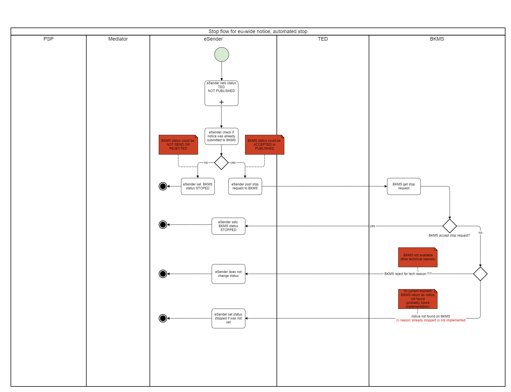

### EfA implementation project "Access to public procurement"
## Documentation of the mediation service
[Table of contents](/documentation/documentation.md)
<br>

## Change notices/stop-and-update functionality

## Content
- [1. use of version numbers and notice IDs in the context of passing on notices ](#versions-explained)
    - [1.1 Versions and the use of version numbers [Update Notice functionality](#versions-update)
    - 1.2 New notice ID for changes [Change Notice functionality](#versions-change)
    - 1.3 Changes that follow each other](#versions-changes)
- [2. adapting the content of a notice](#stop-or-change)
    - 2.1 Update to an announcement](#update)
    - 2.2 Change notices](#change-notice)
- 3. STOP publication functionality](#stop-func)

## 1. use of version numbers and notice IDs in the context of passing on notices <span id='versions-explained'>

When dealing with version numbers and notice IDs in the context of changes to notices that have already been sent to the EU's publication platform (TED) (in Germany with the help of the Public Procurement Data Service), the EU has specified two concepts that must be implemented by the procurement platforms when dealing with the Public Procurement Data Service. As the Public Procurement Data Service does not make any changes to the content of the notices, the operators of the procurement platforms are required to implement these two concepts.<br><br>
The first concept concerns the use of version numbers in a contract notice. Sending updated notices with new (ascending) version numbers for a (previously sent) notice to the Public Procurement Data Service is possible until the notice is published on TED. No further notices with the same notice ID and incremented version number can then be sent. Now the second concept applies.<br><br>
The second concept describes the handling of previously published notices (on TED and in the Public Procurement Data Service) and the concept of change notices is applied here. (see https://docs.ted.europa.eu/eforms/latest/schema/change-notice.html and https://github.com/OP-TED/eForms-SDK/discussions/88 ):
<br><br>

### 1.1 Versions and the use of version numbers [functionality 'Update Notice']<span id='versions-update'>

The concept of versions for notices is used to indicate changes to a notice to TED that were made after the first notice was sent to TED until the publication of a higher version of this notice (on TED and in the Public Procurement Data Service).<br><br>
Notices could therefore be changed to a Notice ID via subsequent versions AFTER they have been accepted by TED (status "Accepted") but not yet published (status "Published"). Versions may only be incremented to a Notice ID until the announcement has been published by TED.<br><br>
As soon as the status of a TED notice has reached "published", no new version may be sent. The following graphic illustrates the above.


*Figure 1: Chain of unpublished versions of an announcement at TED*
<br><br>

### 1.2 New notice ID for changes [functionality 'Change Notice']<span id='versions-change'>

As soon as a notice is published on TED (i.e. has the status "Published"), a correction to this notice can only be made as a "Change". Changes are technically understood as a completely new notice and therefore also require a new notice ID. The version is reset to 01 so that the versioning principle can also be used again for changes to Changes (for the publication process at TED) (see point 1).<br><br>
An announcement that is to be published as a change must refer in the change block (BT-758) to the announcement (incl. version number) that is published at TED. The content contains the entire new notice to be published including the new notice ID in BT-701.<br><br>
The following representation of the corresponding BTs in the XML of any notice illustrates the above.

```
<?xml version="1.0" encoding="UTF-8" standalone="no"?>
<ContractNotice .... >
  <ext:UBLExtensions>
    <ext:UBLExtension>
      <ext:ExtensionContent>
        <efext:EformsExtension>
          <efac:Changes>
             <!-BT-758 - Reference to "Notice-ID"-"Version-ID" of the notice to be changed-->
            <efbc:ChangedNoticeIdentifier>eb131bee-d78c-4a9c-9f4a-9fded9b01a21-04</efbc:ChangedNoticeIdentifier>
            <efac:Change>
              ...
            </efac:Change>
            <efac:ChangeReason>
              ...
            </efac:ChangeReason>
          </efac:Changes>
  </ext:UBLExtensions>
  <cbc:UBLVersionID>2.3</cbc:UBLVersionID>
  <cbc:CustomizationID>eforms-sdk-1.7</cbc:CustomizationID>
  <!-BT-701 NEW Notice ID for this new notice, which replaces a previous notice-->
  <cbc:ID schemeName="notice-id">f3d000d2-7f80-4091-a8e9-c2b93bd2a2d1</cbc:ID>
  <cbc:ContractFolderID>6406055d-28cb-430b-9575-ad9ce5f13cb3</cbc:ContractFolderID>
  <cbc:IssueDate>2023-11-13Z</cbc:IssueDate>
  <cbc:IssueTime>11:22:52Z</cbc:IssueTime>
  <!-- BT-757 version ID - starts again from the beginning-->
  <cbc:VersionID>05</cbc:VersionID>
...
</ContractNotice>
```
*Figure 2: Representation of the BTs that serve as identifier of the previous notice in the change and as identifier of the new notice*

<br>
Until this change is published, the notice could then be changed again with the help of incremented versions using the 'Update Notice' functionality.


*Figure 3: Chain of __published__ notices, a change and further changes to this change until this change is published again at TED*
<br><br>

### 1.3 Changes that follow each other<span id='versions-changes'>

If it is necessary that not only one change has to be published for an announcement, but several changes are published in succession, then the predecessor announcement to be referenced in the change is always the announcement that was published on this topic with the highest version number. This procedure helps to prevent version trees.<br><br>
The following graphic illustrates the above.


*Figure 4: Chains of published changes to an announcement that follow one another*
<br><br>

## 2. customizing the content of an announcement<span id='stop-or-change'>

There are two ways to change the content of an announcement: By *stop + update* before publication or by a change notice (*change notice*) after publication.
<br><br>

### 2.1 Update to an announcement<span id='update'>
An update or resubmission (also known as an update) of a notice is a simple editing process if the notice has not yet been published in TED and/or BKMS. If a notice needs to be corrected, the previous version must first be stopped or be in "rejected" status. Otherwise, an update is not possible to ensure that only one valid version of a document exists in the mediation service at any given time. To create an update, the same noticeID should be used as in the previous document to be corrected, only the versionID must be increased (gaps are possible). An update is NOT the same as a change notice. An update does not contain the UBL extension of a change notice and can only be submitted before the notice has been published.
<br>

#### **Examples**

Scenario A: Correction of a rejected notice by means of an update

1. notice A with the noticeID ABC *version 01* is submitted and rejected, e.g. because it was filled out incorrectly. Since it has been rejected, it is not published.
2. the FVH would like to correct this notice
3. the FVH submits an update with noticeID ABC *Version 02*.
4. the update is accepted because the previous version of the document has the status REJECTED.

Scenario B: Using an update to process a submitted notice

1. notice A with the noticeID ABC *Version 01* is submitted and accepted. It has not yet been published, e.g. because the desired publication date is in the future.
2. the FVH would like to edit something in this notice, e.g. because some information has changed and needs to be adapted.
3. the FVH stops the previously submitted noticeID ABC *version 01* using the stop endpoint (This is mandatory before an update is sent. TED has announced that this will probably also be restricted in TED in the future)
4. the switching service stops the announcement in TED and BKMS (depending on where it has already been sent)
5. the FVH submits an update with noticeID ABC *Version 02*.
6. the update is accepted because the previous version of the notice is in STOPPED status
<br><br>

### 2.2 Change notice<span id='change-notice'>
A change notice (also known as a change notice) is an amendment that changes a previously published notice. When a change notice is submitted, this notice has its own noticeID and versionID. A change notice always contains a UBL extension in which the specific notice to be changed must be specified. This is specified in the BT-738 Change Notice Identifier field. The noticeID-versionID or the Notice Publication Number (if the referenced notice was submitted in the old TED-XML format) must be specified here in the xml.

Example of a reference with noticeID-versionID:

`<efbc:ChangedNoticeIdentifier>c4c415ee-ac08-4465-8fa6-57568cf69462-01</efbc:ChangedNoticeIdentifier>`

Example of a reference reference using the Notice Publication ID:

`<efbc:ChangedNoticeIdentifier>01234567-2022</efbc:ChangedNoticeIdentifier>`

The procedure for submitting a change notice is the same as for any other notice. The process of submission to TED and BKMS is also the same for change notices as for any other notice.
<br><br>

## 3. STOP publication functionality<span id='stop-func'>
The "Stop Publication" function is used to stop the publication of notices on TED/BKMS (upper threshold award) or BKMS only (lower threshold award). Stopping an announcement is only possible if an announcement has been fully processed internally but not yet published.

The publication of an announcement can be stopped for the following reasons:
1. manually by an external user (FVH):
The user can request the stopping of an announcement using the tracking code via the API V1/notices/stop/{trackingCode} in the switching service. It is stored in the switching service that this was a manual stop process.
2. automatically: If TED manually rejects a submitted notice due to [Lawfullness Warnings](Status_information.md/#lawfullness), this notice will not be published in TED. If this announcement has already been sent to the BKMS, it will now also be automatically stopped in the BKMS. It is stored in the switching service that this was an automatic stop process.

There are some differences in the way that above- and below-threshold notifications can be stopped.
 <br> <br>

**Sub-threshold award** <br>
The publication can only be stopped manually before the preferred publication date specified in the notice (BT-738) so that the notice is not yet published on BKMS.


 <br> <br>

**Above-threshold allocation: manual stop** <br>
Publication can only be stopped manually before the announcement is published on TED. Whether the announcement has already been published in BKMS is not relevant here. A manual stop is only possible if no previous versions intended for publication exist (see examples above).


 <br> <br>

**Upper-threshold allocation: automatic stop** <br>
In the event of manual rejection by TED, the publication is automatically stopped in BKMS, even if it has already been published in BKMS.



 <br>

**Stop responses** <br>
You can find out which responses you receive when sending stop requests in the API at https://ozg-vermittlungsdienst.de/q/swagger-ui/#/Lieferungen/stopPublication.


