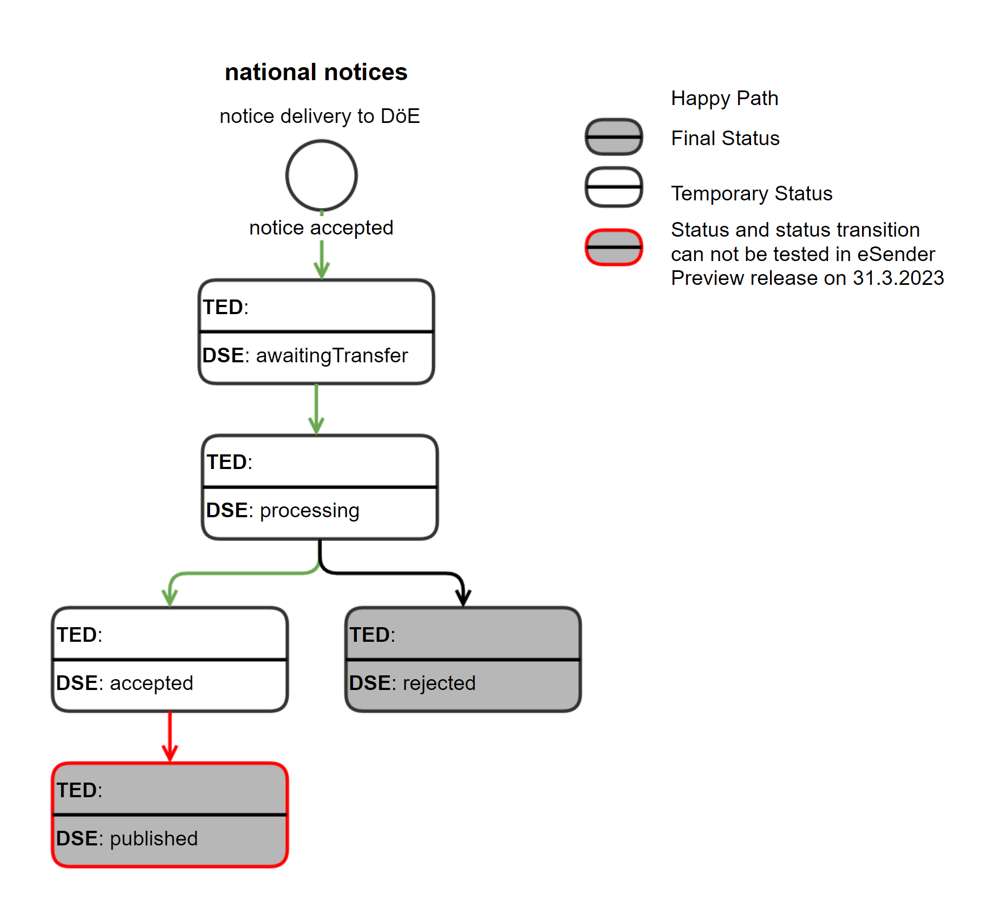
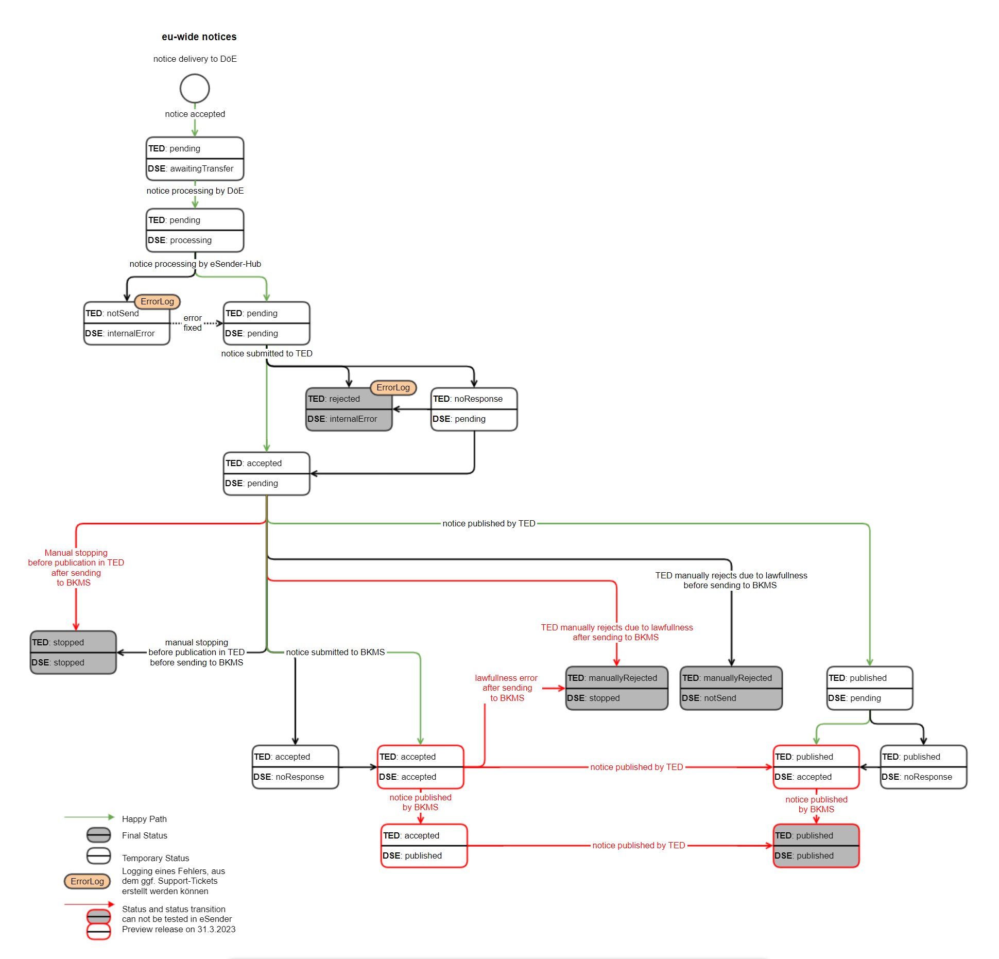

### EfA-Umsetzungsprojekt "Zugang zur öffentlichen Vergabe"
## Dokumentation Vermittlungsdienst
[Inhaltsverzeichnis](/documentation/documentation.md)
<br><br>

# Status- und Transferinformationen

Mit Hilfe der REST API des Vermittlungsdienstes können alle Status- und Fehlerinformationen einer Bekanntmachung abgefragt werden. Die Status- und Fehlerinformationen des BKMS und von TED werden regelmäßig vom Vermittlungsdienst abgefragt und gespeichert, so liegt jederzeit der Status und weitere Informationen zu einer Bekanntmachung zum weiteren Abruf bereit.
<br><br>

## Endpunkte zur Abfrage der Status- und Transferinformationen
Zur Abfrage der Status- und Transferinformationen stellt der Vermittlungsdienst die Endpunkte GET /v1/notices für eine Liste von Datenlieferungen und GET /v1/notices/{trackingcode} für eine einzelne Datenlieferung zur Verfügung.

Der Vermittlungsdienst führt die Statusabfragen an BKMS und TED alle drei Minuten durch. Daher ist eine Abfrage der Statusinformationen der Bekanntmachungen an den Vermittlungsdienst maximal alle 5 Minuten sinnvoll.

Die zugehörige OpenAPI-Spezifikation finden Sie unter https://bkms-mediator-app-preview.efa-fhb.apps-int.nortal.com/ und steht Ihnen im JSON-Format zum Download unter https://bkms-mediator-app-preview.efa-fhb.apps-int.nortal.com/Vermittlungsdienst_REST-API.json bereit.
<br><br>

## Struktur der Statusinformationen
Die Endpunkte zur Abfrage der Statusinformationen, geben die Statusinformationen für jede Bekanntmachung innerhalb des Delivery Schemas wie folgt zurück.

```
<?xml version="1.0" encoding="UTF-8"?>
<delivery>
	...
	<tedStatus>PENDING</tedStatus>
	<tedStatusUpdate>2023-04-26T14:32:52.625Z</tedStatusUpdate>
	<doeStatus>AWAITING_TRANSFER</doeStatus>
	<doeStatusUpdate>2023-04-26T14:32:52.625Z</doeStatusUpdate>
	<statusDescription>string</statusDescription>
	...
</delivery>
```

Die Statusinformationen enthalten sowohl bei unterschwelligen als auch bei oberschwelligen Bekanntmachungen den Status des Datenservice Öffentlicher Einkauf `doeStatus`, das letzte Änderungsdatum des DöE-Status `doeStatusUpdate` sowie eine Beschreibung des aktuell gesetzten Status `statusDescription`.

Bei oberschwelligen Bekanntmachungen wird zusätzlich der TED-Staus `tedStatus` mit dem letzten Änderungsdatum `tedStatusUpdate` übermittelt. Die TED-Statuswerte orientieren sich an den Statuswerten der EU. 
<br><br>


### Status unterschwellige Bekanntmachungen

Die folgenden Statuswerte existieren für unterschwellige Bekanntmachungen: 

| DöE Status        | Beschreibung                                                                                                   |
| ----------------- | -------------------------------------------------------------------------------------------------------------- |
| AWAITING_TRANSFER | Die Bekanntmachung wurde vom Mediator angenommen und akzeptiert. Nun wird die Versendung zum BKMS vorbereitet. |
| PROCESSING        | Die Bekanntmachung wird vom BKMS verarbeitet.                                                                  |
| ACCEPTED          | Die Bekanntmachung wurde vom Bekanntmachungsservice akzeptiert.                                                |
| REJECTED          | Die Bekanntmachung wurde von BKMS abgelehnt.                                                                   |
| PUBLISHED         | Die Bekanntmachung wurde im BKMS veröffentlicht.                                                               |


<br><br>

### Status oberschwellige Bekanntmachungen
Die folgenden Statuswerte existieren für oberschwellige Bekanntmachungen: 

**Anmerkung:** Die in kursiv formatierten Statuskombinationen sind im eSender Preview Release am 31.3.2023 noch nicht testbar, da Bekanntmachungen in eForms-DE 1.0.0 noch nicht vom BKMS angenommen werden.

| TED status (tedStatus)  | Datenservice Öffentlicher Einkauf Status (doeStatus) | Beschreibung                                                                                                                                                             |
| ----------------------- | ---------------------------------------------------- | ------------------------------------------------------------------------------------------------------------------------------------------------------------------------ |
| PENDING                 | AWAITING_TRANSFER                                     | Der Vermittlungsdienst hat die Bekanntmachung angenommen und verarbeitet sie in Kürze.                                                                                   |
| PENDING                 | PROCESSING                                           | Der Vermittlungsdienst verarbeitet die Bekanntmachung.                                                                                                                   |
| PENDING                 | PENDING                                              | Die Bekanntmachung wurde vom eSender zur weiteren Verarbeitung angenommen. Die Übermittlung der Bekanntmachung an TED und an den Bekanntmachungsservice stehen noch aus. |
| NO_RESPONSE             | PENDING                                              | Die Übermittlung an TED wird erneut versucht. Die Übermittlung der Bekanntmachung an den Bekanntmachungsservice steht noch aus.                                          |
| NOT_SEND                | INTERNAL_ERROR                                        | Ein interner Fehler ist aufgetreten. Ein entsprechendes Support-Ticket wird ggf. erstellt.                                                                               |
| REJECTED                | INTERNAL_ERROR                                        | Ein interner Fehler ist aufgetreten. Ein entsprechendes Support-Ticket wird ggf. erstellt.                                                                               |
| STOPPED                 | NOT_SEND                                             | Die Bekanntmachung wurde in TED gestoppt und wird nicht zum Bekanntmachungsservice gesendet.                                                                             |
| ⚠️*STOPPED*           | ⚠️*ACCEPTED/ PUBLISHED/ NO_RESPONSE*                | *Die Bekanntmachung wurde in TED gestoppt und wird in Kürze auch im Bekanntmachungsservice gestoppt werden.*                                                             |
| ⚠️*STOPPED*           | ⚠️*STOPPED*                                        | *Die Bekanntmachung wurde sowohl in TED als auch im Bekanntmachungsservice gestoppt.*                                                                                    |
| ACCEPTED                | PENDING                                              | Die Bekanntmachung wurde von TED akzeptiert, die Übermittlung an den Bekanntmachungsservice steht noch aus.                                                              |
| ACCEPTED                | NO_RESPONSE                                           | Die Bekanntmachung wurde von TED akzeptiert, aber noch nicht veröffentlicht. Die Übermittlung an den Bekanntmachungsservice wird erneut versucht.                        |
| ⚠️*ACCEPTED*          | ⚠️*ACCEPTED*                                       | *Die Bekanntmachung wurde von TED und dem Bekanntmachungsservice akzeptiert, aber noch nicht veröffentlicht.*                                                            |
| ⚠️*ACCEPTED*          | ⚠️*PUBLISHED*                                      | *Die Bekanntmachung wurde von TED akzeptiertt, aber noch nicht veröffentlicht. Die Bekanntmachung wurde bereits im Bekanntmachungsservice veröffentlicht.*               |
| PUBLISHED               | PENDING                                              | Die Bekanntmachung wurde in TED veröffentlicht, die Übermittlung an den Bekanntmachungsservice steht noch aus.                                                           |
| PUBLISHED               | NO_RESPONSE                                           | Die Bekanntmachung wurde in TED veröffentlicht, die Übermittlung an den Bekanntmachungsservice wird erneut versucht.                                                     |
| ⚠️*PUBLISHED*         | ⚠️*ACCEPTED*                                       | *Die Bekanntmachung wurde in TED veröffentlicht und vom Bekanntmachungsservice akzeptiert, aber noch nicht veröffentlicht.*                                              |
| ⚠️*PUBLISHED*         | ⚠️*PUBLISHED*                                      | *Die Bekanntmachung wurde in TED und im Bekanntmachungsservice veröffentlicht.*                                                                                          |
| MANUALLY_REJECTED       | NOT_SEND                                             | Die Bekanntmachung wurde von TED auf Grund einer rechtlichen Prüfung manuell abgelehnt und wurde nicht zum Bekanntmachungsservice gesendet.                              |
| ⚠️*MANUALLY_REJECTED* | ⚠️*ACCEPTED/ PUBLISHED/ NO_RESPONSE*                | *Die Bekanntmachung wurde von TED auf Grund einer rechtlichen Prüfung manuell abgelehnt und wird in Kürze auch im Bekanntmachungsservice gestoppt.*                      |
| ⚠️*MANUALLY_REJECTED* | ⚠️*STOPPED*                                        | Die Bekanntmachung wurde von TED auf Grund einer rechtlichen Prüfung manuell abgelehnt und wurde auch im Bekanntmachungsservice gestoppt.*                               |


**Anmerkung:** Die in rot markierten Statuskombinationen sind im eSender Preview Release am 31.3.2023 noch nicht testbar, da der BKMS eForms-DE 1.0.0 und das Stoppen von Bekannmachungen noch nicht unterstützt.




## Struktur der Transferinformationen
Die Transferinformationen sind ebenfalls für jede Bekanntmachung im Delivery Schema enthalten. Diese Informationen beinhalten Warnungen und Fehlermeldungen vom Vermittlungsdienst, dem Bekanntmachungsservice und TED.
```
<?xml version="1.0" encoding="UTF-8"?>
<delivery>
	...
	<transferResponse>
		<warnings>
			<warning>
				<source>BKMS</source>
				<description>string</description>
				<path>string</path>
				<rule>string</rule>
				<ruleContent>string</ruleContent>
			</warning>
		</warnings>
		<errors>
			<error>
				<source>BKMS</source>
				<description>string</description>
				<path>string</path>
				<rule>string</rule>
				<ruleContent>string</ruleContent>
			</error>
		</errors>
	</transferResponse>
	...
</delivery>
```

Innerhalb der Transferinformationen `transferResponse` werden Warnungen `warnings` von Fehlermeldungen `errors` getrennt aufgelistet. Pro Bekanntmachung ist es möglich mehrere Warnungen und Fehlermeldungen als Rückantwort zu erhalten. 

Eine einzelne Warnung und eine einzelne Fehlermeldung haben den selben Aufbau. `source` gibt an in welchem System die Warnung oder der Fehler entstand. Folgende Werte sind in `source` möglich:
- BKMS für Bekanntmachungsservice
- TED für Tenders Electronic Daily
- PRE_VALIDATION für Validierungen innerhalb des eSender

Die `description` enthält die Beschreibung der Warnung oder der Fehlermeldung. Im `path` wird die Position angegeben an der der Fehler oder die Warnung auftrat. Der Tag `rule` enthält die Bezeichnung der angewandten Regel und `ruleContent` die dazu tatsächlich angewandte Regel.

Warnungen und Fehlermeldungen vom Bekanntmachungsservice und von TED werden unverändert durchgereicht.


