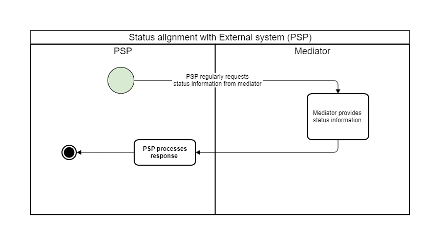
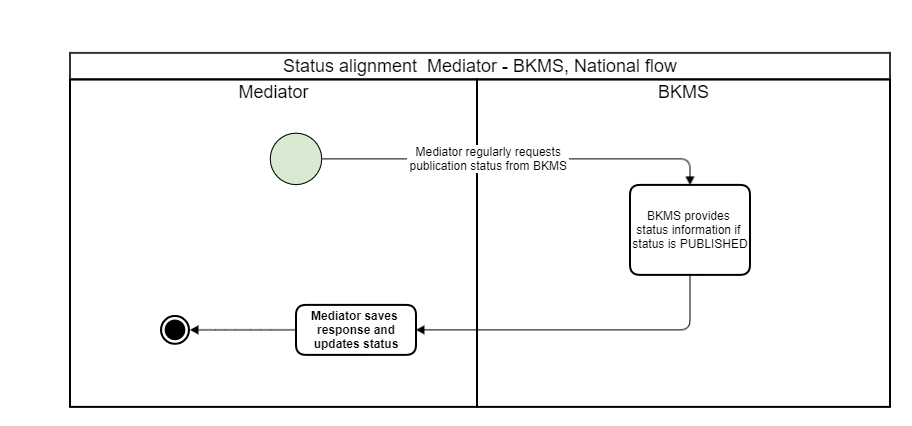
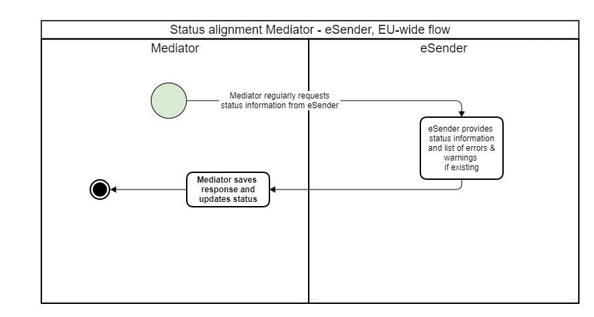
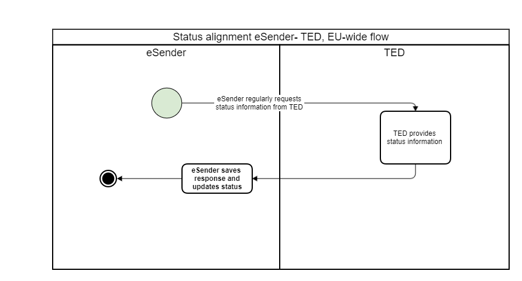
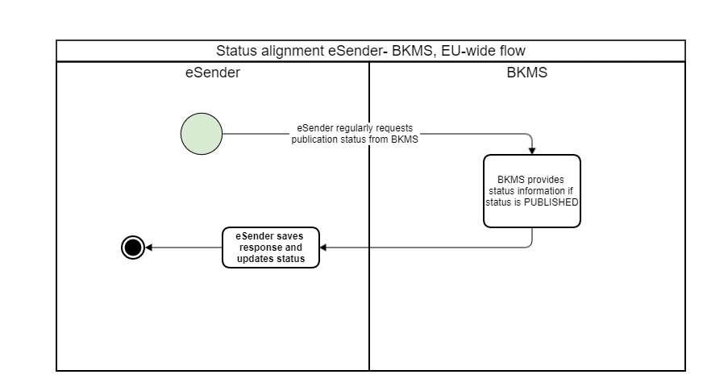

### EfA-Umsetzungsprojekt "Zugang zur öffentlichen Vergabe"
## Dokumentation Vermittlungsdienst
[Inhaltsverzeichnis](/documentation/documentation.md)
<br>

# Status- und Transferinformationen

Mit Hilfe der REST API des Vermittlungsdienstes können alle Status- und Fehlerinformationen einer Bekanntmachung abgefragt werden. Die Status- und Fehlerinformationen des BKMS und von TED werden regelmäßig vom Vermittlungsdienst abgefragt und gespeichert, so liegt jederzeit der Status und weitere Informationen zu einer Bekanntmachung zum weiteren Abruf bereit.
<br><br>
Mehr zum Thema "Fehlerbehandlung" findet sich hier: [Fehlerbehandlung](/documentation/Fehlerbehandlung.md)
<br>

## Inhalte
- [Endpunkte zur Abfrage der Status- und Transferinformationen](#endpunkte)
    - [Statusabgleich mit externen Systemen (FVH)](#externe)
	- [Statusabgleich für Unterschwellenvergabe](#unterschwellig)
	- [Statusabgleich für Oberschwellenvergabe](#oberschwellig)
- [Struktur der Statusinformationen](#info-struktur)
    - [Status-Mapping-Tabelle: Containererstellung](#container-mapping)
    - [Status-Mapping-Tabelle: Oberschwellenvergabe](#oberschwellige-mapping)
    - [Status-Mapping-Tabelle: Unterschwellenvergabe](#unterschwellige-mapping)
- [Struktur der Transferinformationen](#transfer-info)


<br><br>

## Endpunkte zur Abfrage der Status- und Transferinformationen<span id="endpunkte">
Zur Abfrage der Status- und Transferinformationen stellt der Vermittlungsdienst die Endpunkte zur Verfügung.
Der Vermittlungsdienst führt die Statusabfragen an BKMS und TED alle 1-5 Minuten durch. Daher ist eine Abfrage der Statusinformationen der Bekanntmachungen an den Vermittlungsdienst maximal alle 5 Minuten sinnvoll.

### Statusabgleich mit externen Systemen (FVH)<span id="externe">
Es gibt drei Möglichkeiten, einen Status abzufragen: nach Liste (alle von diesem Tenant eingereichten Bekanntmachungen), nach Tracking-Code, oder nach Liste basierend auf Zeitstempeln (alle von diesem Tenant eingereichten Bekanntmachungen, deren Status sich in einem bestimmten Zeitraum geändert hat).
Nachdem eine bestimmte Bekanntmachung an Mediator übermittelt wurde, kann das externe System (FVH) den Status der Bekanntmachung in Mediator regelmäßig anhand des Tracking-Codes überprüfen.



### Statusabgleich für Unterschwellenvergabe<span id="unterschwellig">
Nachdem eine Bekanntmachung an BKMS übermittelt wurde, fragt Mediator regelmäßig den Bekanntmachung-Status von BKMS per noticeID-Version ab, wenn das eForms in BKMS veröffentlicht wurde.





### Statusabgleich für Oberschwellenvergabe<span id="oberschwellig">
Nachdem die Bekanntmachung an den eSender-Hub übermittelt wurde, fragt der Mediator regelmäßig den Bekanntmachung-Status vom eSender-Hub anhand der hub-ID ab.




Nachdem eine Bekanntmachung an TED übermittelt wurde, fragt eSender-Hub regelmäßig den Status bei TED per noticeID-Version ab.




Nachdem die Bekanntmachung an BKMS übermittelt wurde, fragt eSender-Hub regelmäßig den Status von BKMS nach noticeID-Version ab.





Die zugehörige OpenAPI-Spezifikation finden Sie unter https://bkms-mediator-app-preview.efa-fhb.apps-int.nortal.com/ und steht Ihnen im JSON-Format zum Download unter https://bkms-mediator-app-preview.efa-fhb.apps-int.nortal.com/Vermittlungsdienst_REST-API.json bereit.
<br><br>

## Struktur der Statusinformationen<span id="info-struktur">
Die Endpunkte zur Abfrage der Statusinformationen, geben die Statusinformationen für jede Bekanntmachung innerhalb des Delivery Schemas wie folgt zurück.

```
<?xml version="1.0" encoding="UTF-8"?>
<delivery>
	...
	<tedStatus>PENDING</tedStatus>
	<tedStatusUpdate>2023-04-26T14:32:52.625Z</tedStatusUpdate>
	<doeStatus>AWAITING_TRANSFER</doeStatus>
	<doeStatusUpdate>2023-04-26T14:32:52.625Z</doeStatusUpdate>
	<statusDescription>string</statusDescription>
	...
</delivery>
```

Die Statusinformationen enthalten sowohl bei unterschwelligen als auch bei oberschwelligen Bekanntmachungen den Status des Datenservice Öffentlicher Einkauf `doeStatus`, das letzte Änderungsdatum des DöE-Status `doeStatusUpdate` sowie eine Beschreibung des aktuell gesetzten Status `statusDescription`.

Bei oberschwelligen Bekanntmachungen wird zusätzlich der TED-Staus `tedStatus` mit dem letzten Änderungsdatum `tedStatusUpdate` übermittelt. Die TED-Statuswerte orientieren sich an den Statuswerten der EU. 
<br><br>


### Status-Mapping-Tabelle: Containererstellung<span id="container-mapping">

| DöE-Status      | Status Beschreibung |
| --------------- | ------------------------ |
| awaitingTransfer    | Die Bekanntmachung wurde vom Mediator angenommen und akzeptiert. Die weitere Versendung wird vorbereitet. |

Nachdem die Containererstellung abgeschlossen ist, wird Mediator mit weiteren Schritten für die Unter- oder Oberschwellenvergabe bearbeitet, so dass in den Status-Mapping-Tabellen unten die Status aufgeführt sind.
<br><br>

### Status-Mapping-Tabelle: Oberschwellenvergabe<span id="oberschwellige-mapping">

Jede Bekanntmachung wird zwei Statuswerte haben, weil sich ihre Status in zwei Systemen parallel ändern können: TED und das DöE einschließlich BKMS. Bei unterschwelligen Bekanntmachungen wird nur der DöE-Status eingetragen, da diese Bekanntmachungen nicht an TED übermittelt werden. Der eSender-Hub speichert die detailliertesten Statusinformationen. Der Mediator aggregiert die Statusinformationen, um z. B. bestimmte Statusinformationen als Fehlerstatus zu kategorisieren. Wenn ein externer Benutzer einen Status anfordert, erhält er nicht genau den Status, wie er im Mediator oder eSender-Hub gespeichert ist, sondern nur die relevanten Statusinformationen. Die Informationen, die den externen Benutzern zur Verfügung gestellt werden, finden sich in den folgenden Tabellespalten.

| TED-Status | DöE-Status | Nachricht an den externen Benutzer für die gegebene Statuskombination                                                                                                    |
| ----------------------------- | ----------------------------- | ------------------------------------------------------------------------------------------------------------------------------------------------------------------------ |
| pending                       | pending                       | Die Bekanntmachung wurde vom eSender-Hub zur weiteren Verarbeitung angenommen. Die Übermittlung der Bekanntmachung an TED und an den Bekanntmachungsservice stehen noch aus. |
| notSend                       | internalError                 | Ein interner Fehler ist aufgetreten. Ein entsprechendes Support-Ticket wird ggf. erstellt.                                                                               |
| pending                       | pending                       | Die Bekanntmachung wurde vom eSender-Hub zur weiteren Verarbeitung angenommen. Die Übermittlung der Bekanntmachung an TED und an den Bekanntmachungsservice stehen noch aus. |
| noResponse                    | pending                       | Die Übermittlung an TED wird erneut versucht. Die Übermittlung der Bekanntmachung an den Bekanntmachungsservice steht noch aus.                                          |
| accepted                      | pending                       | Die Bekanntmachung wurde von TED akzeptiert, die Übermittlung an den Bekanntmachungsservice steht noch aus.                                                              |
| accepted                      | accepted                      | Die Bekanntmachung wurde von TED und dem Bekanntmachungsservice akzeptiert, aber noch nicht veröffentlicht.                                                              |
| accepted                      | published                     | Die Bekanntmachung wurde von TED akzeptiertt akzeptiert, aber noch nicht veröffentlicht. Die Bekanntmachung wurde bereits im Bekanntmachungsservice veröffentlicht.      |
| publishing                    | pending                       | Die Bekanntmachung wird in TED veröffentlicht, die Übermittlung an den Bekanntmachungsservice steht noch aus.                                                            |
| publishing                    | accepted                      | Die Bekanntmachung wird in TED veröffentlicht, die Bekanntmachung wurde vom Bekanntmachungsservice akzeptiert.                                                           |
| publishing                    | published                     | Die Bekanntmachung wird in TED veröffentlicht, die Bekanntmachung wurde im Bekanntmachungsservice veröffentlicht.                                                        |
| stopped                       | notSend                       | Die Bekanntmachung wurde in TED gestoppt und wird nicht zum Bekanntmachungsservice gesendet.                                                                             |
| stopped                       | pending                       | Die Bekanntmachung wurde in TED gestoppt und wird nicht zum Bekanntmachungsservice gesendet.                                                                             |
| stopped                       | accepted                      | Die Bekanntmachung wurde in TED gestoppt und wird in Kürze auch im Bekanntmachungsservice gestoppt werden.                                                               |
| stopped                       | published                     | Die Bekanntmachung wurde in TED gestoppt und wird in Kürze auch im Bekanntmachungsservice gestoppt werden.                                                               |
| stopped                       | stopped                       | Die Bekanntmachung wurde sowohl in TED als auch im Bekanntmachungsservice gestoppt.                                                                                      |
| published                     | pending                       | Die Bekanntmachung wurde in TED veröffentlicht, die Übermittlung an den Bekanntmachungsservice steht noch aus.                                                           |
| published                     | accepted                      | Die Bekanntmachung wurde in TED veröffentlicht und vom Bekanntmachungsservice akzeptiert, aber noch nicht veröffentlicht.                                                |
| published                     | published                     | Die Bekanntmachung wurde in TED und im Bekanntmachungsservice veröffentlicht.                                                                                            |
| manuallyRejected              | notSend                       | Die Bekanntmachung wurde von TED auf Grund einer rechtlichen Prüfung manuell abgelehnt und wurde nicht zum Bekanntmachungsservice gesendet.                              |
| manuallyRejected              | pending                       | Die Bekanntmachung wurde von TED auf Grund einer rechtlichen Prüfung manuell abgelehnt und wird in Kürze auch im Bekanntmachungsservice gestoppt.                        |
| manuallyRejected              | accepted                      | Die Bekanntmachung wurde von TED auf Grund einer rechtlichen Prüfung manuell abgelehnt und wird in Kürze auch im Bekanntmachungsservice gestoppt.                        |
| manuallyRejected              | published                     | Die Bekanntmachung wurde von TED auf Grund einer rechtlichen Prüfung manuell abgelehnt und wird in Kürze auch im Bekanntmachungsservice gestoppt.                        |
| manuallyRejected              | STOPPED                       | Die Bekanntmachung wurde von TED auf Grund einer rechtlichen Prüfung manuell abgelehnt und wurde auch im Bekanntmachungsservice gestoppt.                                |
| rejected                      | internalError                 | Ein interner Fehler ist aufgetreten. Ein entsprechendes Support-Ticket wird ggf. erstellt.                                                                               |

<br>

### Status-Mapping-Tabelle: Unterschwellenvergabe<span id="unterschwellige-mapping">

| DöE status | Status-Beschreibung                                             |
| ---------- | --------------------------------------------------------------- |
| accepted   | Die Bekanntmachung wurde vom Bekanntmachungsservice akzeptiert. |
| rejected   | Die Bekanntmachung wurde von BKMS abgelehnt.                    |
| processing | Die Bekanntmachung wird vom BKMS verarbeitet.                   |
| published  | Die Bekanntmachung wurde im BKMS veröffentlicht.                |
| stopped    | Die Bekanntmachung wurde  im Bekanntmachungsservice gestoppt.   |


<br>

## Struktur der Transferinformationen<span id="transfer-info">
Die Transferinformationen sind ebenfalls für jede Bekanntmachung im Delivery Schema enthalten. Diese Informationen beinhalten Warnungen und Fehlermeldungen vom Vermittlungsdienst, dem Bekanntmachungsservice und TED.
```
<?xml version="1.0" encoding="UTF-8"?>
<delivery>
	...
	<transferResponse>
		<warnings>
			<warning>
				<source>BKMS</source>
				<description>string</description>
				<path>string</path>
				<rule>string</rule>
				<ruleContent>string</ruleContent>
			</warning>
		</warnings>
		<errors>
			<error>
				<source>BKMS</source>
				<description>string</description>
				<path>string</path>
				<rule>string</rule>
				<ruleContent>string</ruleContent>
			</error>
		</errors>
	</transferResponse>
	...
</delivery>
```

Innerhalb der Transferinformationen `transferResponse` werden Warnungen `warnings` von Fehlermeldungen `errors` getrennt aufgelistet. Pro Bekanntmachung ist es möglich mehrere Warnungen und Fehlermeldungen als Rückantwort zu erhalten. 

Eine einzelne Warnung und eine einzelne Fehlermeldung haben den selben Aufbau. `source` gibt an in welchem System die Warnung oder der Fehler entstand. Folgende Werte sind in `source` möglich:
- BKMS für Bekanntmachungsservice
- TED für Tenders Electronic Daily
- PRE_VALIDATION für Validierungen innerhalb des eSender

Die `description` enthält die Beschreibung der Warnung oder der Fehlermeldung. Im `path` wird die Position angegeben an der der Fehler oder die Warnung auftrat. Der Tag `rule` enthält die Bezeichnung der angewandten Regel und `ruleContent` die dazu tatsächlich angewandte Regel.

Warnungen und Fehlermeldungen vom Bekanntmachungsservice und von TED werden unverändert durchgereicht.


