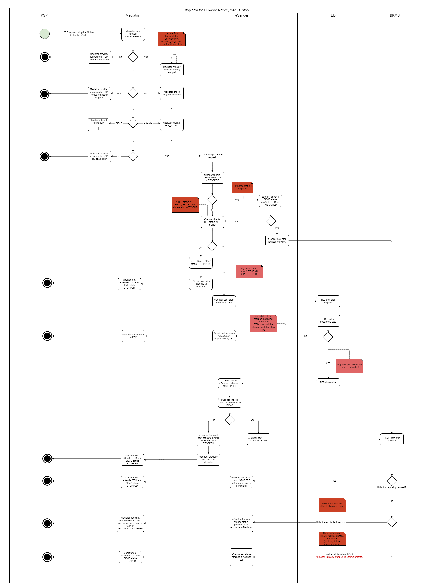

### EfA-Umsetzungsprojekt "Zugang zur öffentlichen Vergabe"
## Dokumentation Vermittlungsdienst
[Inhaltsverzeichnis](/documentation/documentation.md)
 

# Change Notices/ Stop-und-Update-Funktionalität

## Inhalt
- [Anpassen des Inhalts einer Bekanntmachung](#stop-oder-change)
    - [Update zu einer Bekanntmachung](#update)
	- [Change Notices](#change-notice)
- [STOP-Publikation Funktionalität](#stop-func)

## Anpassen des Inhalts einer Bekanntmachung
Es gibt zwei Möglichkeiten, den Inhalt einer Bekanntmachung zu ändern: Durch *Stop + Update* vor Veröffentlichung oder durch eine Änderungsmitteilung (*Change Notice*) nach der Veröffentlichung.
  

### Update zu einer Bekanntmachung
Eine Aktualisierung oder Neueinreichung (auch als Update bezeichnet) einer Bekanntmachung ist ein einfacher Bearbeitungsprozess, wenn die Bekanntmachung noch nicht in TED und/oder BKMS veröffentlicht ist. Wenn eine Bekanntmachung korrigiert werden muss, muss die vorherige Version zuerst gestoppt werden oder sich im Status "rejected" befinden. Andernfalls ist eine Aktualisierung nicht möglich, um sicherzustellen, dass zu jedem Zeitpunkt nur eine gültige Version eines Dokuments im Vermittlungsservice existiert. Um eine Aktualisierung zu erstellen, sollte die gleiche noticeID wie im vorhergehenden zu korrigierenden Dokument verwendet werden, nur die versionID muss erhöht werden (Lücken sind möglich). Eine Aktualisierung ist NICHT dasselbe wie eine Change Notice. Eine Aktualisierung enthält nicht die UBL-Extension einer Change Notice und kann nur eingereicht werden, bevor die Bekanntmachung veröffentlicht wurde.
 

#### **Beispiele**

Szenario A: Korrektur einer abgelehnten Bekanntmachung durch eine Aktualisierung (Update)

1. Bekanntmachung A mit der noticeID ABC *Version 01* wird eingereicht und abgelehnt, z. B. weil sie falsch ausgefüllt wurde. Da sie abgelehnt wurde, wird sie nicht veröffentlicht.
2. Der FVH möchte diese Bekanntmachung korrigieren
3. Der FVH reicht eine Aktualisierung mit noticeID ABC *Version 02* ein.
4. Die Aktualisierung wird akzeptiert, da die vorherige Version des Dokuments den Status REJECTED hat.

Szenario B: Verwendung einer Aktualisierung (Update) zur Bearbeitung einer eingereichten Bekanntmachung

1. Bekanntmachung A mit der noticeID ABC *Version 01* wird eingereicht und angenommen. Sie ist noch nicht veröffentlicht, z.B. weil das gewünschte Veröffentlichungsdatum in der Zukunft liegt.
2. Der FVH möchte etwas in dieser Bekanntmachung bearbeiten, z.B. weil sich einige Informationen geändert haben und angepasst werden müssen.
3. Der FVH stoppt die zuvor eingereichte Bekanntmachung noticeID ABC *version 01* mit Hilfe des Stop-Endpoints (Dies ist obligatorisch, bevor eine Aktualisierung gesendet wird. TED hat angekündigt, dass dies in Zukunft wahrscheinlich auch in TED so restriktiert wird)
4. Der Vermittlungsdienst stoppt die Bekanntmachung in TED und BKMS (je nachdem, wohin sie bereits gesendet wurde)
5. Der FVH reicht eine Aktualisierung mit noticeID ABC *Version 02* ein.
6. Die Aktualisierung wird akzeptiert, da sich die Vorgängerversion der Bekanntmachung im Status STOPPED befindet.
  

### Change Notice
Eine Änderungsmitteilung (auch als Change Notice bezeichnet) ist eine Änderung, die eine bereits veröffentlichte Bekanntmachung verändert. Wenn eine Änderungsmitteilung eingereicht wird, hat diese Bekanntmachung ihre eigene noticeID und versionID. Eine Change Notice enthält immer eine UBL-Extension, in der angegeben werden muss, welche konkrete Bekanntmachung geändert werden soll. Dies wird in dem Feld BT-738 Change Notice Identifier angegeben. Hier muss die noticeID-versionID oder die Notice Publication Number (wenn die referenzierte Notice im alten TED-XML Format eingereicht wurde) in der xml angegeben werden.

Beispiel für einen Referenzverweis mit noticeID-versionID:

`<efbc:ChangedNoticeIdentifier>c4c415ee-ac08-4465-8fa6-57568cf69462-01</efbc:ChangedNoticeIdentifier>`

Beispiel für einen Referenzverweis unter Verwendung der Notice Publication ID:

`<efbc:ChangedNoticeIdentifier>01234567-2022</efbc:ChangedNoticeIdentifier>`

Das Verfahren zur Einreichung einer Change Notice ist das gleiche wie bei jeder anderen Bekanntmachung. Auch der Prozess der Übermittlung an TED und BKMS ist für Änderungsmitteilungen identisch wie für jede andere Bekanntmachung.
  

## STOP-Publikation Funktionalität
Die Funktion "Stop Publication" wird verwendet, um die Veröffentlichung von Bekanntmachungen auf TED/BKMS (Oberschwellenvergabe) oder nur BKMS (Unterschwellenvergabe) zu stoppen. Das Stoppen einer Bekanntmachung ist nur möglich, wenn eine Bekanntmachung intern vollständig prozessiert, aber noch nicht veröffentlicht wurde. 

Die Veröffentlichung einer Bekanntmachung kann aus folgenden Gründen gestoppt werden:
1. Manuell durch einen externen Benutzer (FVH):
Der Benutzer kann das Stoppen einer Bekanntmachung mithilfe des TrackingCodes über die API V1/notices/stop/{trackingCode} im Vermittlungsdienst anfordern. Im Vermittlungsdienst wird hierbei hinterlegt, dass es sich um einen manuellen Stop-Vorgang handelte.
2. Automatisch: Wenn TED eine eingereichte Bekanntmachung aufgrund von [Lawfullness Warnings](Status_information.md/#lawfullness) manuell ablehnt, wird diese Bkeanntmachung in TED nicht veröffentlicht. Falls diese Bekanntmachung bereits an den BKMS versendet wurde, wird diese nun automatisch auch im BKMS gestoppt. Im Vermittlungsdienst wird hierbei hinterlegt, dass es sich um einen automatischen Stop-Vorgang handelte.

Es gibt einige Unterschiede in der Art und Weise, wie ober- und  unterschwellige Bekanntmachungen gestoppt werden können.
    

**Unterschwellige Vergabe**  
Die Veröffentlichung kann nur vor dem in der Bekanntmachung angegebenen bevorzugten Veröffentlichungsdatum (BT-738) manuell gestoppt werden, sodass die Bekanntmachung noch nicht auf BKMS veröffentlicht ist.

     

**Oberschwellige Vergabe: manuelle Stop**  
Die Veröffentlichung kann nur manuell gestoppt werden, bevor die Bekanntmachung auf TED veröffentlicht wird. Ob die Bekanntmachung in BKMS bereits veröffentlicht wurde ist hierbei nicht relevant. Ein manueller Stop ist nur möglich wenn keine zur Veröffentlichung vorgesehenen Vorgängerversionen existieren (Siehe Beispiele oben).

    

**Oberschwellige Vergabe: automatische Stop**  
Bei manueller Ablehnung durch TED wird die Veröffentlichung automatisch im BKMSgestoppt, auch wenn sie im BKMS vorher schon veröffentlicht worden sein sollte. 

  

**Stopp-Antworten**  
Welche Rückmeldungen Sie beim Versenden von Stop-Anfragen erhalten können Sie der API entnehmen unter https://ozg-vermittlungsdienst.de/q/swagger-ui/#/Lieferungen/stopPublication.