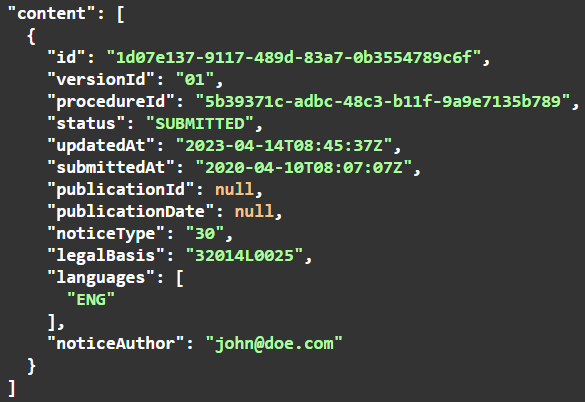

### Datenservice Öffentlicher Einkauf
# Häufig gestellte Fragen

- [Datenservice Öffentlicher Einkauf](#datenservice-öffentlicher-einkauf)
- [Standard eForms-DE und SDK-DE](#standard-eForms-DE-und-SDK-DE)
- [Allgemein](#allgemein)

## Datenservice Öffentlicher Einkauf

### Anbindung

Welche Systeme gibt es und wo brauche ich einen Account?

  
**[Redaktionssystem](https://resy.datenservice-oeffentlicher-einkauf.de/)**: Web-Oberfläche zum Erstellen von Bekanntmachungen und der Veröffentlichung bei TED sowie im Bekanntmachungsservice.   
Haben Sie in Ihrer Vergabestelle keine Software eines Fachverfahrensherstellers zum Erstellen von Bekanntmachungen,  unterstützt diese nicht alle von Ihnen benötigte Formulare oder haben Sie bisher die eNotices2 von TED genutzt? Dann ist das Redaktionssystem richtig! 
  
**[Vermittlungsdienst](https://ozg-vermittlungsdienst.de/)**: Rein technische Schnittstelle zur Annahme, Validierung und Weiterleitung von Bekanntmachungen an TED und den Bekanntmachungsservice.   
Bietet KEINE Oberfläche zum Erstellen von Bekanntmachungen! Es ist ausschließlich Maschine-zu-Maschine Kommunikation möglich, wie z.B. von einer Vergabestellensoftware. Diese Anbindung wird meist durch den Fachverfahrenshersteller durchgeführt. 
  
**[Self-Service Portal](https://github.com/EFA-FHB/ozg-vermittlungsdienst-doku/blob/main/documentation/SSP.md)**: Web-Oberfläche für das Accountmanagement von Accounts des Vermittlungsdienstes. 
  Hauptsächlich genutzt durch Fachverfahrenshersteller. Dashboard Accounts sind möglich zur Ansicht der Statusinformationen von eingelieferten Bekanntmachungen, dazu wenden Sie sich bitte an Ihren Fachverfahrenshersteller wenden! 
 

 

Welche Informationen werden benötigt, um einen Account zu beantragen? (aktualisiert am 11.10.23)

 

Seit dem 04.10 sollen Accounts im [Self-Service Portal](https://portal.ozg-vermittlungsdienst.de) beantragt werden. Alle benötigte Informationen werden im Registrierungsformular für einen VD Account abgefragt. Diese sind:

 

- Systemumgebung, für die Zugangsdaten beantragt werden (Preview, Staging, Produktion). Die Registrierung im Portal erfolgt für die entsprechende Umgebung, d. h. wenn ein Konto für die Staging-Umgebung erforderlich ist, sollte dieses im Staging-Portal beantragt werden.

-  E-Mail-Adresse, welche als Benutzername verwendet werden soll (diese muss pro Umgebung eindeutig sein, keine Dopplungen erlaubt)
  
- URL der Vergabeplattform auf der die Bekanntmachungen veröffentlicht werden
  
- Vor- und Nachname sowie die E-Mail-Adresse des Vertreters des FVH (Fachverfahrenshersteller)
  
- Name des FVH

 

Pro Registrierung muss eine E-Mail Adresse als Benutzername angegeben werden. Ist es möglich dieselbe E-Mail-Adresse für mehrere Systeme anzugeben?

 
Generell erfragen wir zwei Emails pro Account (teils auch als Mandant bezeichnet): Eine Accountemail zur Aktivierung des Accounts und eine Kontaktemail. Es wird eine individuelle Email pro Account zur Aktivierung benötigt, um das Passwort für den Account zu setzen und eine eindeutige Authentifizierung mit der Kombination aus Email und Passwort zu ermöglichen. Die Account-Email kann aber auch ein Funktionspostfach sein und wird nur zur Verwaltung des Accounts benötigt. Die Kontakt-Emailadresse wird nur genutzt, falls beim Betrieb Fragen aufkommen zu einer Bekanntmachung, die von diesem Account versendet wurden. Kontakt-Email und Account Email dürfen bei Bedarf identisch sein und dieselbe Kontakt-Email (z.b. ein zentraler Ansprechpartner) darf bei mehreren Accounts verwendet werden. Es können allerdings zwischen den Systemumgebungen Ihre Account E-Mail je einmal wiederverwenden, zum Beispiel dieselbe Account Mail-Adresse für Preview, Staging und Production. Generell empfehlen wir einen Account pro Vergabeplattform.

 

Bei der Accounterstellung muss eine Kontakt-E-Mmail-Adresse eines FVH angegeben werden. Wozu wird diese verwendet?

 
Diese Email wird verwendet, wenn wir proaktiv auf Sie zugehen wollen. Dies kann der Fall sein, wenn es beispielsweise Auffälligkeiten mit ihrem Account oder den eingelieferten Bekanntmachungen gibt oder wir generelle Informationen an alle Accountverantwortlichen versenden. 

 

Können mehrere Accounts gleichzeitig beantragt werden? Wie viele Accounts empfehlen sich jeweils für die Preview- und Staging-Umgebung?

 
Die URL der Vergabeplattform dient rein der Zuordnung dr Accounts/ Mandanten, diese hat nichts mit der Verlinkung auf die Vergabeunterlagen zu tun. 

Manche Vergabeplattformen nutzen z.B. Dropbox oder google drive oder Ähnliches für das Hosten der Vergabeunterlagen, weshalb sich daraus nicht eindeutig die dahinterliegende Plattform identifizieren lässt. Aus diesem Grund ist diese Information zusätzlich notwendig. Die Verlinkung zu den Vergabeunterlagen bleibt weiterhin im XML Dokument und diese wird primär in der BKMS Oberfläche angezeigt. Der bei der Accounterstellung mitgegebene Link wird nur rechts unten, unter der Bekanntmachung selbst, als Disclaimer/ Quelle angezeigt. 

 

Worin besteht der Unterschied zwischen der bei der Accounterstellung angefragten URL der Vergabeplattform und der Verlinkung zu den Vergabeunterlagen im eForms-Dokument?

 
Senden Sie uns gern eine Liste von benötigten Accounts an support-oeffentlichevergabe@bdr.de Inklusive aller benötigter Informationen pro Account. Wir empfehlen, auf Staging exakt so viele Accounts zu verwenden, wie sie für Produktion planen, zu nutzen. Zusätzlich sind natürlich beliebig viele Testaccounts auf Preview und Staging möglich.  

 

Wird auf Staging oder Preview der Veröffentlichungszyklus und die Validierung auf die selbe Art wie in Produktion durchgeführt oder werden die Statuswechsel beschleunigt? Mit welchen Verzägerungen zwischen Annahme und Veröffentlichung ist zu rechnen? 

 
In allen Umgebungen wird die gleiche Validierung und die gleiche Verzögerung in der Veröffentlichung durchgeführt wie in der Produktionsumgebung. Die Zeitverzögerungen liegen in diesem Fall bei TED (Veröffentlichung werktags frühestens am nächsten Werktag bei Annahme bis 16 Uhr) bzw der rechtlich notwendigen Logik der nationalen Veröffentlichung (Weiterleitung an den BKMS) nach frühestens 48h. Der BKMS veröffentlicht sofort, wenn eine Bekanntmachung entgegengenommen wurde, es sei den das Bevorzugte Veröffentlichungsdatum liegt in der Zukunft. In diesem Fall würde die Veröffentlichung sowohl in TED als auch in BKMS erst am gewünschten Tag stattfinden unter den bei TED geltenden Einschränkungen (z.B. keine Veröffentlichung am Wochenende).

 

Zur Anforderung von Zugängen soll die URL der Vergabeplattform angegeben werden. Wozu dient diese Angabe?

 
Die Angabe der URL dient dazu, die genannten Systeme voneinander unterscheiden zu können, Ihnen den korrekten Zugang zu ermöglichen und Duplikate zu vermeiden. Vergabeplattformen sind die Systeme, in denen Bekanntmachungen veröffentlicht werden, die URL der Vergabeplattform kann so z.B. alpha.oeffentlichevergabe.de (Test-Umgebung BKMS) sein. Diese URL dient dazu, zu identifizieren, auf welcher Plattform Sie Ihre Bekanntmachungen derzeit veröffentlichen. Zu diesem Thema ist uns bewusst, dass es hier unterschiedliche Vorgehensweisen je nach Struktur des Systems der jeweiligen FVH geben kann. Prinzipiell gilt, dass sie einen Account pro System benötigen, dass zukünftig in den Vermittlungsdient einliefern soll. Wenn Sie unsicher sind, welche Systeme/ Plattformen für Sie an den DöE anzuschließen sind, unterstützen wir Sie gern bei dieser Entscheidung. Senden Sie uns dazu gern eine Anfrage an support-oeffentlichevergabe@bdr.de. 

 

Welche Systemumgebung ist die Umgebung, an die unsere Testsysteme Bekanntmachungen versenden können? Worin besteht der Unterschied zwischen der Preview und Staging Umgebung?

 
Die Preview-Umgebung dient nur zum Testen. Hier werden häufig Updates eingespielt und dies ist auch unsere Testumgebung für zukünftige Releases. Die Staging-Umgebung ist eine 100% Kopie der Produktionsumgebung und sollte nur für produktionsnahe Tests genutzt werden. Beide Umgebungen liefern in die Alpha Umgebung des BKMS und TED Preview ein. Auf Staging sollten Ihre Tests genauso durchgeführt werden, wie sie es in Produktion planen, zu tun. Prinzipiell sind aber beide Umgebungen zum Test geeignet.

 

Wo sind Beispiele zu eForms-DE zu finden? Welche unterschiedlichen Typen gibt es? ? 

 
Beispieldokumente für eForms-DE sind im schematron Repository der KoSIT zu finden: https://projekte.kosit.org/eforms/eforms-de-schematron/-/tree/main/src/test/eforms-de-base-samples 
ÜBer die jeweiligen tags und releases können die unterschiedlichen Versionen der Dokumente abgerufen werden.

Die Abkürzungen sind wie folgt zu verstehen: 

PIN
Eng: Prior Information Notice
Deu: Vorinformation
Subtyp 1-14, E2
PINs sind Bekanntmachungen, die vor Beginn des "Aufrufs zum Wettbewerb" veröffentlicht werden.

CN
Eng: Contract Notice
Deu: Offenes Verfahren / Öffentliche Ausschreibung
Subtyp 15-24, E3
CNs sind Bekanntmachungen, die den "Aufruf zum Wettbewerb" einleiten.

CAN
Eng: Contract Award Notice
Deu: Bekanntmachung (vergebener Vertrag)
Subtyp 25-40, E4
CANs werden zur Erstellung von Ergebnisbekanntmachungen verwendet, die kurz nach der Vertragsunterzeichnung veröffentlicht werden. Sie beziehen sich auf die Bekanntmachung und enthalten Informationen über das Vergabeverfahren, wie z. B. die Auftragsvergabe, den Gewinner usw.

Bei der Bennenung der Beispeieldokumente geht es um folgendes:

eforms = Standard Dokumenttyp
PIN/CN/CAN = siehe oben; bezeichnet das Art von Bekanntmachung
Nummer 1-40 oder E1-E4 = Subtyp der Bekanntmachung, wobei E für unterschwellige Bekanntmachungen sind
DE = Standard ist eForms-DE
(in)/valid = ob das file laut Spezifikation eForms-de gültig oder ungültig ist
Es existieren derzeit noch nicht für alle Bekanntmachungstypen eine Beispieldatei. Wenn sie für einen bestimmten Typ ein Beispiel benötigen, das im vorher genannten Link nicht existiert, können wir gern eine Anfrage hierzu weiterleiten. Leider stellt auch die EU nicht für alle Bekanntmachungstypen Beispiele bereit, sodass die zur Verfügungstellung von Beispiel teilweise recht zeitintensiv ist. 

 

### Roadmap

Gibt es eine Roadmap bezüglich der Weiterentwicklung auch nach Stichtag 25.10.2023 der Komponenten Vermittlungsdienst, eSenderHub, usw., insbesondere im Hinblick auf Feature- und API-Erweiterungen, Meilensteine und die jeweiligen Go-live-Zeitpunkte?

 
Zum derzeitigen Stand sind nach dem 25.10.2023 noch zwei Releases für den Datenservice geplant. Der Inhalt der Releases bezieht sich primär auf Komfortfunktionen und Auswertungsmöglichkeiten. API-Änderungen und Erweiterungen sind nach aktuellem Planungsstand nicht vorgesehen.

 

Wird es eine Roadmap bezüglich der Weiterentwicklung des SDK geben? Dies ist für Plattformbetreiber insbesondere vor dem Hintergrund der Anpassungszeitpunkte an neue SDK-EU-Versionen interessant, da das SDK-DE und SDK-EU aktuell in ihrer Versionierung noch auseinandergehen.

 

Die Versionsbezeichnungen der SDK zum jeweiligen nationalen Standard eForms-DE orientieren sich an den Versionsbezeichnungen des Standards eForms-DE. Zu jedem eForms-DE-SDK ist angegeben, auf welcher europäischen SDK-Version diese beruht. (siehe auch Erläuterung auf https://gitlab.opencode.de/OC000008125155/SDK-eforms-de)

Es ist nicht geplant, dass zu jeder minor Version des eForms-EU auch eine neue Version eForms-DE veröffentlicht wird. Deshalb wird die Versionierung von eForms-EU und eForms-DE auch in Zukunft nicht direkt übereinstimmen. Es wird aber immer für jede eForms-DE Version exakt eine korrespondierende eForms-EU Version geben.

 

In welchem Zeitrahmen wird ein DE-Update zur Verfügung gestellt, nachdem ein EU-Update veröffentlicht wurde?

 

Es ist hierbei zu beachten, dass nicht für jedes EU-Update automatisch ein DE-Update notwendig ist.
 
Das GDK liegt nicht in der Verantwortung der KoSIT. Jedoch die Spezifikation eForms-DE. Wie beim 1. technischen Arbeitstreffen gemeinsam festgestellt wurde, können wir angesichts noch vorliegenden Unklarheiten über in Kraft treten und Lebensdauer der Versionen des EU-SDK, derzeit noch keine einfache Antwort mit klaren Daten geben. Was feststeht ist, dass eine bestimmte Version eForms-DE sich kompatibel zu einer bestimmten Version eForms-SDK erklärt und dies möglichst zeitnah geschehen soll. Wie derzeit eForms-DE 1.0.1 kompatibel zu eForms-SDK 1.5.1 ist (SDK 1.5.1 wurde am 20. Januar 2023 veröffentlicht und eForms-DE am 5. Februar). D.h. implizit, dass es nicht zu jeder Version eForms-SDK eine Version eForms-DE geben wird. Die aktuelle eForms-DE Version 1.1.0 ist kompatibel zu SDK 1.7. 

 

### Go-Live

Welche Einreichungsfristen sind zu beachten? (ergänzt am 12.10.23)

 
Um sicherzustellen, dass die Bekanntmachung noch am selben Tag auf TED veröffentlicht wird, empfehlen wir  die Bekanntmachung bis 23:00 Uhr desselben Tages beim Vermittlungsdienst eingereicht sein.

Bsp. für die FVH:
 Um sicherzustellen, dass die Bekanntmachung noch am selben Tag an den Vermittlungsdienst gesendet wird, empfehlen wir die Bekanntmachung bis 22:00 Uhr desselben Tages beim Fachverfahrenshersteller eingereicht sein.

 

 Wann startet der Datenservice Öffentlicher Einkauf? (ergänzt am 25.09.23)

 
Der Produktivstart des Datenservice Öffentlicher Einkauf ist durch §83a der aktuellen Vergabeverordnung (VgV) geregelt. Dies wird voraussichtlich der 25.10.2023 sein.

 

Werden zum Go-live alle 40 EU-Bekanntmachungstypen unterstützt?

 
Es werden alle Dokumententypen aus eForms-DE angenommen (40 für die Oberschwelle und 3 für die Unterschwelle). Wo notwendig werden diese generisch in das eForms-EU Format konvertiert. Dies entspricht den Inhalten des aktuellen eForms-DE Standards.

 

Ist es möglich ab dem 25.10.2023 weiterhin Bekanntmachungen über eNotices2 einzuliefern? 

 
Ab dem 25.10.2023 müssen rechtlich alle oberschwelligen Bekanntmachungen im eForms-DE Format über den Datenservice Offentlicher Einkauf eingeliefert werden. Eine direkte Einlieferung über eNotices2 ist nicht standardkonform, da die Anpassungen des eForms-DE Standards nicht berücksichtigt würden und ist rechtlich nicht mehr zulässig. 

 

Gilt die Einführung von eForms sowohl für Ober- (EU) als auch Unterschwellenwerte (National) oder nur für die EU-Ebene?

 
Ab dem 25.10.23 müssen EU-weite Mitteilungen im Format eForms-DE verpflichtend über die Schnittstelle übermittelt werden. Wenn die Schnittstelle auch für nationale Bekanntmachungen genutzt werden soll, muss dies ebenfalls über das eForms Format geschehen, damit der Datenservice diese verarbeiten kann. Welche Formate derzeit unterstützt und verarbeitet werden, erfahren Sie in unserer Vorschau unter https://github.com/EFA-FHB/ozg-vermittlungsdienst-doku/blob/development/documentation/eForms_support.md.

 

Wie wird mit einem Wechsel des eSenders für eine Bekanntmachung umgegangen, wenn diese berichtigt werden soll? Wie wird mit einem Wechsel des eSenders innerhalb eines Verfahrens mit mehreren Bekanntmachungen umgegangen? Wie können Korrekturen oder Verweise für Folgebekanntmachungen in Bezug auf im alten Format eingereichte Bekannmachungen durchgeführt werden? 

 

Es wird nicht möglich sein, über den Datenservice den Status einer alten Bekanntmachung abzufragen oder eine alte Bekanntmachung zu stoppen, die nicht über den Datenservice eingeliefert wurde, da der Datenservice keine Anfragen zu im alten Format versendeten Bekanntmachungen versenden kann. Der Wechsel des eSender hat jedoch keinen Einfluss auf die Möglichkeit, auf alte Bekanntmachungen zu referenzieren. 
Wie Verweise und Korrekturen alter Bekanntmachungen möglich sind, finden Sie hier ausführlich beschrieben: https://github.com/EFA-FHB/ozg-vermittlungsdienst-doku/blob/main/documentation/eForms_creation.md

 

### Kommunikationskanäle

 
Erreichbarkeiten:

*Fragen und Verbesserungsvorschläge* gegenüber dem Vermittlungsdienst und dem eSender-Hub können an oeffentliche-vergabe@nortal.com gerichtet werden. Alternativ können Github Issues im Dokumentationsrepository und dem SDK-eForms-DE Repository erstellt werden.

Bei *Supportanfragen zum Betrieb* des Vermittlungsdienst und des eSender-Hubs wenden Sie sich bitte an: support-oeffentlichevergabe@bdr.de.

*Fragen zum Bekanntmachungsservice* können an support-oeffentlichevergabe@bdr.de gerichtet werden.

Wir sind offen für Ihre Vorschläge!

 

Wie kann sichergestellt werden, dass Plattformanbieter regelmäßig über Neuigkeiten bzgl. des Datenservice informiert bleiben, insbesondere bzgl. neuer Versionen der Komponenten (Vermittlungsdienst, eSenderHub, REST-API, usw.), neuer Features, einer Aktualisierung der Roadmap etc.?

 
Eine Kommunikation erfolgt durch Regelmäßige Informationstermine für die Fachverfahrenshersteller, Ankündigungen per E-Mail, aktuelle Roadmap, Versionshinweise und FAQ sind in dem veröffentlichten Dokumentationsrepository: https://github.com/EFA-FHB/ozg-vermittlungsdienst-doku. Ebenfalls gibt es das SDK-eForms-DE Repository: https://gitlab.opencode.de/OC000008125155/SDK-eforms-de.

 

Wie kann sichergestellt werden, dass Plattformanbieter regelmäßig über Neuigkeiten bzgl. des eForms-DE Standard/ SDK-eForms-DE informiert bleiben.

 

Die offiziellen Publikation zum Standard eForms-DE erfolgt auf https://xeinkauf.de/eforms-de/ .

Die Publikation des zugehörigen SDK erfolgt auf https://gitlab.opencode.de/OC000008125155/SDK-eforms-de .

Publikationen zum organisatorischen Rahmen siehe:

https://www.finanzen.bremen.de/digitalisierung/digitalisierung-von-verwaltungsleistungen-fuer-unternehmen/digitale-beschaffung-103422

Fragen zum DE-SDK sind über Issues im Repository zu eröffnen.

 

### Dokumentation

Gibt es durch die Dokumentation zum Vermittlungsdienst (https://github.com/EFA-FHB/ozg-vermittlungsdienst-doku) bereits weiterführende Informationen zum Konstrukt des Datenservice. Inwieweit ist geplant, diese auf dem neusten Stand zu halten und ggf. durch Informationen in Form von FAQs ö. Ä. zu ergänzen? Handelt es sich bei dieser GitHub-Dokumentation um die offizielle Bereitstellung von Informationen zu diesem Thema?

 

Die Github-Dokumentation wird weitergepflegt und ist bis auf weiteres die offizielle Dokumentation. Die kann auch im [Self-Service Portal](https://portal.ozg-vermittlungsdienst.de/) des DöEs gelesen werden. 

 

Wie kann für ein Release ermittelt werden, welche Versionen der Teilkomponenten unterstützt werden?  

 

Unter [eForms Unterstützung](/documentation/eForms_support.md) ist dokumentiert welche eForms-Versionen die Teilkomponenten unterstützen.
 
Für jedes Release verffentlichen wir releasenotes, um zu beschreiben, welche Komponente welche Version unterstützt. Die Versionen eForms-DE 1.0.1 und 1.1.0 werden ab 13. September in allen Komponenten des Datenservice öffentlicher Einkauf unterstützt. 

 

Ist die Dokumentation zum Vermittlungsdienst (https://github.com/EFA-FHB/ozg-vermittlungsdienst-doku) die offizielle Dokumentation?

 

Ja, die Github-Dokumentation wird regelmäßig aktualisiert und ist bis auf weiteres die offizielle Dokumentation. Die Dokumentation wird zugleich im [Self-Service Portal](https://portal.ozg-vermittlungsdienst.de/) veröffentlicht.

 

### Statusmodell

Bekanntmachung anhalten, ändern oder abbrechen? (ergänzt am 27.09.23)

 
-"Publishing" im nächsten Monat in eNotices2 Web und API sichtbar 
- Käufer/API kann die Veröffentlichung einer Bekanntmachung im Status "Submitted" stoppen
- Sobald der Status "Published" (d.h. auf TED) erreicht ist, kann die Bekanntmachung geändert oder das Verfahren fortgesetzt werden
- Los oder Verfahren können über Vergabebekanntmachung ohne Gewinner storniert werden
- Change notice mit dem Grund "cancel" = die Bekanntmachung ist null und nichtig - dies ist möglich, wird aber nicht empfohlen!

 

Wie kann der Beginn der Stillhaltezeit von 48 Stunden nachvollzogen, wann die Bekanntmachung bei TED eingegangen ist?

 
Es bestehen zwei Möglichkeiten, den Zeitpunkt der erfolgreichen Einlieferung bei TED aus den Statusinformationen im Vermittlungsdienst abzulesen. Entweder über den technischen Zeitstempel, wann der eSender eine Bestätigung für die Einlieferung von der TED API erhalten hat (<tedStatus>ACCEPTED</tedStatus>  tedStatusUpdate>2023-07-31T08:02:02.442Z</tedStatusUpdate>) oder über den von TED übermittelten Wert submittedAt, der bei der Statusabfrage mitgeliefert wird (<ted_accepted_timestamp>). Beide Werte liegen nur minimal auseinander, da es eine minimale Verzögerung geben kann zwischen dem Zeitpunkt, wann TED die Bekanntmachung annimmt und wann eine Erfolgsmeldung an den eSender als Response zurückgeliefert wird. 

 

Mit den Statusänderungsmeldungen der EU haben Plattformanbieter auch weitergehende Metadaten zum jeweiligen Status erhalten, bspw. die Submission-ID, den konkreten Zeitpunkt der Veröffentlichung auf TED, die ABl.-Nummer etc. Mit der ABl.-Nummer hatten Kunden bisher die Möglichkeit, bei Folgebekanntmachungen zu diesem Auftrag (Angabe "frühere Bekanntmachung desselben Auftrags") diese Nummern nicht mehr manuell eintragen zu müssen, da diese vorbefüllt werden konnten. Besteht auch weiterhin die Möglichkeit, o. g. Informationen zur Veröffentlichung zu erhalten, um den Kunden diese Reihe an Funktionalitäten zu bieten?

 
TED stellt nicht mehr dieselben Metadaten pro Bekanntmachung zur Verfügung wie früher, wir geben alle relevanten Infos zurück, die wir bekommen.
Die folgenden Daten werden von TED zu einer Bekanntmachung zur Verfügung gestellt.

 

Wir prozessieren dabei den Status, den Zeitpunkt der Einlieferung und wenn gegeben den Zeitpunkt der Veröffentlichung. Die ABl.-Nummer wird in eNotices2 nicht mehr verwendet. Wenn Sie weitere Daten aus dieser Abfrage benötigen, schreiben Sie uns bitte eine Mail mit Ihren Anforderungen an: support-oeffentlichevergabe@bdr.de. Gerne organisieren wir einen bilateralen Austausch.

 

Wie werden abgelehnte Bekanntmachungen in Fehlerzuständen wie 'REJECTED' Status von TED oder einem 'INTERNAL ERROR' Status von BKMS weiter prozessiert? 

 
Es wird ein internes Monitoring geben, um auf Fehlerzustände (Status InternalError) oder Bugs zu reagieren. Aktuell ist Nortal unter der E-Mail Adresse support-oeffentlichevergabe@bdr.de der erste Ansprechpartner, wenn Sie Probleme mit Ihren Einlieferungen haben udn Ihre Bekanntmachungen in einen Fehlerstatus laufen. Generell deuten solche Fehlerzustände auf Bugs im DöE, in TED oder in der versendeten Bekanntmachung hin. Wann immer Fehler im System passieren (Beispielsweise bei Ablehnung durch TED), werden diese geloggt, sodass bei Bedarf ein Support Ticket erstellt und eine technische Analyse durchgeführt werden kann. Es wird dann individuell entschieden, welche Maßnahmen zur behebung des Fehlers zielführend sind. Bei technischen Fehlern kann die Bekanntmachung entweder nach Behebung erneut als neue Version versendet oder intern manuell erneut prozessiert werden. Dies ist jedoch vom Einzelfall abhängig. Sollte TED ablehnen besteht die Möglichkeit, dass ein Fehler in der Bekanntmachung existiert, beispilesweise die notice-id bereits genutzt wird. In diesem Fall wird gespeichert, welche Fehlermeldung TED bei der Ablehnung zurückgeliefert hat, sodass entsprechend reagiert werden kann. 

Sollte ihr System nach dem doe_status INTERNAL_ERROR (welcher NICHT final ist) den Bekanntmachungsstatus nicht mehr automatisch aktualisieren, können Sie den Status auch über die Notices Tabelle im Self-Service Portal (portal.ozg-vermittlungsdienst.de) mit den Login Daten ihres Systems beim Vermittlungsdienst prüfen. Bekanntmachungen werden nicht im INTERNAL_ERROR Status verbleiben. Bitte eröffnen sie hierzu keine Tickets bei der BDR, sondern wenden Sie sich an Ihren Fachverfahrenshersteller. Lediglich der doe_status REJECTED is final, in diesem Fall müssen sie die Bekanntmachung mit einer neuen Notice-ID oder Version einliefern. 

 

Kann es vorkommen, dass eine oberschwellige Bekanntmachung nach Ablauf der Frist in NOT_PUBLISHED übergeht, wenn sie schon im BKMS veröffentlicht wurde? Denn dann hätten wir ja TED:NOT_PUBLISHED / DSE:PUBLISHED, einen Status, den ich im Ablaufdiagramm nicht entdecken konnte.

 
Der Status NOT_PUBLISHED ist nur für Bekanntmachungen mit lawfullness warnings relevant. Wenn eine Bekanntmachung keine lawfulness warnings hat, wird keine manuelle Prüfung durch TED durchgeführt, sodass es auch nicht zum Status NOT_PUBLISHED basierend auf einer manuellen Ablehnung kommen kann. 

Bei lawfullness warnings wird eine Bekanntmachung erst 5 Tage nach SUBMITTED in TED an den BKMS weitergeleitet, um die manuelle Prüfung abzuwarten. Sollte es aber dennoch zu einer Situation kommen, bei der eine Bekanntmachung bereits im BKMS veröffentlicht ist, die dann in TED auf NOT_PUBLISHED wechselt, dann wird diese Bekanntmachung automatisch durch unser System im BKMS gestoppt, sodass der Status auf DöE:Stopped wechseln würde. So stellen wir sicher, dass keine von TED abgelehnten Bekanntmachungen im BKMS veröffentlicht bleiben. Dieses Szenario ist aber sehr sehr unwahrscheinlich. 

 

### API-Vermittlungsservice

Wie können Plattformbetreiber die Informationen des CVS-Reports der EU zu einer Bekanntmachung erhalten?

 
Alle Fehler und Warnungen aus dem CVS Report werden in den Statusinformationen übergeben. Dabei übergeben wir die ID, den Pfad, den Inhalt und den Text jeder angeschlagenen Regel. Es ist nicht vorgesehen, den CVS Report als Datei zurückzugeben.

 

In der REST-API-Beschreibung wird von "aktuellen Datenlieferungen" gesprochen. Was ist damit genau gemeint?

 
Der Endpunkt v1/notices gibt Statusinformationen zu allen Bekanntmachungen zurück, die vom derzeit authentifizierten Mandanten erfolgreich eingeliefert wurden.

 

Kann auch ein API-Key zur Authentifizierung genutz werden oder nur die Authentifizierung über Token?

 
Die Authentifikation via API-Keys wird bald abgeschaltet, auch auf Preview. Langfristig können Sie sich nur über die Tokens mit Refresh alle 24h authentifizieren. In Einzelfällen werden API-Keys noch zu Test- und Debuggingzwecken genutzt. 

 

In der REST-API wird von Mandanten gesprochen. Bedeutet 1 Mandant = 1 API-Key = 1 Vergabeplattform?

 
Diese Annahme ist korrekt.

 

In der REST-API-Beschreibung wird von "aktuellen Datenlieferungen" gesprochen. Was ist damit genau gemeint?

 
Der Endpunkt v1/notices gibt Statusinformationen zu allen Bekanntmachungen zurück, die vom derzeit authentifizierten Mandanten erfolgreich eingeliefert wurden.

 

Vergabeplattformen möchten zeitnah Statusänderungen erkennen (derzeit erfolgt eine Statusabfrage pro relevanter Datenlieferung etwa alle 10 Minuten). Ist für "GET /v1/notices" geplant, die Liste auf solche Datenlieferungen einschränken oder filtern zu können, bei denen ein TED- oder DÖE-Statuswechsel seit einem übergebenen Zeitpunkt stattfand, um die Abfragelast auf dem System zu senken?

 
Vielen Dank für diesen Vorschlag; wir werden eine Umsetzung prüfen.

 

Wie können Plattformbetreiber die Informationen des CVS-Reports der EU zu einer Bekanntmachung erhalten, wenn diese weder in der Antwort bei Veröffentlichung (POST → /v2/notices), noch in den Statusinformationen (GET → /v1/notices/{trackingCode}) enthalten sind?

 
Alle Fehler und Warnungen aus dem CVS Report werden zukünftig in den Statusinformationen übergeben. Dabei übergeben wir die ID, den Pfad, den Inhalt und den Text jeder angeschlagenen Regel. Derzeit ist es nicht vorgesehen, den CVS Report als Datei zurückzugeben.

 

Ist es möglich, die online Validator API produktiv zu nutzen?

 
Ja, die produktive Nutzung des Online Validators wird unterstützt. In der Produktivumgebung und in der Stagingumgebung wird die eforms-de-schematron Bugfix-Version immer die gleiche sein, wie auch im Vermittlungsdienst selbst. Auch die Nutzung des Offline-Validators (https://github.com/EFA-FHB/eforms-validator-core) ist empfohlen. 

 

### Laufende Vergabeverfahren und Umstellung auf den neuen Datenservice

 Wie erfolgte die Verlinkung mit bzw. der Verweis auf vorherige Bekanntmachungen? (ergänzt am 27.09.23)

 
 

- Die Bekanntmachungen sind mit der Verfahrens-ID verknüpft.

  Besonderheiten:

   --> Planung/PINs sind nicht Teil von Verfahren: BT-125 verwenden 

   --> Zuschläge innerhalb eines Rahmenvertrags: OPT-100 verwenden 

   --> Änderungsmitteilung: BT-758 verwenden 

   --> Vertragsänderung: BT-1501 verwenden 

   --> Bekanntmachungen vor eForms (und alle anderen Fälle): OPP-090 verwenden 

- TED-Veröffentlichungsnummer ([1-8 Ziffern]-[Jahr]) oder eForms UUID verwenden 

- In den [Developer Docs FAQ](https://docs.ted.europa.eu/home/eforms/FAQ/index.html#_forms_and_procedures) finden Sie diese Informationen ebenfalls

  - Weitere Details zur Verlinkung der Bekanntmachungen siehe
https://github.com/EFA-FHB/ozg-vermittlungsdienst-doku/blob/main/documentation/eForms_creation.md

-  Details zur Verwendung der Referenzen können hier nachgelesen werden: https://docs.ted.europa.eu/eforms/latest/schema/procedure-lot-part-information.html#previousNoticeSection 

 Die Komponenten des Datenservice können nur die neuen eForms-Strukturen entgegennehmen. In den Vergabeplattformen wird aktuell zur EU mit den TED-Schema-Strukturen kommuniziert. Für laufende Vergabeverfahren wird es so sein, dass bspw. nach einer Auftragsbekanntmachung eine Bekanntmachung vergebener Aufträge veröffentlicht wird oder bspw. für eine Bekanntmachung vergebener Aufträge eine Auftragsänderung. Können Bekanntmachungen bis zum Stichtag 25.10.2023 für laufende Vergabeverfahren weiterhin im TED-2.0.9-XML-Format an den Datenservice gesendet werden oder sollen diese bis zum Stichtag wie bisher direkt an TED übermittelt werden?

Bis eForms-DE verpflichtend wird, kann im alten Format direkt bei TED eingeliefert werden. Für die zukünftige Einlieferung an den Datenservice Öffentlicher Einkauf kann ausschließlich das neue Format des Standards eForms-DE genutzt werden.

 

Wird es möglich sein, Berichtigungen zum Datenservice zu senden, welcher diese als eigenständiger, neuer eSender-Hub an TED übermittelt, auch wenn die Bekanntmachungen zuvor durch den Plattformbetreiber als ehemaliger eSender-Hub an TED übermittelt wurde?  
Genauer gesagt:

- Wie wird mit einem Wechsel des eSenders für eine Bekanntmachung umgegangen, wenn diese berichtigt werden soll?
- Wie wird mit einem Wechsel des eSenders innerhalb eines Verfahrens mit mehreren Bekanntmachungen umgegangen?

 
Es wird nicht möglich sein, über den Datenservice den Status einer alten Bekanntmachung abzufragen oder eine alte Bekanntmachung zu stoppen, die nicht über den Datenservice eingeliefert wurde, da der Datenservice keine Anfragen zu Bekanntmachungen von anderen eSendern durchführen kann. Dies ist eine Restriktion von TED zu einliefernden eSendern.

Die Berichtigung einer Bekanntmachung ist prinzipiell möglich, indem vor Veröffentlichung einer Bekanntmachung eine neue Version einer Bekanntmachung im eForms Format an den Datenservice verschickt wird. Dieses Update wird dann zu TED versendet und TED veröffentlicht die aktuellste Version der Bekanntmachung. Wenn die ursprüngliche Bekanntmachung bereits veröffentlicht ist, muss eine „Change Notice“ versendet werden.

Es ist derzeit in Klärung mit TED, wie auf eine vorherige Bekanntmachung im alten Format referenziert werden kann, um diese miteinander zu verknüpfen und inwiefern der Wechsel des einliefernden eSenders Einfluss auf Änderungen hat.

 

Wird OPP-090-Procedure ausschließlich für den Fall alter Bekanntmachungen (altes TED Schema) mit Weiterbearbeitung in eForms genutzt?
 
 

Sowohl Change Notices und somit der "Change Notice Version Identifier" (BT-758) als auch "Framework Notice Identifier" (OPT-100) und "Previous Notice" (OPP-090) sind TED spezifische Lösungen, die direkt genutzt werden können.

 

### Akzeptierte SDK-Versionen

Laut unseres Kenntnisstands ist das eForms-DE-Format nicht mehr kompatibel zum eForms-EU-Format, da es kein reines Subset mehr davon ist. Somit können mit dem eForms-DE-Format keinerlei API-Funktionen der EU aufgerufen werden, sei es die neue eForms-API oder die APIs der Viewer-Services (PDF-/HTML-Rendering). Ist es korrekt, dass der neue Datenservice keine Render-Methode anbietet und auch die Render-Methoden der EU aufgrund der Inkompatibilität nicht mehr verwendet werden können? Wie können Funktionen wie PDF-/HTML-Rendering dennoch genutzt werden?

 

Frage 2 unter [Roadmap](#roadmap) - Der Bedarf für eine Rendering Methode wurde bereits aufgenommen und wird derzeit analysiert.

Der eSender-Hub trägt Sorge dafür, entsprechend der eingelieferten eForms-DE Version diese Bekanntmachung in ein valides eForms-EU Dokument zu transformieren, um damit die TED-Funktionen nutzen zu können.

 

 Welche Versionen des Standards eForms-DE werden aktuell unterstützt? (ergäntz am (29.09.23)

 
Im Oktober 2023 werden vom Datenservice Öffentlicher Einkauf die Versionen 1.0 und 1.1 des Standards eForms-DE unterstützt, technisch entspricht dies einer CustomizationID (siehe Feld OPT-002-notice) mit den Werten "eforms-de-1.1" bzw. "eforms-de-1.0" . Zur Unterstützung der Implementierung stehen aktuell auf https://gitlab.opencode.de/OC000008125155/SDK-eforms-de die SDK-DE mit den Versionen SDK-DE-1.1.0_1.7.1 bzw. SDK-DE-1.0.1_1.5.3:20230727 bereit.

 

Derzeit scheint der Mediator auch eForm-EU bis SDK-Version 1.5 zu akzeptieren. Wie lange wird dies noch zur Verfügung stehen? Hintergrund ist, dass Vergabestellen häufig längere Zeit (oft Wochen) zwischen Anlage der Bekanntmachung (bzw. Verfahrensstart) und deren Veröffentlichung benötigen. Daher ist ein längerer Zeitraum zwischen Beginn der Produktivstellung der eForms-DE und Abschaltung der eForms-EU notwendig.

 
Aktuell ist geplant, die Unterstützung für eforms-EU 1.5 mit dem Release im Juli abzuschalten, da sie auch im Bekanntmachungsservice nicht unterstützt wird. Falls es notwendig ist, diese oder andere EU Versionen länger zu unterstützen, kann darüber diskutiert werden.

 

### Sonderfälle

Wird es für etwaige seltene, jedoch denkbare, Sonderfälle entsprechende Vorgehensmodelle geben, auf die sich bei Eintreten der Fälle berufen werden kann? 
 

 Hierzu sollen zwei Beispiele dienen:
Beispiel 1: 
Der Vermittlungsdienst nimmt eine Bekanntmachung entgegen, welche laut Vermittlungsdienst/eSenderHub valide ist. Die EU lehnt später die Entgegennahme ab (Status "rejected"), etwa weil die SDK-Version nicht mehr unterstützt wird. Der Plattformbetreiber erhält gemäß Statusmapping den Status "internalError". Wie würde das weitere Vorgehen in dem Falle aussehen? 
Beispiel 2: 
Laut der EU wird demnächst eine Business-Rule eingeführt, die es nicht mehr erlaubt, dass das "dispatch date" in einer Bekanntmachung (Tag der Absendung der Bekanntmachung), welches von den Plattformbetreibern gesetzt wird und der Zeitpunkt der Übermittlung des Datenservice an die EU, max. um 24 Stunden abweichen darf, sonst wird die Annahme durch die EU blockiert. Etwaige technische Probleme im Datenservice müssten somit immer innerhalb von 24 Stunden gelöst werden.

 
Es wird eine Supportstruktur geben, um auf Fehlerzustände (Status InternalError) oder Bugs zu reagieren. Es ist derzeit in Klärung, wie diese Supportstruktur zu welchem Zeitpunkt des Betriebs aussehen wird. Zu Beginn ab Juni ist Nortal unter der E-Mail Adresse support-oeffentlichevergabe@bdr.de der erste Ansprechpartner. Wann immer Fehler im System passieren (Beispielsweise bei Ablehnung durch TED), werden diese geloggt, sodass bei Bedarf ein Support Ticket erstellt und eine technische Analyse durchgeführt werden kann.

 

# Standard eForms-DE und SDK-DE

[Zum Anfang](#häufig-gestellte-fragen) 

**Bitte beachten Sie, dass wir alle Fragen bezüglich des Standards eForms-DE gemäß unserem aktuellen Wissensstand beantworten. Änderungen der Informationen sind jederzeit möglich.**

**Bei weiteren Fragen zum <u>Standard eForms-DE</u> wenden Sie sich gerne per E-Mail an die Koordinierungsstelle für IT-Standards (KoSIT) als Betreiberin: eforms@finanzen.bremen.de** 

**Bei weiteren Fragen zum <u>SDK-DE</u> wenden Sie sich gerne per E-Mail an den Support der Bundesdruckerei mit dem expliziten Hinweis, zu welcher Version des SDK-DE Sie Fragen haben, unter [support-oeffentlichevergabe@bdr.de](mailto:support-oeffentlichevergabe@bdr.de)**

## Allgemeine Fragen

  

    Gibt es Vorgaben zur Sprache der Bekanntmachung oder Mehrsprachigkeit?
  

   
  Es gibt zwar keine Aussage zur Wahl der Sprache von Ausschreibungen in der Vergabeordnung, jedoch ist nach § 23 Abs. 1 Verwaltungsverfahrensgesetz (VwVfG) die Amtssprache deutsch. Dementsprechend ist zu erwarten, dass deutsche Behörden ihre Unterlagen immer mindestens in deutscher Sprache ausfertigen müssen. Mehrsprachigkeit ist natürlich möglich und erlaubt. 
  Für Veröffentlichende Entitäten die nicht als Behörde klassifiziert werden ist die Veröffentlichung auch ohne deutsche Sprache in Ordnung. Ab dem 31.01.2024 ist die Regel CR-DE-26 zum BT-300 temporär für die Validierung im Vermittlungsdienst deaktiviert, im Online Validator (validator.ozg-vermittlungsdienst.de) wird der Fehler jedoch weiterhin zurückgegeben. 

## Fragen zum SDK-DE

Wo ist die neueste Version des vom Datenservice Öffentlicher Einkauf (DÖE) unterstützten und zum deutschen Standard eForms-DE konformen SDK-DE zu finden? (aktualisiert am 16.11.2023)

 

Das SDK-DE ist auf https://gitlab.opencode.de/OC000008125155/SDK-eforms-de zu finden. Die neueste Version zu dem auf [xeinkauf.de](https://xeinkauf.de/eforms-de/) publizierten Standard eForms-DE Version 1.1.0 gehörenden SDK-DE ist **1.1.0_1.7.2**:

https://gitlab.opencode.de/OC000008125155/SDK-eforms-de/-/releases/SDK-DE_1.1.0_1.7.2 

 

## Fragen zu Business Terms und Groups (BT/BG)

Sortiert nach BT/BG Nummer.

###  Beschaffer Rechtsnatur (BT-11) und CPV

CPV-Code Hauptgegenstand und Querabhängigkeiten zur Rechtsform des Bieters. Einschränkende Regel BR-BT-00262-0211 der EU. (aktualisiert am 27.09.23)

 

Gemäß dieser Regel können Zuwendungsempfänger nach VgV nur Bauleistungen ausschreiben, jedoch keine Dienstleistungen. Auch bei Vergabeverfahren nach SektVO, KonzVgV oder VSVgV gibt es bei ausschreibenden Zuwendungsempfängern Einschränkungen gegenüber sonstigen Vergabestellen bei der Auswahl der in einem Vergabeverfahren anwendbaren Formulare, was unverständlich ist.

**Es handelt sich um einen BUG bei TED. Dieser wurde inzwischen behoben und ist sowohl im DÖE als auch im SDK ab Version 1.1.0_1.7.2 eingebaut; 
https://gitlab.opencode.de/OC000008125155/SDK-eforms-de/-/blob/SDK-DE_1.1.0_1.7.2/sdk/examples/de/notices/ContractAwardNotice_CVD3.xml?ref_type=tags**

 

###  BT-743 (Elektronische Rechnungslegung) muss auf "erforderlich" gesetzt werden

BT-743 (Elektronische Rechnungslegung) muss durch eine EU-Regel auf "erforderlich" gesetzt werden, sobald die Rechtsgrundlage BT-01 nicht auf "Sonstige" gesetzt wird

 

TED wird diesen Fehler einer zu strengen Regel bzgl. BT-743 (Elektronische Rechnungslegung) leider nur in ab der Version 1.10 des TEd-SDK beheben, nicht aber für vorherige Versionen. Plattformen, die in Deutschland Bekanntmachungen an den Vermittlungsdienst des Datenservice Öffentlicher Einkauf senden, werden bedauerlicherweise mit dem Fehler bis zur voraussichtlichen Einführung des SDK-DE 1.2.0_1.10.0 im Februar 2024 und der nachfolgenden Implementierung in den Vergabeplattformen bzw. Redaktionssystem zurechtkommen müssen.

Vergabestellen können als Übergangslösung bis dahin in BT-743 (Elektronische Rechnungslegung) zwar "erforderlich" eintragen, aber dann in BT-77 (Bestimmungen - Finanzierung) vermerken, dass obwohl in BT-743 "erforderlich" eingetragen sei, laut hiesiger Verordnung dies NICHT "erforderlich" sei, sondern stattdessen die elektronische Rechnung "zulässig" und gewünscht sei.

**Es handelt sich um einen BUG bei TED. Dieser wird in 1.10 und somit in eForms 1.2 behoben sein. Für ältere Versionen muss der obige Workaround verwendet werden.**

 

### Bekanntmachung der Ergebnisse (BG-7), Angebot (BG-320 Angebot)

Sollen im Element „Bekanntmachung über die Ergebnisse“ (BG-7) > „Angebot“ (BG-320) nur bezuschlagte oder alle eingegangenen Angebote/Lose gelistet werden?

 

In dieser Frage gelten unverändert die Bestimmungen der jeweiligen Richtlinien und Verordnungen unter welche das Vergabeverfahren fällt. 

 

### Keine sofortige Veröffentlichung (BG-8; BT-195/BT196/BT197/BT-198) 

Warum sind Angabe der Befristung der nicht zu veröffentlichenden Felder bei Pflichtfeldern obligatorisch?

 

Die Spezifikation folgt in diesem Punkt dem Implementation Handbook der EU. Es handelt sich um eine Soll-Formulierung, die keine Geschäftsregel erfordert. 
Details: https://op.europa.eu/en/publication-detail/-/publication/73a78487-cc8b-11ea-adf7-01aa75ed71a1 

 

### Zuschlagskriterien (BG-707, BG-38, BT-53 et al.)

Sind Zuschlagskriterien mit einer Gewichtung nicht anzugeben oder optional?

 

Für Zuschlagskriterien >=10% sind die Angaben sind für eForms-de mandatorisch, für Zuschlagskriterien < 10% bleiben die von TED vorgesehenen Kardinalitäten der Angaben aktuell unverändert.

Es wird dringend empfohlen, auch für die Zuschlagskriterien, deren Gewichtung unter 10% liegt, die Angaben zu erfassen, um die 100% Regel von TED zu erfüllen.

 

### Nationale Ausschlussgründe (BT-67 exclusion grounds)

Weshalb wurden die Codes zu nationalen Ausschlussgründen der Codeliste "Criterion Exclusion Grounds" in der Version eForms-DE v1.1.0 verändert?

 

Entfernt wurden lediglich die Codes "ex-os" (Ausschlusshinweise Oberschwelle) und "ex-us" (Ausschlusshinweise Unterschwelle), da stattdessen der in der EU bestehende Code "nati-ground" (rein nationale Ausschlussgründe) verwendet werden kann.

Wir haben das Changelog für sie aktualisiert: https://projekte.kosit.org/eforms/eforms-de-codelist/-/blob/main/CHANGELOG.md.
  

Welcher Auschlussgrund kann vorbelegt werden, sollten alle Gründe gleichermaßen zutreffen?

Für den Fall, dass alle Ausschlussgründe gleichermaßen zutreffen, ist "nati-ground" (rein nationale Ausschlussgründe) der umfassendste Code.

 

Warum müssen nach GWB zwingende Ausschlussgründe in einer Auftragsbekanntmachung überhaupt ausgewählt bzw. angegeben werden?

 Motivation ist, dass bei Ausschreibungen nicht nur auf nationale Gesetze verwiesen wird, sondern insbesondere zur Transparenz auch gegenüber Bietern aus dem Ausland Ausschlussgründe explizit aufgeführt werden.
 

 

Was soll eine Vergabestelle in das Feld "Beschreibung" (BT-67(b)-Procedure) je auswählbarem Ausschlussgrund eintragen?

Die Darstellung wurde für EU-weite und nationale Vergabeverfahren einheitlich gewählt.
In BT-67 kann eine Erläuterung zu den ausgewiesenen Ausschlussgründen hinterlegt werden.

 

### Frühere Planung (BT-125) 

Wie sind die Felder OPP-090-Procedure, BT-125-Lot und BT-1251-Lot technisch (erlaubte Zeichen) und fachlich zu befüllen?

 

Die BT-125(i) & OPP-090 werden mit der UUID (Bekanntmachungsnummer) der EU Vorinformation angegeben oder mit der Amtsblattnummer, um auch auf ältere Vorinformationen zu verweisen.

Für den BT-1251 wird im SDK lediglich eine Längenbeschränkung von 30 Zeichen vorgegeben.

 

Für welchen Fall wird BT-125-Lot und BT-1251-Lot genutzt?

 

Eine Vergabestelle hat eine Vorinformation veröffentlicht, in der sie ankündigt, dass zeitnah eine Ausschreibung zu Gegenstand X stattfinden soll. Diese Vorinformation erhält nun eine Bekanntmachungsnummer. Einige Zeit später schreibt die Vergabestelle den Gegenstand X in einer Auftragsbekanntmachung (CN) aus. Im BT-125(i) wird nun die Bekanntmachungsnummer der Vorinformation eingetragen, um auf die Vorinformation, welche bereits vor einiger Zeit veröffentlicht wurde, zu verweisen.
BT-1251 ist eine Konkretisierung, an welcher Stelle auf Gegenstand X informiert wurde. Dies geschieht in der Vorinformation in Parts. Also BT-1251 ist die Angabe in welchem Part der Vorinformation informiert wurde.

 

### Anzeige des Gewinners in einer Vergabebekanntmachung  (ergänzt 27.10.23)
(BT-142, BT-13713, , OPT-320, BT-13714, , OPT-310, OPT-300, BT-721, BT-145, BT-1451, BT-768, BT-3202)
 
 

Kurzfassung
 

 

Zu beachten ist, dass in eForms Auftragnehmer und Auftraggeber zu bezuschlagten Angeboten (Verträge) an unterschiedlichen Stellen in der eForms-Struktur hinterlegt sind.

Auftraggeber ist in der Struktur Vertrag hinterlegt.
Einem Vertrag ist ein Angebot zugeordnet, dem Angebot sind Bieter zugeordnet. Diese Bieter stellen die Auftragnehmer des Vertrags dar.

Was genau zu tun ist, damit diese Rückwärtsverkettung ermöglicht wird und zu einer korrekten Anzeige im Bekanntmachungsservice führt, beschreibt die folgende Langfassung .

 
 

  
Langfassung
  

 
Die nachfolgende Darstellung soll helfen, das eForms-Formular zur Ergebnisbekanntmachung (CAN) so weit auszufüllen, dass im Bekanntmachungsservice (www.oeffentlichevergabe.de) die zugehörigen vergebenen Verträge korrekt angezeigt werden können. 
Diese Ausfüllanleitung richtet sich Fachverfahrenshersteller zur technischen Umsetzung die nachfolgenden Felder im Fachverfahren. Ggf. kann dies zur Anleitung für Anwender genutzt werden. Aus diesem Grund werden die technischen Feldbezeichner sowie ihre deutsche Oberflächenbezeichnungen (gemäß Standard eforms—DE genutzt, sofern vorhanden, ansonsten die aus dem SDK-DE) angegeben:
 

1.	Beschreibung der Ergebnisse der Ausschreibung   
    Die Ergebnisse zu einer Aussschreibung werden im XML im Abschnitt <efac:NoticeResult> abgelegt. In den nachfolgenden Abschnitten werden nur noch die Unter-Abschnitte beschrieben, die hier erforderlich sind, um die erwarteten Ergebnisse im Bekanntmachungsservice auszugeben.

2.	Beschreibung der Ergebnisse eines Loses
   
    Im Formularbaustein „Ergebnis der Lose“ (<efac:LotResult>) befindet sich das BT-142 (Gewinner ermittelt, <cbc:TenderResultCode listName="winner-selection-status">). Dahinter befindet sich eine Codeliste mit den folgenden Werten:

       a.	Ein Wettbewerbsgewinner wurde noch nicht ermittelt, der Wettbewerb ist noch nicht abgeschlossen.

       b.	Es wurde kein Wettbewerbsgewinner ermittelt, und der Wettbewerb ist abgeschlossen. 

       c.	Es wurde mindestens ein Gewinner ermittelt (Code: selec-w).

    Nur für den Fall, dass „c“ ausgewählt wurde, kann für dieses Los ein Ergebnis mitgeteilt werden und es ist mindestens das Gewinner-Angebot zu diesem Los anzugeben. Sollte für mehrere Angebote ein Zuschlag erteilt worden sind, sind nachfolgend alle Gewinner-Angebote aufgeführt werden. Im Abschnitt „Ergebnis der Lose“       (<efac:LotResult>)   wird die Beziehung zwischen dem Los <efac:TenderLot> , BT-13713-LotResult, (Verfahrensergebnis Loskennung)  und dem Angebot (<efac:LotTender>, OPT-320-LotResult) hergestellt.

3.	Beschreibung des Angebotes
   
    Die Beschreibung der Angebote erfolgt im Formularbaustein  „Angebote“ (<efac:LotTender>)
    Hier ist wichtig, eine Formularinterne Referenznummer auf das Angebot zu setzen, da dieses z.B. im vorherigen Abschnitt bereits verwendet werden sollte – in der Referenz auf das Angebot (s. <efac:LotTender>, OPT-320-LotResult im Abschnitt 2). Auch hier ist anschließend noch einmal das LOS zu referenzieren, auf das sich das Angebot       bezieht (im Feld Angebot Loskennung): <efac:TenderLot>, BT-13714-Tender>. Zusätzlich ist nun an dieser Stelle eine weiterere Referenz einzubauen auf den Abschnitt 
    <efac:TenderingParty> im Feld OPT-310-Tender (Kennung – Bieter). Diese Referenz verweist auf den Formluarbaustein „Bieter“, welcher nachfolgend beschrieben wird.

4.	Beschreibung des/der Bieter(s) zu einem Angebot

    Im Formularbaustein „Bieter“ <efac:TenderingParty > sind die Angaben zu den Bietern eines / der Angebote(s) zu hinterlegen,. Hier geht es überwiegend darum, anzuzeigen, ob das Angebot durch einen Einzelnen Bieter oder durch eine Bietergemeinschaft oder durch einen Bieter, der Unterauftragnehmer beschäftigen wird, gelegt wurde. Hier      werden deshalb ausschließlich Referenzen auf die Bieterorganisationen benötigt. Handelt es sich um einen Bieter in diesem Angebot, dann ist die Referenz auf die Bieterorganisation im Feld <efac:Tenderer> OPT-300-Tenderer (ID – Bieter ) anzugeben. 
    Für jeden angegebenen Bieter zusätzlich das Feld efac:Tenderer/efbc:GroupLeadIndicator OPT-170-Tenderer (Leiter des Bieters) auszufüllen. Mindestens eine der angegebenen Bieterorganisationen muss als „Leiter des Angebotes“ qualifiziert sein. Bieterparteien, die sich in Unteraufträgen zusammengschlossen haben, können hier ebenfalls       angegeben werden (auf die entsprechende Beschreibung dieser Felder sei an dieser Stelle jedoch verzichtet).

5.	Beschreibung des Vertrages
    
    Nachdem die oben genannten Anforderungen 2-5 erfüllt sind, können die Zusammenhänge abgebildet werden, die den fachlich interessanten Teil im Bekanntmachungsservice darstellen, nämlich die Verträge, die zu einem Los abgeschlossen wurden. Dies erfolgt im Formularbaustein „Aufträge“ („Verträge“) <efac:SettledContract>.
    In diesem Abschnitt sollten folgende Informationen angegeben werden: 
  
      BT-721-Contract – Bezeichnung des Vertrags

      BT-145-Contract – Datum des Vertragsschlusses

      BT-1451-Contract – Datum der Entscheidung über den Gewinner

      BT-768-Contract - Auftrag als Teil einer Rahmenvereinbarung.

Um den Gewinner ermitteln zu können ist das nachfolgend benannte Feld das wichtigste: 

BT-3202-Contract – Auftrag Angebotskennung, denn über dieses Feld wird im Rahmen einer Rückwärtsverkettung das zugrundeliegende Angebot ermittelt und über dieses der Bieter, bzw. Leiter einer    Bietergemeinschaft, der den Vertrag für die Bieter unterzeichnet hat

Um darüber hinaus auch abbilden zu können, welche Organisation auf Auftraggeberseite den Vertrag unterzeichnet hat, soll auch das Folgende Feld ID – Vertragsunterzeichner <cac:SignatoryParty> (OPT-300-Contract-Signatory) mit einer Referenz auf die vertragsunterzeichnende Organisation der Auftraggeberseite enthalten.

Diese Referenzen nach dem beschriebenen Muster so aufzubauen, erfüllt darüber hinaus einen weiteren Zweck: Nur wenn alle Referenzen sauber existieren, können die Anforderungen nach BT-165 (Unternehmensgröße) ist verpflichtend zu befüllen und das BT-706 (Nationalität des Wirtschaftlichen Eigentümers des Gewinners) ist verpflichtend zu befüllen, des Standard eForms-DE erfüllt werden.

 

 

 

### Identifikationsnummer (Organisation) (BT-501) Leitweg-ID 

Was für eine Kennung/Identifier muss für BT-501 eingegeben werden? (aktualisiert am 25.10.2023)

 
 Grundsätzlich gilt, dass die Wahl einer eindeutigen Kennung bei der jeweiligen Organisation selbst liegt. Anforderungen an diese Kennung sind:

* Diese muss eindeutig sein, d.h. es darf keine andere Organisation mit der gleichen Kennung geben
* Diese sollte über alle Bekanntmachungen nachhaltig genutzt werden

Für die öffentliche Verwaltung wird die Verwendung der Leitweg-ID empfohlen (da diese bereits bei der elektronischen Rechnung häufig eingesetzt wird). Diese hat folgende Form:

0204:Leitweg-ID

Beispiel (fiktiv):

0204:991-1234512345-06

Die Format-Spezifikation der Leitweg-ID (Version 2.0.2) kann über folgenden Link eingesehen und heruntergeladen werden:

https://leitweg-id.de/wp-content/uploads/2021/08/Leitweg-ID-Formatspezifikation-v2-0-2.pdf

Solange oder soweit diese nicht zur Verfügung steht, ist vorübergehend eine andere eindeutige Identifikationsnummer zu benennen. Sollte es keine andere eindeutige Identifikationsnummer geben, kann auch eine Telefonnummer der Organisation als eindeutige Identifikationsnummer eingetragen werden. Diese sollte dann folgende Form haben:

`t:03023125000`

Diese ist mit Präfix (t:), Vorwahl, ohne Sonderzeichen und ohne Leerzeichen, wie im fiktiven Beispiel, anzugeben.

**Hinweise für Vergabekammern:**

Für die Vergabekammern empfehlen wir die Kennungen nachstehender Tabelle zu verwenden. Diese sind u. a. folgender Seite entnommen:

https://www.bundeskartellamt.de/DE/UeberUns/LinksundAdressen/Vergabekammern_der_L%C3%A4nder/Vergabekammern_artikel.html

| Bund/Bundesland | Behörde                                                                                                                                          | Kennung    |
|------------|---------------------------------------------------------------------------------------------------------------------------------------------------|-------------------|
|Bund|Vergabekammern des Bundes|t:022894990|
| Baden-Württemberg |Vergabekammer Baden-Württemberg                                                                                                             | 0204:08-A9866-40      |
| Bayern |Vergabekammer Nordbayern bei der Regierung von Mittelfranken                                                                                           | t:0981531277      |
| Bayern|Regierung von Oberbayern Vergabekammer Südbayern                                                                                                              |t:08921762411     |
| Berlin| Vergabekammer des Landes Berlin                                                                                                                        | 0204:11-1300000V00-74     |
| Brandenburg| Vergabekammer des Landes Brandenburg beim Ministerium für Wirtschaft und Energie                                                                  | t:03318661719     |
| Bremen |Vergabekammer Bremen Senatorin für Bau, Mobilität und Stadtentwicklung                                                                                  | t:042136159796    |
| Hamburg| Vergabekammer bei der Finanzbehörde                                                                                                                   | t:040428231690    |
| Hamburg|Vergabekammer bei der Behörde für Stadtentwicklung und Wohnen                                                                                                 |t:040428403230    |
| Hessen| Vergabekammer des Landes Hessen bei dem Regierungspräsidium Darmstadt                                                                                  | t:06151126603      |
| Mecklenburg-Vorpommern| Vergabekammern beim Ministerium für Wirtschaft, Arbeit und Gesundheit                                                                  | t:03855885160     |
| Niedersachsen| Vergabekammer Niedersachsen beim Niedersächsischen Ministerium für Wirtschaft, Arbeit und Digitalisierung                                       | t:04131153308     |
| Nordrhein-Westfalen|  Vergabekammer Rheinland über Bezirksregierung Köln                                                                                       | t:02211473055     |
| Nordrhein-Westfalen|Vergabekammer Westfalen                                                                                                                       |t:02514111691   |
| Rheinland-Pfalz| Vergabekammer Rheinland-Pfalz bei dem Ministerium für Wirtschaft, Verkehr, Landwirtschaft und Weinbau                                         | t:06131162234     |
| Saarland| Vergabekammern des Saarlandes                                                                                                                        | t:0681501994     |
| Sachsen| Vergabekammer des Freistaates Sachsen bei der Landesdirektion Sachsen                                                                                 | t:03419773800     |
| Sachsen-Anhalt| 1. und 2. Vergabekammer des Landes Sachsen-Anhalt                                                                                              | t:03455141529     |
| Schleswig-Holstein| Vergabekammer Schleswig-Holstein beim Ministerium für Wirtschaft, Verkehr, Arbeit, Technologie und Tourismus des Landes Schleswig-Holstein | t:04319884640     |
| Thüringen| Vergabekammer Freistaat Thüringen beim Thüringer Landesverwaltungsamt                                                                               | t:0361573321276 |
| |||
|
|||
| |||

### Neuauflage des Verfahrens (BT-634)

Welchen Nutzen hat  BT-634-Lot in der CN, wenn zum Zeitpunkt der Erstellung der Bekanntmachung noch nicht beurteilt werden kann ob das Verfahren/Los neu ausgeschrieben werden muss.

 

Die Bezeichnung für BT-634 (Neuauflage des Verfahren) ist in Englisch weniger veriwrrend: „Relaunch", also „Neustart“. Der BT-634 soll also nicht für eine Angabe in der Zukunft genutzt werden, sondern als Indikator dafür, ob ein Verfahren bzw. Los zum ausgeschriebenen Gegenstand bereits existiert hat und in der Vergangenheit annulliert wurde. Dann kann mit dem BT-634 auf Verfahrens- oder Losebene die Angabe getätigt werden, ob diese Bekanntmachung der „Neustart“ für die Annullierung einer vorherigen Bekanntmachung ist.
  

 

### Fahrzeugklasse (BT-723)

 Hilfestellungen zur Auswahl der Werte der Codeliste für BT-723 Fahrzeugklasse

 

Eine Hilfestellung ist Anhang II der Rahmenrichtlinie https://eur-lex.europa.eu/legal-content/DE/TXT/HTML/?uri=CELEX:32007L0046 zu entnehmen.:
|Code|Bedeutung|
|---|---|
|M1|Leichtes Nutzfahrzeug der Fahrzeugklasse M1 bzw. Pkw (Kraftfahrzeuge für die Personenbeförderung mit höchstens acht Sitzplätzen außer dem Fahrersitz.)|
|M2|Leichtes Nutzfahrzeug der Fahrzeugklasse M2 	(Kraftfahrzeuge für die Personenbeförderung mit mehr als acht Sitzplätzen außer dem Fahrersitz und einer zulässigen Gesamtmasse bis zu 5 Tonnen.)|
|N1|Leichtes Nutzfahrzeug der Fahrzeugklasse N1 	(Kraftfahrzeuge für die Güterbeförderung mit einer zulässigen Gesamtmasse bis zu 3,5 Tonnen.)
|N2|Schweres Nutzfahrzeug der Fahrzeugklasse N2 (Kraftfahrzeuge für die Güterbeförderung mit einer zulässigen Gesamtmasse von mehr als 3,5 Tonnen bis zu 12 Tonnen.)|
|N3|Schweres Nutzfahrzeug der Fahrzeugklasse N3	(Kraftfahrzeuge für die Güterbeförderung mit einer zulässigen Gesamtmasse von mehr als 12 Tonnen.)|
|M3|Bus der Fahrzeugklasse M3	(Kraftfahrzeuge für die Personenbeförderung mit mehr als acht Sitzplätzen außer dem Fahrersitz und einer zulässigen Gesamtmasse von mehr als 5 Tonnen.)

 

### (Besonders) geeignet für KMU (BT-726)

Unschärfen durch den  Zusammenhang zwischen "Besonders geeignet für KMU" (BT-726) und  der Erfassung strukturierter Daten im unstrukturierten Datenfeld  "Zusätzliche Angaben" (BT-300)

 

Die Unschärfen, die sich aus der Erfassung strukturierter Daten in unstrukturierten Feldern ergeben, sind den Beteiligten bewusst, werden aber aktuell als akzeptabel erachtet. Die Vorgehensweise wird als Zwischenlösung gesehen und weiter an einer "sauberen" Lösung gearbeitet.
Dies geschieht in der Abwägung, dass der BKMS etwaige Daten sofort ab 25. Oktober auswerten kann
  

 

Entfernt der Datenservice diese Informationen, oder werden diese auch zur EU übermittelt?

 

Der eSender-Hub entfernt diese Daten nicht, die Eingaben aus diesem Feld werden auch 1:1 an die EU weitergelitet. Da es sich um ein Textfeld handelt, gibt es hier auch kein technisches Problem. Es kann nur ein Wert für den Beginn des Textfeldes eingefügt werden: #Besonders geeignet für:{freelance ODER selbst ODER startup}#'. Nach dieser Angabe können aber weitere Erläuterungen als Freitext eingefügt werden.
  

 

Müssen auch die Werte in Klammern mit gesendet werden? z.B. freelance (Besonders geeignet für Freiberufler)

 

Nein, diese Werte  dienen dringlich dem besseren Verständnis der Codes
  

 

Wie verhält es sich mit der Lokalisierung, wenn z. B. die Sprache der Bekanntmachung englisch ist und dann im Freitextfeld BT-300 deutsche Begriffe stehen (auch in Bezug auf den Umlaut in Selbstständige)?

 

Prinzipiell erfolgt keine automatische Übersetzung von Feldinhalten, d.h. deutsche Begriffe in den Feldern bleiben deutsch. Die EU hat noch keinen eineitlichen Ansatz zur Lokalisierung beschlossen.
  

 

Dürfen darüber hinaus noch weitere Informationen in das Feld geschrieben werden, z. B. durch den Nutzer oder automatisiert durch die Anwendung? 

 

Es ist möglich, nach Angabe des Codes noch einen Freitext einzufügen, solange die Gesamtzeichenbegrenzung eingehalten wird. Zur Verdeutlichung wurde BT-300 um folgenden Hinweis ergänzt:
"Insofern es notwendig ist wegen der Regel BR-DE-26 einen der Codes (freelance, selbst, startup) anzugeben, so muss der Code in der ersten Zeile angegeben und mit zwei Leerzeilen von sonstigen zusätzlichen Informationen getrennt sein. Das Format der ersten Zeile ist wie folgt definiert: #Besonders geeignet für:{freelance|selbst|startup}."
  

 

### Bevorzugtes Veröffentlichungsdatum (Requested Publication Date BT-738)

Neuerungen und Details (ergänzt am 27.09.23) 

 

- Datum der Veröffentlichung von eForms-Bekanntmachungen auf TED: nicht mehr 5 feste Kalendertage 

- Möglichkeit, ein bevorzugtes Veröffentlichungsdatum festzulegen (BT-738)

- Wenn kein Datum genannt ist, dann veröffentlicht TED "So bald wie möglich", d.h. in der nächsten verfügbaren OJS-Ausgabe

   --> Bekanntmachung kann um 9:00 Uhr am nächsten Morgen im TED erscheinen; maximal 2 Arbeitstage

   --> weniger Zeit, um die Veröffentlichung zu stoppen

- Wenn ein Datum genannt ist, veröffentlicht TED am bevorzugten Datum oder in der nächsten verfügbaren OJS-Ausgabe nach diesem Datum
  
   --> siehe TED-Veröffentlichungskalender für Arbeitstage

   --> das bevorzugte Veröffentlichungsdatum kann bis zu 60 Tage in der Zukunft liegen 

- Am Werktag vor dem erwarteten Veröffentlichungsdatum:
  
   -->  täglicher Export an Arbeitstagen zwischen Mittag und Mittag - Mitteilung geht in OJS-Ausgabe ein
  
   -->  über Nacht in den Status "Veröffentlichung" (oder über das Wochenende oder an Feiertagen)
  

   

### BT-1501(n) Verlinkung alter SIMAP/nicht-eForms Bekanntmachungen

Welche ID muss ich verwenden um auf alte Bekanntmachungen vor der Verpflichtung von eForms zu verlinken?

 
Bitte nutzen sie hierzu die Notice Publication ID oder auch Dokumentennummer, die von TED für jede Bekanntmachung einzigartig vergeben wird. Diese ist sowohl in den Suchergebnissen der Bekanntmachungen auf der TED Webseite in der Spalte 'Dokumentennummer' als auch im direkten Link von TED zu der Bekanntmachung als auch in der Detailseite der Bekanntmachung in der Überschrift zu sehen. Sie besteht aus einer Reihe an Zahlen, einem Bindestrich und dem Veröffentlichunsjahr der Bekanntmachung. z.B. 1234576-2022. Die Anzahl der Zahlen vor dem Bindestrich kann variieren. 
  

### BT-1501(s)-Contract  

Welchen Wert muss ich für BT-1501(s)-Contract nutzen?

 
Bitte legen sie einen Vertrag an und Verlinken sie die ID dessen anschließend in diesem Feld. Diese kann z.B. den Wert CON-0001 haben.

### Lose

Wie sind die LOT-Einträge bei "keinem", einen oder mehreren Losen zu verwenden?

 

Laut TED muss, bei 'keinem' Los nur ein technischer Lot eintrag vorhanden sein mit dem Wert LOT-0000. 
Wenn es zwei Lose gibt, gibt es zwei Lots mit den Werten LOT-0001 und LOT-0002. Bei 5 Losen z.B. LOT-0001, LOT-0002, LOT-0003, LOT-0004, LOT-0005. Die Struktur von LOT-0000 ist komplett identisch wie von jedem anderen LOT, also auch LOT-0001. Lediglich die ID ist anders.

Doku ist hier zu finden: https://docs.ted.europa.eu/eforms/1.5/schema/procedure-lot-part-information.html

 

Bei der Durchsicht der Dokumente des nationalen Tailorings sind einige Unstimmigkeiten bzgl. Losgruppen entdeckt worden. Gemäß eForms-DE Standard v1.0.0 und v1.0.1 werden die optionalen Felder der Gruppe "Vergabe — Gruppen von Losen" oder "Rahmenvereinbarung, Losgruppe, Höchstwert" mit Anzahl "0" markiert und sollen daher nicht verwendet werden können. Im SDK-eForms-DE v1.5.1, welches auf dem eForms-DE-Standard v1.0.0 basiert, tauchen die Felder hingegen in der fields.json auf. Wie soll zukünftig im Allgemeinen mit Losgruppen umgegangen werden?

 

Der Einfachheit halber und zur Vermeidung von Inkonsistenzen mit von EU gelieferten Schematron-Regeln enthält das SDK zum nationalen Standard eForms-DE auf technischer Ebene Felder, die dennoch gemäß des Standards eForms-DE nicht genutzt werden.

Losgruppen sind in eForms-DE nicht vorgesehen.

 

### NUTS-Codes

Gibt es eine Codeliste mit Ländercodes, bei denen die Angabe des NUTS Codes nicht möglich ist? 

 

Länderspezifische NUTS-Code-Listen sind im TED SDK vorhanden (https://github.com/OP-TED/eForms-SDK/blob/1.7.0/codelists/country.gc )
  

 

Muss im Umkehrschluss das Land nie angegeben werden, wenn man NUTS Codes angeben kann? 

 

Da das Land Bestandteil des NUTS-Codes ist, ist eine zusätzliche separate Nennung nicht erforderlich.
  

 

Bleibt die Angabe der NUTS-lvl3-Codes weiterhin pflichtig?

 
Ja, soweit NUTS-Codes vorhanden sind, sind diese anzugeben

 

# Allgemein
[Zum Anfang](#häufig-gestellte-fragen)

### eNotices Portal der EU

 
 

Informationen von TED per 27.09.23

 

 

- Bei API-Übermittlungen sollte NoticeAuthorEmail die E-Mail des Käufers sein - eSender müssen die wahre E-Mail-Adresse des Auftraggebers in den Metadaten angeben 

- Der E-Mail-Autor der Bekanntmachung erhält Benachrichtigungen über Statusänderungen:  
       --> Einreichung, Validierung fehlgeschlagen, gestoppt, nicht veröffentlicht, veröffentlicht
  
- Der eSender erhält eine Kopie an die E-Mail-Adresse, die von EU Login für den API-Schlüssel verwendet wird.

- laufende Verbesserungen des Inhalts und der Übersetzung dieser E-Mail-Benachrichtigungen 
  
- Neue Funktion in Kürze: Käufer erhalten eine E-Mail-Benachrichtigung, wenn eine Bekanntmachung mit demselben Käufernamen veröffentlicht wurde

- Beachten Sie bei API-Tests (Risiko, viele E-Mails zu erhalten): verwenden Sie einen eindeutigen "Hauptkäufernamen" für wiederkehrende Käufer und einen zufälligen Namen für mehrere Käufer
  
- **Vermittlungsdienst API Parameter: authorEmail
               ​Bitte die E-Mail Ihrer Endkunden entsprechend angeben​**
           

            

Nach Angabe der EU (siehe https://simap.ted.europa.eu/de_DE/web/simap/statistical-production-files - Statistik 2023 nach Format und Übermittlungskanal) haben bisher noch viele Auftraggeber das EU-Portal eNotices zur Erstellung und Veröffentlichung der Bekanntmachung genutzt. eNotices2, das neue Portal mit den integrierten eForms, kennt und berücksichtigt nicht das nationale Tailoring. Dürften Vergabestellen weiterhin eNotices2 verwenden, obwohl dort das nationale Tailoring nicht berücksichtigt ist?

 
eNotices2 darf für oberschwellige Einlieferungen ab dem 25.10. nicht mehr genutzt werden, da die Anpassungen des eForms Standards nicht berücksichtig würden, sodass die direkte Einlieferung über eNotices2 an TED nicht mehr rechtlich zulässig ist. 

 

Wird es ein neues Portal für interessierte Unternehmen geben, das die jetzige service.bund.de-Seite ersetzt? 

 
Es ist kein weiteres Portal zum Ersatz von sevice.bund.de geplant. Projektwunsch ist es, dass alle Bekanntmachungen (Ober- und Unterschwelle) im Datenservice Öffentlicher Einkauf vorhanden sind. 

 

Existiert ein Mapping von XVergabe auf eForms?

 
Der Standard XVergabe wird dauerhaft durch eForms-DE ersetzt und nicht weiterentwickelt. Der Abdeckungsgrad der enthaltenen Informationen ist sehr unterschiedlich. Seitens Datenservice Öffentlicher Einkauf wird kein Mapping von XVergabe auf eForms zur Verfügung gestellt.

 

---
[Zum Anfang](#häufig-gestellte-fragen)
